<p align="center">
  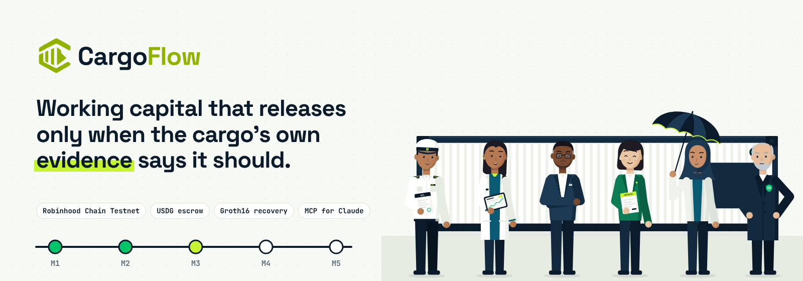
</p>

<h3 align="center">Evidence-gated working capital for physical trade finance</h3>

<p align="center">
  <a href="https://cargoflow.adoranto737.workers.dev"></a>
  <a href="#deployed-contracts-v3-source-verified"></a>
  <a href="https://explorer.testnet.chain.robinhood.com"></a>
  <a href="#measured-not-claimed"></a>
  <a href="#measured-not-claimed"></a>
  <a href="#use-cargoflow-in-claude"></a>
  <a href="https://github.com/LSUDOKO/CargoFlow/actions/workflows/ci.yml"></a>
  <a href="https://www.npmjs.com/package/@cargoflow/sdk"></a>
  <a href="https://www.npmjs.com/package/@cargoflow/mcp"></a>
  <a href="https://www.npmjs.com/package/@cargoflow/gateway"></a>
  <a href="https://pypi.org/project/cargoflow/"></a>
  <a href="LICENSE"></a>
</p>

<p align="center">
  
  
  
  
  
</p>

<p align="center">
  <a href="https://cargoflow.adoranto737.workers.dev"><b>Live app</b></a> ·
  <a href="https://cargoflow-api-75ul.onrender.com/v1/health"><b>API</b></a> ·
  <a href="https://cargoflow.adoranto737.workers.dev/docs"><b>API docs</b></a> ·
  <a href="#use-cargoflow-in-claude"><b>Use in Claude</b></a> ·
  <a href="https://cargoflow.adoranto737.workers.dev/deployments"><b>Contracts</b></a> ·
  <a href="https://explorer.testnet.chain.robinhood.com/address/0x06DaF9462eCF2434ED0314a005Bf762cCDEd7Fe1"><b>Explorer</b></a> ·
  <a href="docs/README.md"><b>Docs</b></a> ·
  <a href="docs/guides/README.md"><b>Role guides</b></a> ·
  <a href="docs/pitch/CargoFlow-pitch.pdf"><b>Pitch deck (PDF)</b></a> ·
  <a href="#demo-video"><b>Demo video</b></a>
</p>

A financier locks USDG in a shipment-specific escrow facility. Tranches release only when multi-source sensor
evidence satisfies an on-chain policy. An anomaly pauses the facility, a context-bound zero-knowledge proof of
secondary evidence resumes it, and the buyer's single invoice payment repays the financier, pays the exporter the
rest and hands the buyer the electronic bill of lading, in one transaction. Everyone signs from their own wallet or
passkey; Claude can read and prepare everything through a remote MCP server, but never holds a key.

```
PHYSICAL REALITY → CRYPTOGRAPHIC EVIDENCE → EVIDENCE CONFIDENCE → FINANCIAL RISK → AVAILABLE CAPITAL → USDG SETTLEMENT
```

> [!NOTE]
> **Status: testnet prototype with production-grade engineering.** Contracts v3 deployed and verified on Robinhood Chain
> Testnet (3 October 2026) with testnet USDG (no monetary value). Not audited, not a regulated financial product, and the ZK
> trusted setup is single-party (testnet only). See [honest limits](#honest-limits).

## Contents

| Story | Product | Engineering |
|---|---|---|
| [The problem in one paragraph](#the-problem-in-one-paragraph) | [Product tour](#product-tour) | [Architecture](#architecture) |
| [Meet the cast](#meet-the-cast) | [Use CargoFlow in Claude](#use-cargoflow-in-claude) | [Live on Robinhood Chain Testnet](#live-on-robinhood-chain-testnet) |
| [How it works, in twelve beats](#how-it-works-in-twelve-beats) | [Role guides](docs/guides/README.md) | [Under the hood](#under-the-hood) |
| [Demo video](#demo-video) | [For developers](#for-developers) | [Sponsor integrations](#sponsor-and-partner-integrations) · [Measured](#measured-not-claimed) · [Limits](#security-and-honest-limits) |
| [Why CargoFlow is fundable](#why-cargoflow-is-fundable) | [Pitch deck (PDF, 16 slides)](docs/pitch/CargoFlow-pitch.pdf) | [Built for Arbitrum Open House Singapore](#built-for-arbitrum-open-house-singapore) |

## The problem in one paragraph

<p align="center">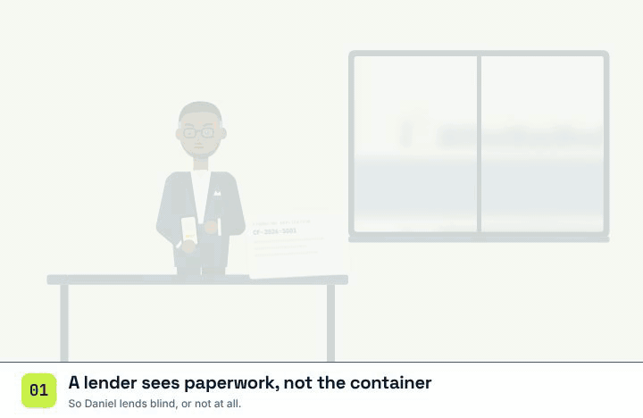</p>

The Asian Development Bank puts the global trade finance gap at
[$2.5 trillion in 2025, about 10% of global trade, with 41% of SME applications rejected](https://www.adb.org/news/demand-trade-finance-rise-amid-supply-chain-realignment-adb-report)
([survey brief](https://www.adb.org/publications/adb-global-trade-finance-gap-survey)). In India, half of B2B sales are
made on credit with
[average payment terms of 52 days](https://group.atradius.com/knowledge-and-research/reports/b2b-payment-practices-trends-india-2025)
(Atradius, 2025), so an exporter waits about two months for cash it has already earned. And the cargo itself is at
risk in transit: biopharma alone loses
[about $35 billion a year to failures in temperature-controlled logistics](https://www.aircargonews.net/pharma-logistics/2019/07/failures-in-temperature-controlled-logistics-cost-biopharma-industry-billions/)
(IQVIA). A lender advancing money against a reefer container sees paperwork, not the container, so it either lends
blind or does not lend. CargoFlow lets the cargo's own sensor evidence decide how much capital is available, on-chain,
milestone by milestone.

### The sources, as captured on 3 October 2026

The sentences are highlighted on the original pages, nothing retyped.

<table>
  <tr>
    <td width="50%" valign="top"><a href="https://www.adb.org/news/demand-trade-finance-rise-amid-supply-chain-realignment-adb-report">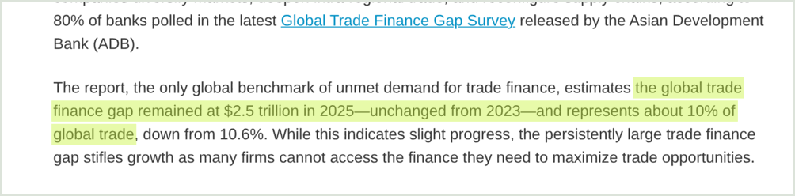</a><br><sub>Asian Development Bank, news release, 15 Jan 2026</sub></td>
    <td width="50%" valign="top"><a href="https://www.adb.org/news/demand-trade-finance-rise-amid-supply-chain-realignment-adb-report">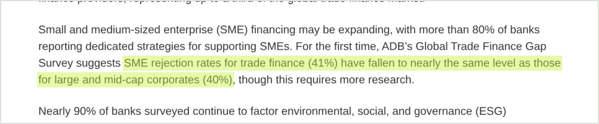</a><br><sub>Same release, citing the ADB Global Trade Finance Gap Survey (Dec 2025)</sub></td>
  </tr>
  <tr>
    <td width="50%" valign="top"><a href="https://group.atradius.com/knowledge-and-research/reports/b2b-payment-practices-trends-india-2025">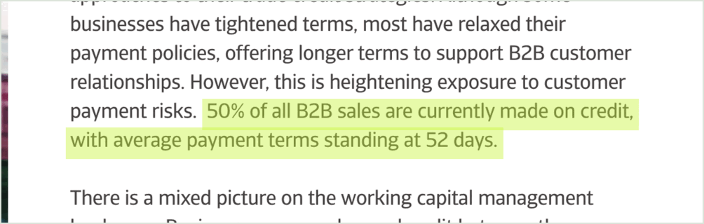</a><br><sub>Atradius, Payment Practices Barometer, India 2025 (PDF p. 3), 29 Jul 2025</sub></td>
    <td width="50%" valign="top"><a href="https://www.aircargonews.net/pharma-logistics/2019/07/failures-in-temperature-controlled-logistics-cost-biopharma-industry-billions/">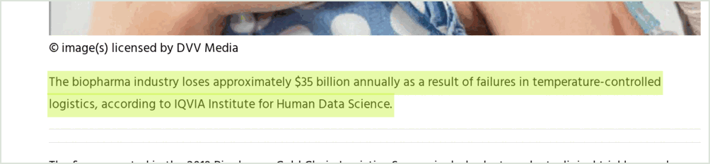</a><br><sub>Air Cargo News, citing the IQVIA Institute, 26 Jul 2019</sub></td>
  </tr>
</table>

Captures and highlight boxes: [`video/public/sources/`](video/public/sources) ([`highlights.json`](video/public/sources/highlights.json)).

## Meet the cast

<p align="center">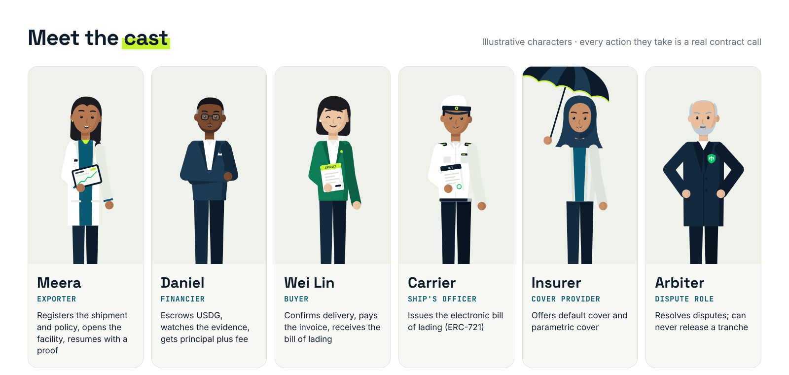</p>

Meera ships vaccines from Pune through Nhava Sheva to Singapore at 2 to 8 °C. Daniel would lend against the shipment
if he could see it. Wei Lin buys it. The characters are illustrative; everything they do below is a real contract call,
and each of them has a step-by-step guide: [exporter](docs/guides/exporter.md) ·
[financier](docs/guides/financier.md) · [buyer](docs/guides/buyer.md) · [carrier](docs/guides/carrier.md) ·
[arbiter](docs/guides/arbiter.md).

## Why CargoFlow is fundable

<p align="center"><a href="docs/pitch/CargoFlow-pitch.pdf">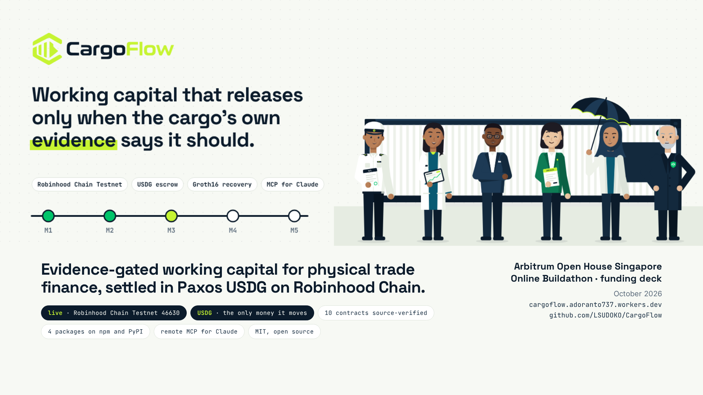</a></p>

**[Pitch deck, PDF (16 slides)](docs/pitch/CargoFlow-pitch.pdf)** · [HTML version with the animations](docs/pitch/index.html) ·
[every slide as PNG](docs/pitch/slides) · rebuilt with `node docs/pitch/export.mjs`. Every number in it traces to a
source below or to a transaction on chain; plans and assumptions are labelled as such.

| | |
|---|---|
| **Market gap** | A [$2.5 trillion trade finance gap](https://www.adb.org/news/demand-trade-finance-rise-amid-supply-chain-realignment-adb-report) (ADB, 2025), 41% of SME applications rejected, 52-day average terms in India ([Atradius](https://group.atradius.com/knowledge-and-research/reports/b2b-payment-practices-trends-india-2025)). First corridor: India's pharmaceutical exports, [USD 30.47 billion in FY 2024-25](https://www.pib.gov.in/PressReleasePage.aspx?PRID=2231234) (PIB), shipped at 2 to 8 °C to importers such as Singapore. Bottom-up, with stated assumptions: SAM about $15.2B a year sold on credit (30.47 × 50%), SOM about $152M financed a year at a 1% share by year 3. |
| **Traction (testnet, honest)** | Ten contracts source-verified on Robinhood Chain Testnet; full lifecycles settled on chain with every transaction linked ([below](#live-on-robinhood-chain-testnet)), including a passkey payment and an automatic ZK recovery; `@cargoflow/sdk`, `@cargoflow/mcp`, `@cargoflow/gateway` on npm and `cargoflow` on PyPI (0.1.0); a public MCP server used from claude.ai; 366 contract, 25 circuit, 296 frontend unit and 18 end-to-end tests. No users or revenue yet; not audited. |
| **Moat** | The chain of mechanisms, not one feature: signed device readings, Dempster-Shafer fusion with a published score, a Groth16 recovery proof bound to the contract's own public signals, a vault only the controller can release, a bill of lading that moves inside the payment, and parametric cover proven from the evidence commit order. |
| **Business model (planned)** | 30 to 50 bps protocol fee on financed volume inside the settlement waterfall; a share of cover premiums written through the `CoverPool`; SaaS and data for financiers, insurers and logger vendors (portfolio risk, evidence API, MCP). The contracts charge no protocol fee today. |
| **Roadmap** | M1 audit and public ZK ceremony · M2 real logger pilots and a secure-element board end to end · M3 Robinhood Chain mainnet with real USDG and the first outside financier · M4 MLETR legal opinion on the bill of lading · M5 calibrated scoring and a second corridor. Each milestone has an exit test. |
| **Use of funds (plan)** | 35% audit and ZK ceremony (M1), 25% pilots and logger hardware (M2), 20% mainnet launch and first facilities (M3), 10% legal (M4), 10% team and infrastructure; released milestone by milestone, the way CargoFlow releases capital. |

<table>
  <tr>
    <td width="50%" valign="top"><a href="docs/pitch/CargoFlow-pitch.pdf">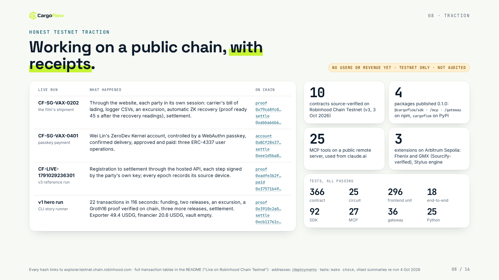</a><br><b>Traction.</b> Receipts on a public chain, labelled for what they are.</td>
    <td width="50%" valign="top"><a href="docs/pitch/CargoFlow-pitch.pdf">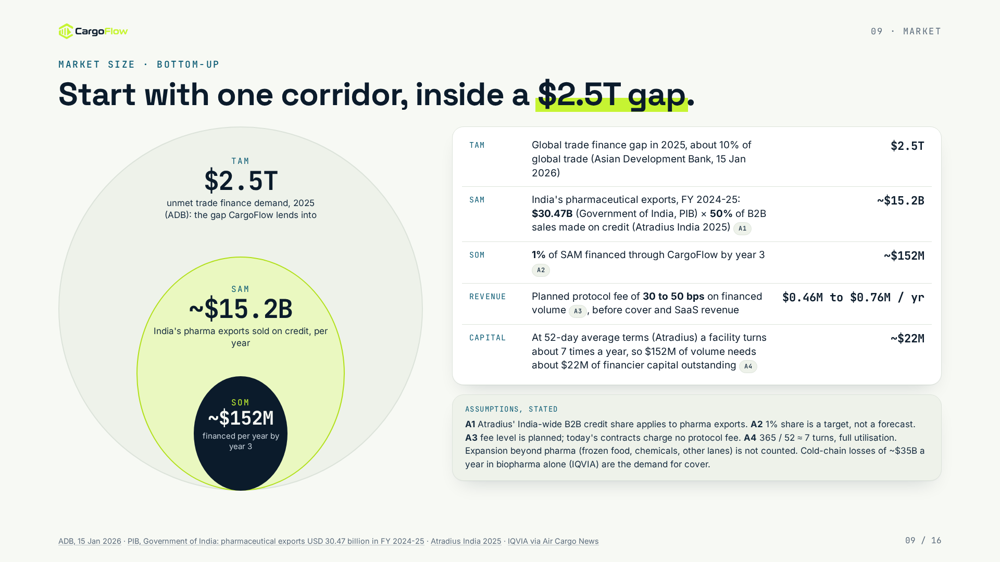</a><br><b>Market.</b> Bottom-up from cited figures; every assumption labelled.</td>
  </tr>
  <tr>
    <td width="50%" valign="top"><a href="docs/pitch/CargoFlow-pitch.pdf">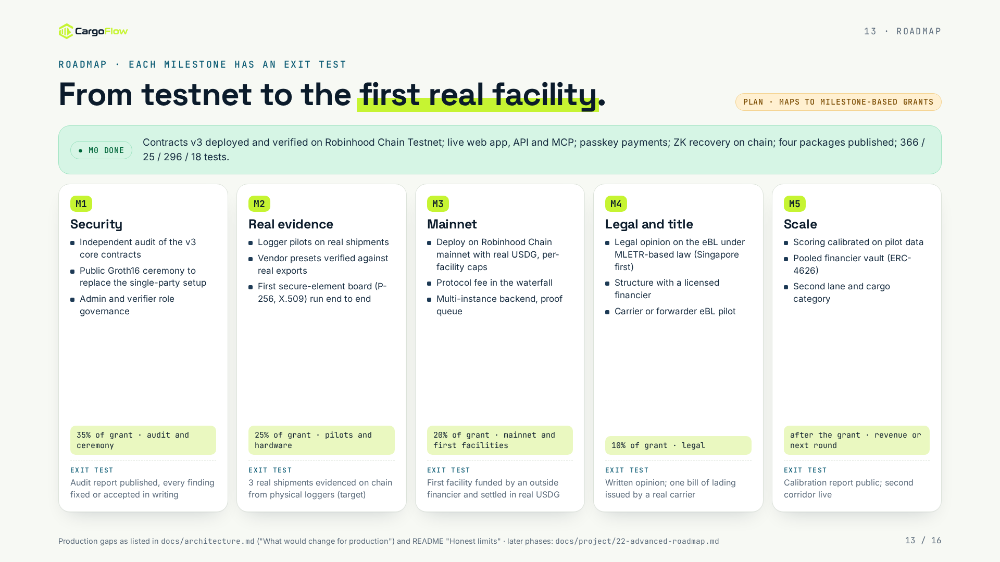</a><br><b>Roadmap.</b> Milestones with exit tests, mapped to milestone-based grants.</td>
    <td width="50%" valign="top"><a href="docs/pitch/CargoFlow-pitch.pdf">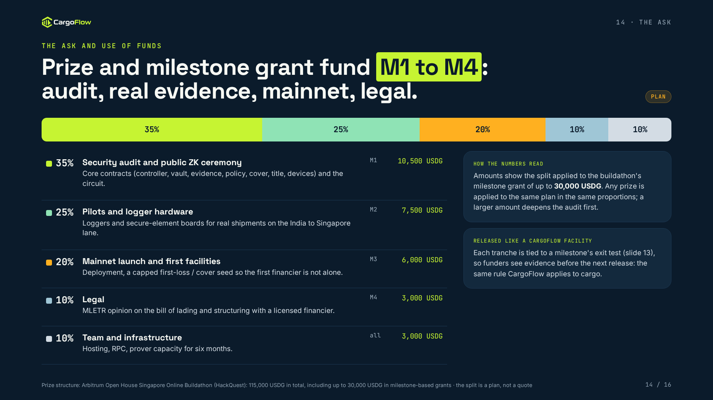</a><br><b>The ask.</b> What prize and grant money buys, milestone by milestone (plan).</td>
  </tr>
</table>

## Built for Arbitrum Open House Singapore

CargoFlow is an entry to the **Arbitrum Open House Singapore: Online Buildathon** (Arbitrum Foundation, on
[HackQuest](https://www.hackquest.io/hackathons/Arbitrum-Open-House-Singapore-Online-Buildathon)). Here is each rule
and judging criterion, with where to check it.

| Rule or criterion | How CargoFlow meets it | Check it |
|---|---|---|
| **Deployed on an Arbitrum chain** | All ten core contracts live on Robinhood Chain Testnet (46630); the Stylus engine and the Fhenix and GMX extensions on Arbitrum Sepolia | [Deployed contracts](#deployed-contracts-v3-source-verified) |
| **Smart contract quality** | 366 contract tests (unit, fuzz, eight invariants, real-proof integration, smart-account callers); immutable core with no proxy; OpenZeppelin 5.4; Slither triaged; an authority matrix that lists what each role *cannot* do; a pause that stops new risk but never blocks an exit | [Measured](#measured-not-claimed) · [architecture](docs/architecture.md#who-may-do-what) |
| **Product-market fit** | A sourced problem (trade finance gap, SME rejections, 52-day terms); portals for exporter, financier, buyer, carrier and arbiter; a financing market with fee guidance; SDK, MCP server, gateway and Python packages published | [Product tour](#product-tour) · [role guides](docs/guides/README.md) |
| **Innovation and creativity** | Capital gated by fused sensor evidence; context-bound zero-knowledge recovery; an AI monitor that can only make outcomes stricter; parametric cover proven from commit order; a bill of lading that moves inside the payment; Claude as a keyless co-pilot | [How it works](#how-it-works-in-twelve-beats) · [under the hood](#under-the-hood) |
| **Real problem solving** | End-to-end runs on the public testnet with every transaction linked: excursion, pause, proof, resume, settlement, passkey payment | [Live runs](#the-films-shipment-end-to-end-cf-sg-vax-0202) |
| **Extra consideration: Paxos USDG** | USDG is the only money CargoFlow moves: escrow, tranches, invoice payment, the waterfall and cover, on the real Paxos testnet token `0x7E95…802F` | [Paxos USDG](docs/sponsors/README.md#paxos-usdg) |
| **Prize reserved for Robinhood Chain** | Built on Robinhood Chain first: its RIP-7212 P-256 precompile carries the passkey flow, and USDG is native there | [A passkey payment](#a-passkey-payment-cf-sg-vax-0401) |
| **Milestone-based grants** | The roadmap above is written as milestones with exit tests, so each grant tranche can be released against evidence | [Pitch deck, slides 13 and 14](docs/pitch/CargoFlow-pitch.pdf) |

## How it works, in twelve beats

The explainer uses the reference numbers (a 100,000 USDG invoice, a 40,000 USDG facility in five milestones of 8,000,
a 3% fee); the live runs further down use the same mechanics at testnet scale (30 / 20 USDG).

<table>
  <tr>
    <td width="50%" valign="top">
      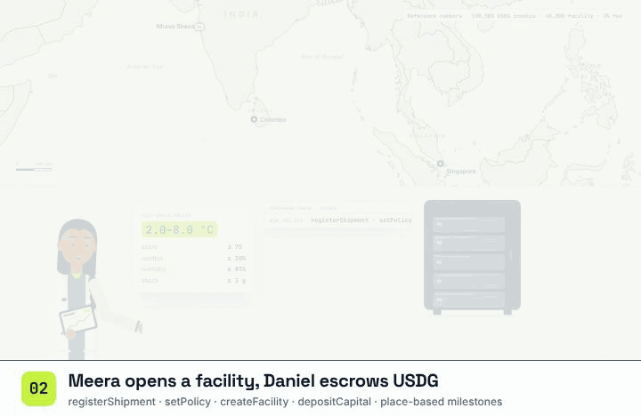
      <p><b>1 · The facility.</b> Meera registers the shipment and reveals a commit-reveal policy (2.0 to 8.0 °C, score ≥ 75, conflict ≤ 30%, humidity ≤ 85%, shock ≤ 3 g). Daniel approves and deposits the whole facility into the <code>ReceivableVault</code>. Milestones can each be tied to a place on the route.</p>
      <sub><code>registerShipment</code> · <code>setPolicy</code> · <code>createFacility</code> · <code>approve</code> + <code>depositCapital</code></sub>
    </td>
    <td width="50%" valign="top">
      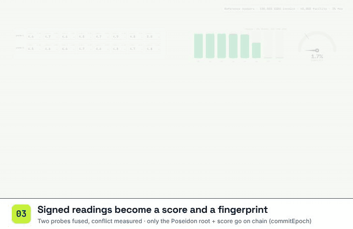
      <p><b>2 · Evidence.</b> The reefer's logger signs each reading with its device key. Eight readings per sensor close an epoch; the two probes are fused (Dempster-Shafer), their disagreement measured, and the epoch scored out of 100. Only a salted Poseidon root and the score go on chain.</p>
      <sub><code>commitEpoch</code> on the <code>EvidenceRegistry</code> (backend worker key)</sub>
    </td>
  </tr>
  <tr>
    <td width="50%" valign="top">
      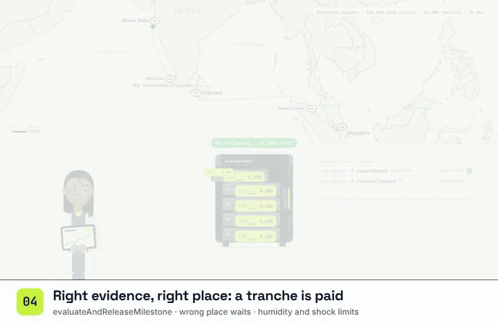
      <p><b>3 · Release.</b> Pass the policy in the right place and a tranche goes to Meera. The controller re-checks the committed epoch against the on-chain policy itself, whatever the backend asked for. Wrong place? It waits: neither a failure nor a pause.</p>
      <sub><code>evaluateAndReleaseMilestone</code> on the <code>FinancingController</code></sub>
    </td>
    <td width="50%" valign="top">
      
      <p><b>4 · Excursion.</b> Off Sri Lanka probe-1 reaches 11.7 °C, probe-2 holds at 4.6. The sensors disagree (74.8% conflict), the score falls to 48 and the facility pauses: releases now revert. The AI monitor can only make an outcome stricter, through a key that can do nothing but pause.</p>
      <sub><code>pauseFinancing</code> (reason code + AI audit)</sub>
    </td>
  </tr>
  <tr>
    <td width="50%" valign="top">
      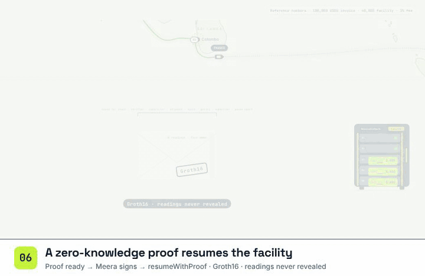
      <p><b>5 · Zero-knowledge recovery.</b> Once probe-2 has eight fresh in-band readings, the service proves in zero knowledge that they sit inside the band, without revealing any of them. Meera gets a "Proof ready" notification and signs once; the contract verifies the Groth16 proof, bound to this exact pause, and releases resume.</p>
      <sub><code>resumeWithProof</code> → <code>Groth16Verifier</code></sub>
    </td>
    <td width="50%" valign="top">
      
      <p><b>6 · Settlement.</b> In Singapore Wei Lin confirms delivery and pays. That one payment runs the waterfall: 40,000 principal + 1,200 fee to Daniel, 58,800 to Meera.</p>
      <sub><code>markDelivered</code> · <code>approve</code> (vault) + <code>settle</code> on the <code>FinancingController</code>, paid out by the <code>ReceivableVault</code></sub>
    </td>
  </tr>
  <tr>
    <td width="50%" valign="top">
      
      <p><b>7 · Title moves with the money.</b> The carrier's electronic bill of lading (ERC-721) was bound into escrow; it leaves for Wei Lin in the same transaction as her payment: documents against payment, enforced by the contract.</p>
      <sub><code>EBLRegistry</code> · <code>bindTitle</code> · released inside <code>settle</code></sub>
    </td>
    <td width="50%" valign="top">
      
      <p><b>8 · Cover.</b> If it goes wrong, an insurer's default cover pays min(cover, drawn principal). Parametric cover pays after N consecutive failed epochs, proven from the <code>EvidenceRegistry</code>'s commit order: principal to the financier plus salvage to the exporter.</p>
      <sub><code>CoverPool</code> · pull-based payouts</sub>
    </td>
  </tr>
  <tr>
    <td width="50%" valign="top">
      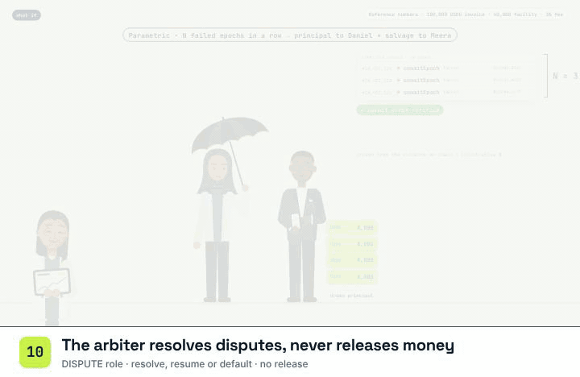
      <p><b>9 · Disputes.</b> The exporter, financier or arbiter can open a dispute, which freezes releases. Only the dispute role resolves it (resume or default) and it can never release a tranche.</p>
      <sub><code>openDispute</code> · <code>resolveDispute</code> · <code>markDefaulted</code></sub>
    </td>
    <td width="50%" valign="top">
      
      <p><b>10 · Passkeys, live.</b> Wei Lin signs in with a passkey (no extension) and pays from a ZeroDev Kernel smart account: three ERC-4337 user operations on the live testnet, <a href="#a-passkey-payment-cf-sg-vax-0401">linked below</a>.</p>
      <sub>Kernel v3.1 · WebAuthn validator · RIP-7212 P-256 precompile</sub>
    </td>
  </tr>
  <tr>
    <td width="50%" valign="top">
      
      <p><b>11 · Claude.</b> Add the remote MCP server as a custom connector and ask. Claude reads the fleet, explains a pause and prepares unsigned transactions with a link to sign in the app. <a href="#use-cargoflow-in-claude">Set it up</a>.</p>
      <sub>25 tools · Streamable HTTP · no keys</sub>
    </td>
    <td width="50%" valign="top">
      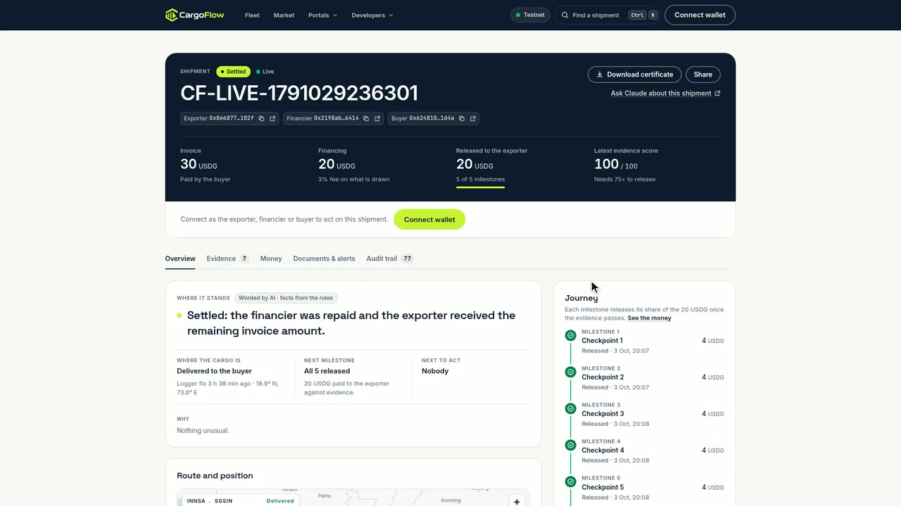
      <p><b>12 · All of it, on chain.</b> Every beat above ran on the v3 contracts. The settled shipment's dashboard shows each milestone with its transaction, the evidence, the proof and the audit trail. <a href="#live-on-robinhood-chain-testnet">Transactions</a>.</p>
      <sub><a href="https://cargoflow.adoranto737.workers.dev/track/0xc57490f8b1f0190b00197db978963899f55314865c0059eddaf8cfecdc8ff9e5">Open the settled shipment</a></sub>
    </td>
  </tr>
</table>

### The same story as a sequence diagram

A 40,000 USDG facility against a 100,000 USDG invoice, 5 milestones of 8,000, 3% fee.

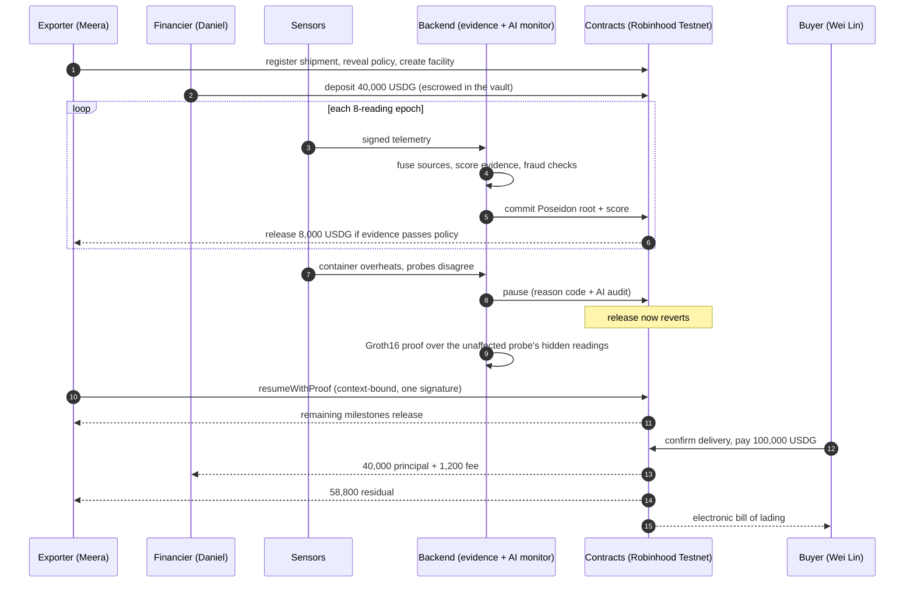
```mermaid
sequenceDiagram
    autonumber
    participant X as Exporter (Meera)
    participant F as Financier (Daniel)
    participant S as Sensors
    participant B as Backend (evidence + AI monitor)
    participant C as Contracts (Robinhood Testnet)
    participant Y as Buyer (Wei Lin)
    X->>C: register shipment, reveal policy, create facility
    F->>C: deposit 40,000 USDG (escrowed in the vault)
    loop each 8-reading epoch
        S->>B: signed telemetry
        B->>B: fuse sources, score evidence, fraud checks
        B->>C: commit Poseidon root + score
        C-->>X: release 8,000 USDG if evidence passes policy
    end
    S->>B: container overheats, probes disagree
    B->>C: pause (reason code + AI audit)
    Note over C: release now reverts
    B->>B: Groth16 proof over the unaffected probe's hidden readings
    X->>C: resumeWithProof (context-bound, one signature)
    C-->>X: remaining milestones release
    Y->>C: confirm delivery, pay 100,000 USDG
    C-->>F: 40,000 principal + 1,200 fee
    C-->>X: 58,800 residual
    C-->>Y: electronic bill of lading
```

What makes it different:

- **Capital follows physical evidence.** A failed milestone changes what can be drawn, on-chain, not in a dashboard.
- **No single oracle.** Sources are fused with Dempster-Shafer and an explicit conflict factor, then scored with
  documented penalties. The same input always yields the same score.
- **Privacy by construction.** Raw telemetry never goes on-chain: only Poseidon Merkle roots, scores and proof
  verification status do. Recovery is proved in zero knowledge over readings that stay private.
- **An AI that cannot move money.** A language model may only ever make an outcome *stricter* (pause or ask for more
  proof), through a key that holds no other role. It never sees telemetry-derived text, and the policy gate decides
  alone whenever the model is absent, slow or wrong. See [the AI monitor](backend/README.md#ai-monitor).
- **Contracts hold final authority.** Core contracts are immutable (no proxy). Pause is narrow and cannot withdraw
  funds. Eight invariants are fuzz- and invariant-tested.

## Product tour

Every frame below is the live app at **https://cargoflow.adoranto737.workers.dev**, recorded on 3 October 2026 for
the demo video with real testnet transactions (shipment `CF-SG-VAX-0202`, and `CF-SG-VAX-0401` for the passkey
payment).

<p align="center"><a href="https://cargoflow.adoranto737.workers.dev">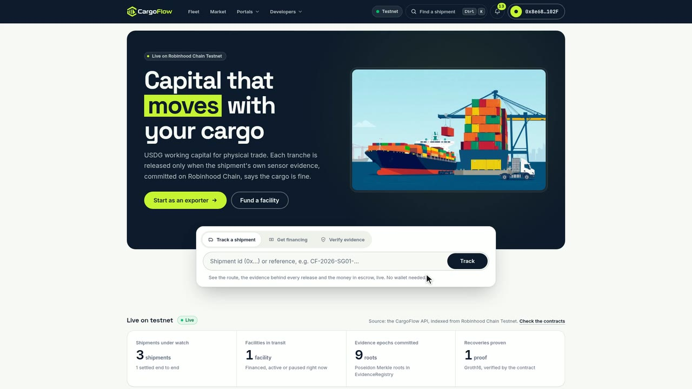</a></p>

**The cast, on the site.** The landing page introduces the same six people as the film, then tells how it works as a
scroll story: the route draws, the vault fills, the door probe warms and the payment pauses, the proof unlocks it.

<table>
  <tr>
    <td width="50%" valign="top"><a href="https://cargoflow.adoranto737.workers.dev/#how-it-works">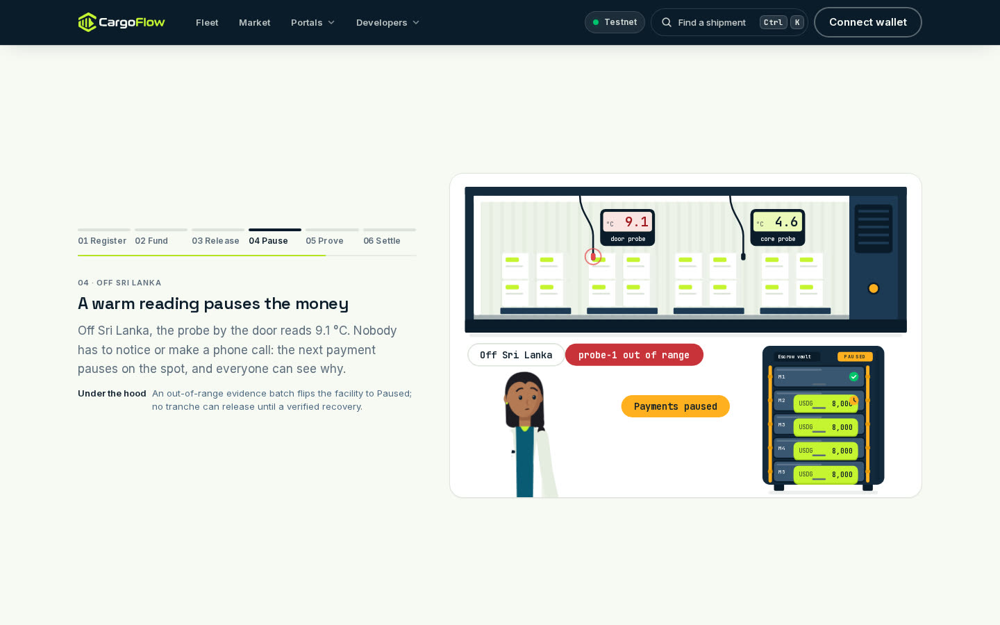</a><br><b>Step 4, pause.</b> A warm reading pauses the money; nobody has to notice or call.</td>
    <td width="50%" valign="top"><a href="https://cargoflow.adoranto737.workers.dev/#how-it-works">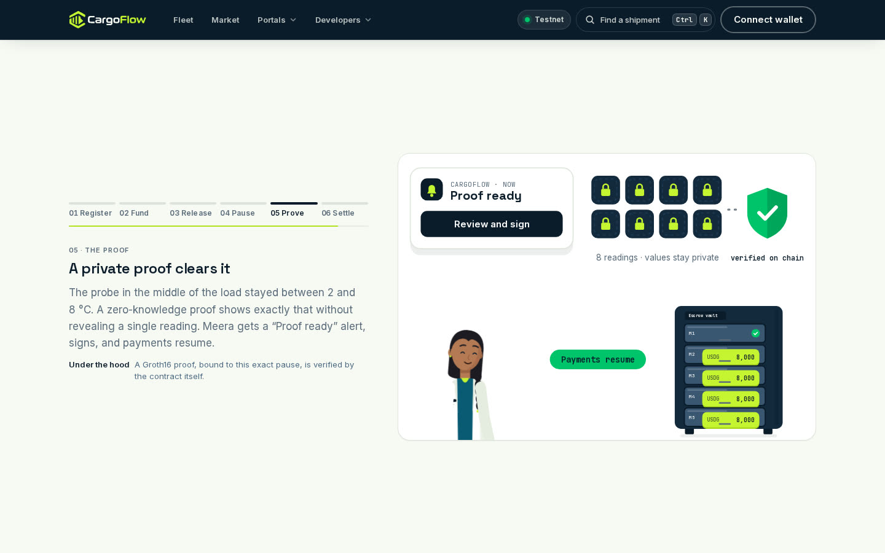</a><br><b>Step 5, prove.</b> Eight sealed readings prove the cargo is fine; the latch lifts.</td>
  </tr>
  <tr>
    <td width="50%" valign="top">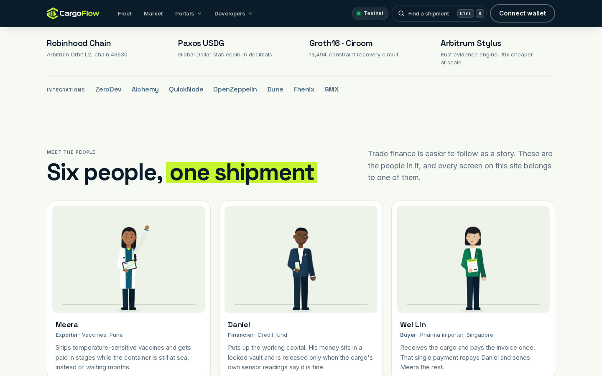<br><b>Meet the people.</b> Every screen belongs to one of them.</td>
    <td width="50%" valign="top" align="center">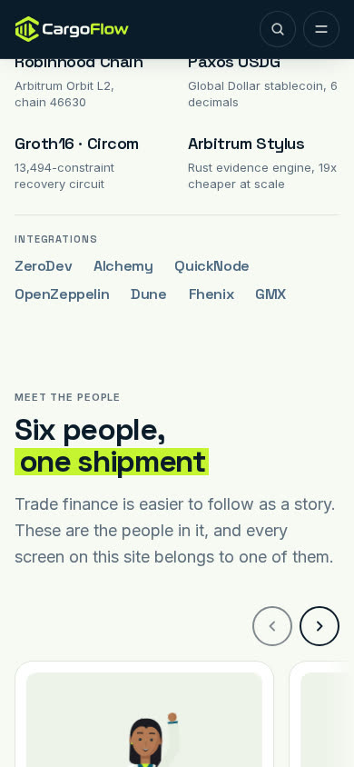<br><b>On a phone.</b> A swipe carousel; motion turns off with reduced-motion settings.</td>
  </tr>
</table>

<table>
  <tr>
    <td width="33%" valign="top"><a href="https://cargoflow.adoranto737.workers.dev/exporter">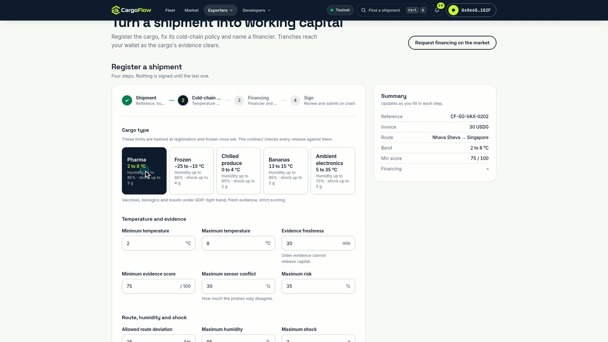</a><br><b>Exporter.</b> Four steps (shipment, cold-chain policy, financing, sign); the Pharma template fills 2 to 8 °C, humidity and shock. <a href="https://cargoflow.adoranto737.workers.dev/exporter">/exporter</a></td>
    <td width="33%" valign="top"><a href="https://cargoflow.adoranto737.workers.dev/financier"></a><br><b>Financier.</b> Facilities that name your wallet, a settlement preview (20.6 back on 20), approve and deposit. <a href="https://cargoflow.adoranto737.workers.dev/financier">/financier</a></td>
    <td width="33%" valign="top"><a href="https://cargoflow.adoranto737.workers.dev/ebl">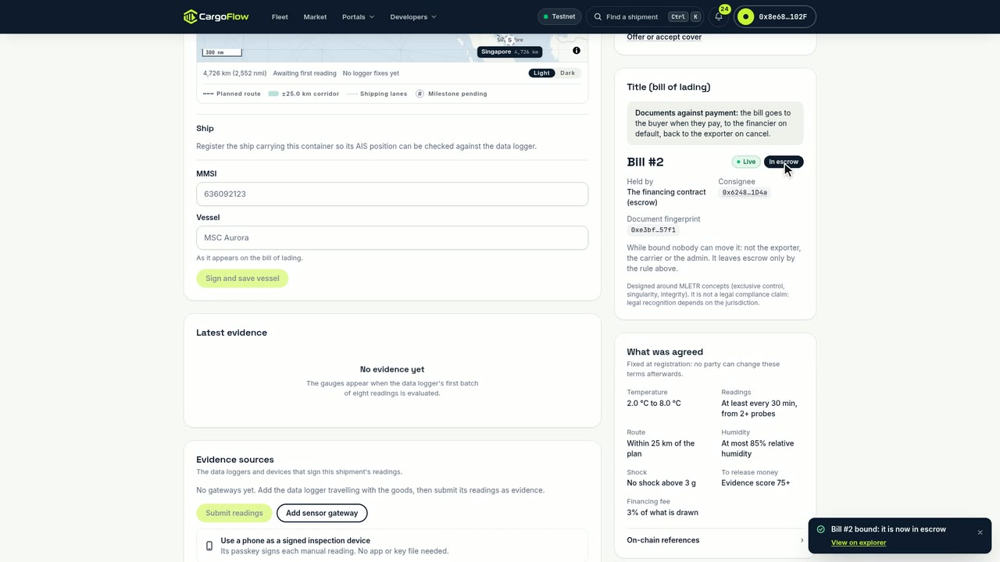</a><br><b>Carrier and title.</b> The carrier issues bill #2; Meera binds it and the title card reads <i>In escrow</i>. <a href="https://cargoflow.adoranto737.workers.dev/ebl">/ebl</a></td>
  </tr>
  <tr>
    <td width="33%" valign="top">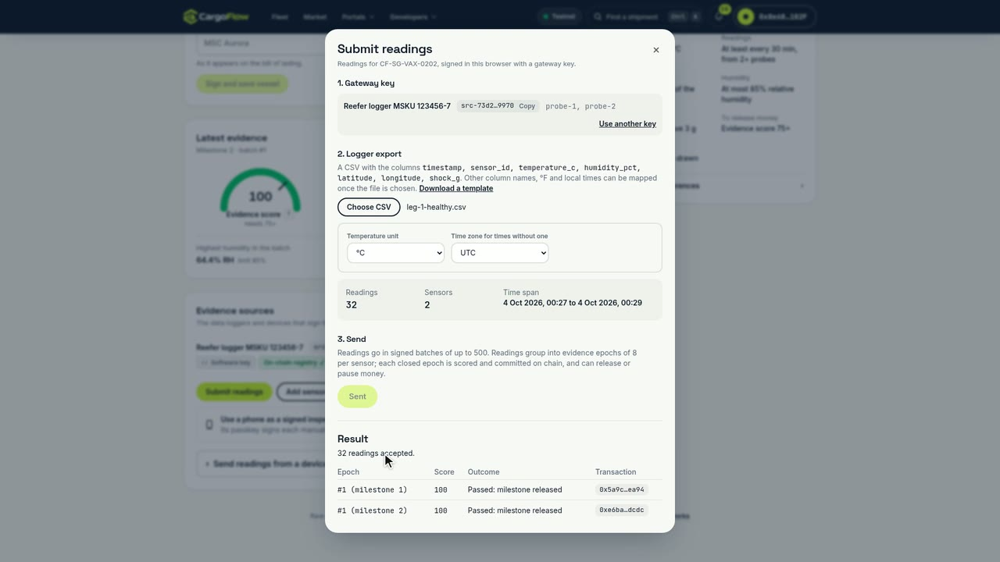<br><b>Readings in, tranches out.</b> A logger CSV (or the gateway agent) sends signed readings; two epochs pass and two tranches are paid.</td>
    <td width="33%" valign="top">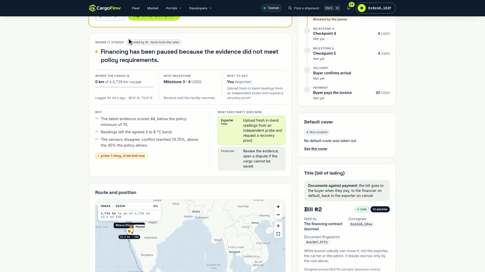<br><b>Paused, in plain words.</b> Why it paused (score 48, conflict 74.8%) and what each party does next.</td>
    <td width="33%" valign="top"><br><b>Recovered.</b> "Groth16 proof verified on-chain": eight hidden readings proven in band, none revealed.</td>
  </tr>
  <tr>
    <td width="33%" valign="top"><br><b>Settled with a passkey.</b> <code>CF-SG-VAX-0401</code>, paid by Wei Lin's passkey smart account.</td>
    <td width="33%" valign="top">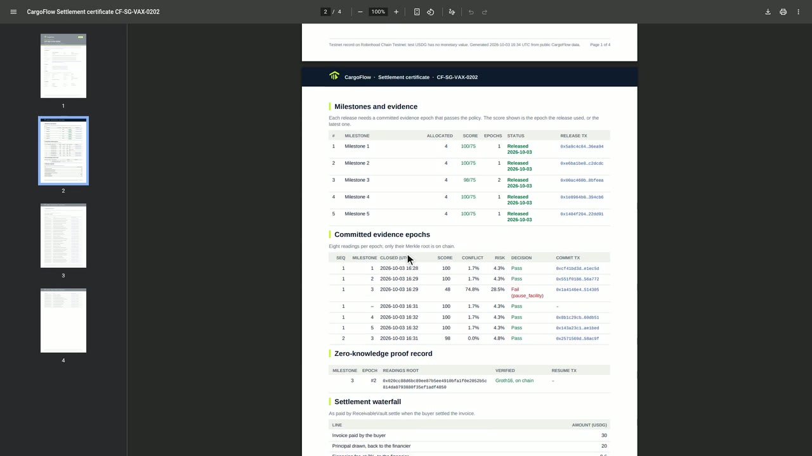<br><b>Certificate.</b> A settlement certificate (PDF) with every epoch, the proof and the waterfall.</td>
    <td width="33%" valign="top"><a href="https://cargoflow.adoranto737.workers.dev/market"></a><br><b>Market.</b> Requests without a financier get offers, with a suggested fee band and its reasons. <a href="https://cargoflow.adoranto737.workers.dev/market">/market</a></td>
  </tr>
</table>

More pages: [`/shipments`](https://cargoflow.adoranto737.workers.dev/shipments) (fleet),
[`/buyer`](https://cargoflow.adoranto737.workers.dev/buyer), [`/arbiter`](https://cargoflow.adoranto737.workers.dev/arbiter),
[`/developers`](https://cargoflow.adoranto737.workers.dev/developers),
[`/docs`](https://cargoflow.adoranto737.workers.dev/docs), [`/deployments`](https://cargoflow.adoranto737.workers.dev/deployments).

## Alerts on your phone: the Telegram bot

Every party can subscribe a shipment's alerts to Telegram (also email, Slack or a signed webhook) from the shipment
page. Recorded on a real phone during a live testnet run of `CF-LIVE-1791103821739`: the bot confirms the subscription,
then two **RELEASED** alerts and a **PAUSED** alert arrive with their transactions within seconds of the chain events,
and about a minute later **RECOVERY_READY**, the automatic zero-knowledge recovery, with a link that opens the shipment
straight on the recovery card for Meera to sign. Bot: [@Cargo_FlowBot](https://t.me/Cargo_FlowBot).

<table>
  <tr>
    <td width="34%" align="center" valign="top">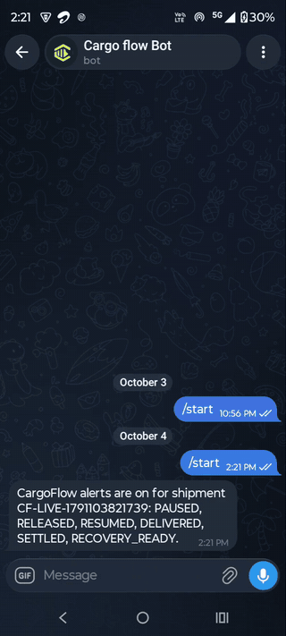<br><b>The live recording</b></td>
    <td width="22%" align="center" valign="top">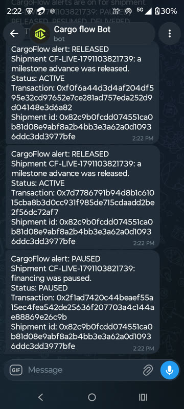<br>Released, released, paused</td>
    <td width="22%" align="center" valign="top">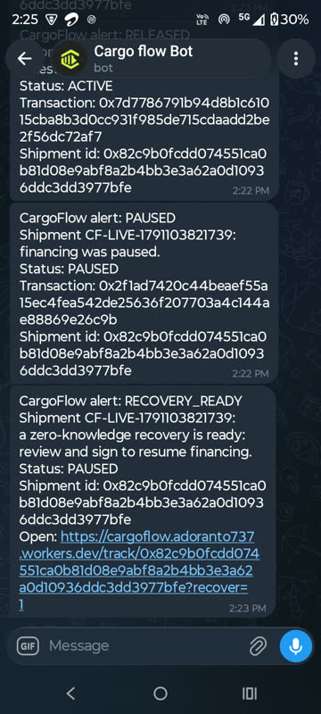<br>Recovery ready</td>
    <td width="22%" align="center" valign="top">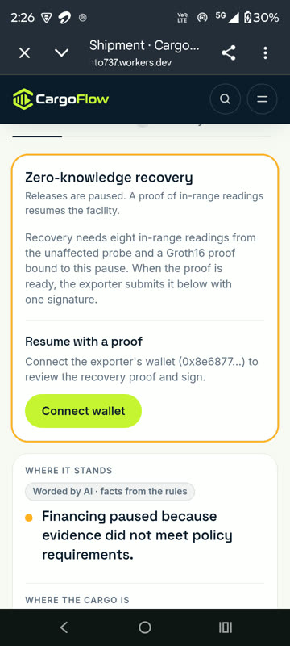<br>One tap to sign</td>
  </tr>
</table>

Transactions behind the alerts: deposit [`0xcf71dae6…f5ee1b069`](https://explorer.testnet.chain.robinhood.com/tx/0xcf71dae603aa093071d5a4b7513e4d8260518f6a34c668cee6c8973f5ee1b069),
transit [`0x476a4aaa…843787fa8c`](https://explorer.testnet.chain.robinhood.com/tx/0x476a4aaaf3b44a61f8a8ab93239ff92851335fb8b771b1d3a6cd42843787fa8c),
releases [`0xf0f6a44d…d3d6a82`](https://explorer.testnet.chain.robinhood.com/tx/0xf0f6a44d3d4af204df595e32cd97652e7ce281ad757eda252d9d04148e3d6a82)
and [`0x7d778679…dc72af7`](https://explorer.testnet.chain.robinhood.com/tx/0x7d7786791b94d8b1c61015cba8b3d0cc931f985de715cdaadd2be2f56dc72af7),
pause [`0x2f1ad742…869e26c9b`](https://explorer.testnet.chain.robinhood.com/tx/0x2f1ad7420c44beaef55a15ec4fea542de25636f207703a4c144ae88869e26c9b).

## Use CargoFlow in Claude

CargoFlow runs a public remote MCP server, so Claude can read shipments, evidence, cover and the market, and prepare
unsigned transactions with a link to sign them in the web app. It holds no keys.

<table>
  <tr>
    <td width="50%" valign="top">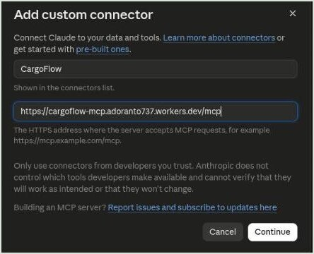<br><b>1 · Add the connector.</b> <a href="https://claude.ai/new?modal=add-custom-connector">Open the Add custom connector dialog</a> (or Settings → Connectors → Add custom connector), name it CargoFlow and paste the URL.</td>
    <td width="50%" valign="top">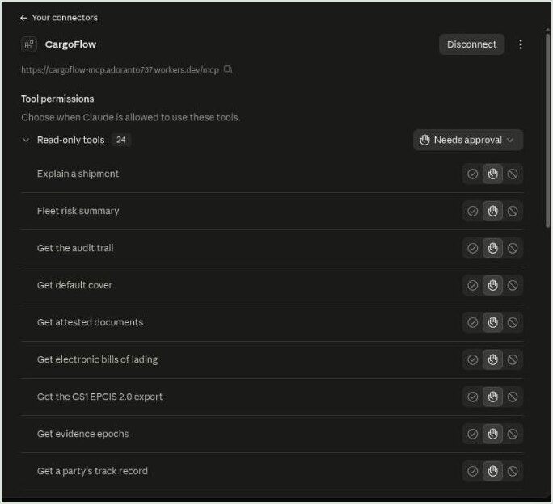<br><b>2 · The tools appear.</b> Read-only tools (fleet risk, explanations, evidence, cover, documents, bills of lading, EPCIS) plus <code>prepare_*</code> tools.</td>
  </tr>
  <tr>
    <td width="50%" valign="top">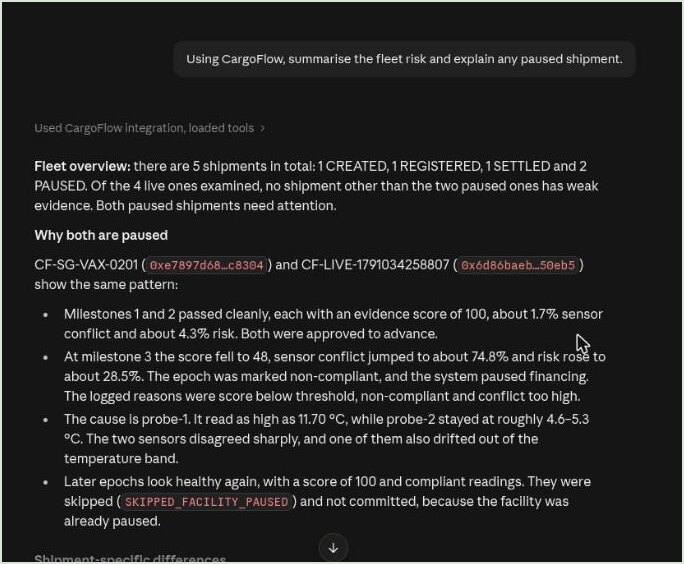<br><b>3 · Ask.</b> "Using CargoFlow, summarise the fleet risk and explain any paused shipment." Claude calls <code>fleet_risk_summary</code> and <code>explain_shipment</code> and answers from live testnet data.</td>
    <td width="50%" valign="top">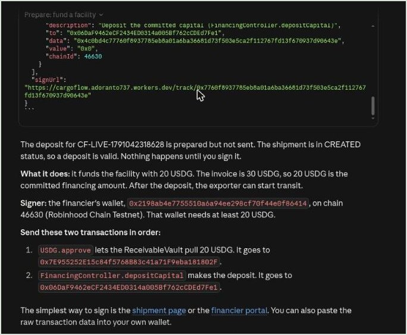<br><b>4 · Prepare, never sign.</b> "Prepare the deposit for …" returns two unsigned transactions <code>{to, data, value, chainId}</code> and a link that opens the shipment ready to sign. Nothing is sent.</td>
  </tr>
</table>

### More of the claude.ai session

The tool calls, the prepared deposit, and the app opening from Claude's link.

<table>
  <tr>
    <td width="33%" valign="top">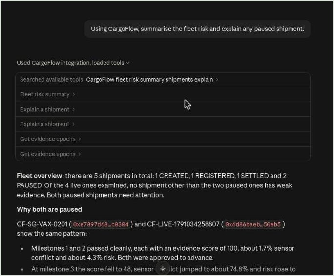<br>The tool calls Claude made, expanded.</td>
    <td width="33%" valign="top">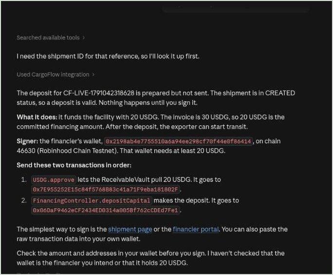<br>The prepared deposit: what it does, who signs, two transactions in order.</td>
    <td width="33%" valign="top">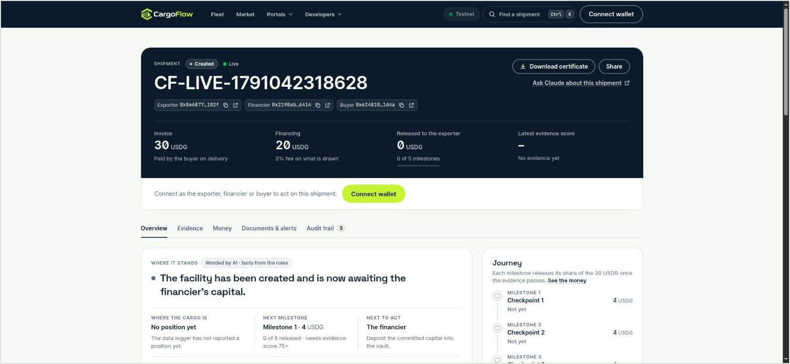<br>The link opens the shipment in CargoFlow, ready for the financier to sign.</td>
  </tr>
</table>

<p align="center">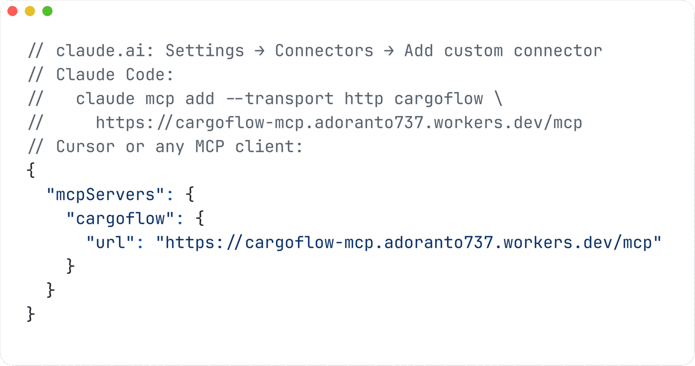</p>

```bash
claude mcp add --transport http cargoflow https://cargoflow-mcp.adoranto737.workers.dev/mcp   # Claude Code
```

25 tools: shipments, evidence, explanations, track, audit, parties, market, cover, documents (hash check against the
on-chain invoice hash), fleet risk, pricing, EPCIS, bills of lading, and `prepare_*` tools for deposit, release,
ZK resume, delivery, settlement, dispute, cover, cancel and parametric trigger. The
[developers page](https://cargoflow.adoranto737.workers.dev/developers) has a copy button, starter prompts that open
Claude directly, and an "Add to Cursor" link. Source: [`packages/mcp`](packages/mcp). The captures above are real
claude.ai sessions on 3 October 2026 ([all of them](video/public/footage/claude)).

## Architecture

<p align="center"></p>

The chain is the financial source of truth. Each party signs its own money moves from the web app, straight to the
contracts. The Go service scores evidence and acts on chain only through three role-limited keys: the worker commits
epochs, the monitor may only pause, the manager starts transit, releases and submits proofs. Postgres holds
operational evidence (readings, epochs, the action outbox, the audit trail) and is reconciled from chain events; the
API's facility view reads the chain directly, so a lagging indexer can never show money that did not move.

| Trust boundary | What crosses | Protection |
|---|---|---|
| Sensor → service | readings | Ed25519 (or P-256 / passkey) signature over method, path, time and body hash; replay, equivocation and fraud gates |
| Service → chain | roots, scores, pauses, releases | three role-limited keys, idempotent outbox, startup role verification |
| Service → model | integers, booleans, enum members | no telemetry-derived text; strict parsing; any failure falls back to the policy gate |
| Model → chain | at most a pause request | stricter-only, confidence threshold, pause-only key; contracts decide legality |
| Prover → chain | `a, b, c` | the contract derives every public signal; the proof is bound to chain, verifier, controller, shipment, epoch, policy, submitter and pause count |
| MCP / Claude → anything | reads and unsigned transactions | holds no keys; every write is signed by the party in their own wallet |

Components, the facility state machine, the full authority matrix (including what each role *cannot* do) and every
trust boundary are in [`docs/architecture.md`](docs/architecture.md).

### Repository layout

| Path | Purpose |
|---|---|
| `contracts/` | Solidity core (Foundry): registry, policy, evidence, controller, vault, verifier, cover, devices, bills of lading |
| `backend/` | Go service: ingestion, evidence engine, AI monitor, proof worker, API (wallet-signed gateway registration and recovery), indexer, reconciler, CLI story runner |
| `circuits/` | Circom telemetry-epoch circuit and Groth16 tooling |
| `infra/` | Hardened Dockerfile and compose stack |
| `scripts/` | Key generation, funding, testnet deploy and explorer verification |
| `docs/` | Architecture, role guides, runbooks, security, benchmarks, protocol knowledge base, design system, media kit |
| `stylus/` | Optional Rust (Stylus) evidence engine for Arbitrum Sepolia, benchmarked against a Solidity reference |
| `frontend/` | Next.js 16 web app: landing, live dashboard, fleet, market, exporter / financier / buyer portals, bills of lading, passkey accounts, API reference, arbiter console |
| `packages/sdk` | `@cargoflow/sdk`: typed TypeScript client, ABIs, unsigned transaction builders, gateway signing (Ed25519 and P-256), Merkle proof checks |
| `packages/mcp` | `@cargoflow/mcp`: MCP server (stdio, Streamable HTTP, and a Cloudflare Worker for the hosted endpoint) |
| `packages/gateway` | `@cargoflow/gateway`: edge agent for data loggers (folder watch, USB mass storage, serial, offline queue) |
| `packages/python` | `cargoflow` Python SDK: data frames, portfolio analytics, Monte Carlo of default and recovery |
| `contracts/confidential` | Fhenix CoFHE extension: encrypted invoice margin and penalty terms (Arbitrum Sepolia) |
| `contracts/hedge` | GMX v2 hedge vault for a financier's own collateral (Arbitrum Sepolia) |
| `analytics/dune` | Dune SQL for volume, escrow, pause and recovery rates and lender yield |
| `video/` | The demo film (Remotion): the cast, the illustration library, the scenes, and the README media kit (`video/src/readme`) |

## Live on Robinhood Chain Testnet

Chain `46630` · RPC `https://rpc.testnet.chain.robinhood.com` · Explorer `https://explorer.testnet.chain.robinhood.com`

**Use it now:** connect any wallet on Robinhood Chain Testnet, or sign in with a passkey (Face ID, fingerprint or a
security key) through a ZeroDev smart account.

| Service | URL |
|---|---|
| Web app (Cloudflare Workers) | **https://cargoflow.adoranto737.workers.dev** |
| API (Render, Docker) | https://cargoflow-api-75ul.onrender.com ([health](https://cargoflow-api-75ul.onrender.com/v1/health), [OpenAPI 3.1](https://cargoflow-api-75ul.onrender.com/v1/openapi.json)) |
| Interactive API reference | https://cargoflow.adoranto737.workers.dev/docs |
| Remote MCP server (Cloudflare Workers) | `https://cargoflow-mcp.adoranto737.workers.dev/mcp` ([how to add it to Claude](#use-cargoflow-in-claude)) |
| Every contract and service, with copy buttons | https://cargoflow.adoranto737.workers.dev/deployments |

The free Render instance sleeps when idle, so the first request after a quiet spell can take up to a minute; a GitHub
Action pings it every 10 minutes.

### Deployed contracts, v3 (source-verified)

Deployed on 3 October 2026 in blocks 128,127,715 to 128,127,723. Every contract's source is verified on the explorer.

| Contract | What it does | Address |
|---|---|---|
| CargoFlowAccess | Roles (OpenZeppelin `AccessControlDefaultAdminRules`) | [`0x6b334b4C73c27CB297470140c86311075408b050`](https://explorer.testnet.chain.robinhood.com/address/0x6b334b4C73c27CB297470140c86311075408b050) |
| ShipmentRegistry | Shipments, parties, invoice hash, route commitment | [`0x2B9E2B70b6fF48DaD9847944bbEcE16c9f4396F3`](https://explorer.testnet.chain.robinhood.com/address/0x2B9E2B70b6fF48DaD9847944bbEcE16c9f4396F3) |
| PolicyEngine | Commit-reveal cold-chain policy (temperature, humidity, shock, route, evidence thresholds) | [`0x74be1E30bEeDc004447F0427Dd6EBC62CCDabA25`](https://explorer.testnet.chain.robinhood.com/address/0x74be1E30bEeDc004447F0427Dd6EBC62CCDabA25) |
| EvidenceRegistry | Committed epochs: Poseidon root, score, centroid, maxima, source devices | [`0x3930f06dC9Deb7b7587AD5a04B05350CaACc7BA2`](https://explorer.testnet.chain.robinhood.com/address/0x3930f06dC9Deb7b7587AD5a04B05350CaACc7BA2) |
| ReceivableVault | Escrow and the settlement waterfall | [`0x167783DB96E27f36f78C8E5F6f1575b0c45a8151`](https://explorer.testnet.chain.robinhood.com/address/0x167783DB96E27f36f78C8E5F6f1575b0c45a8151) |
| FinancingController | Facility state machine, place-based milestones, pause, ZK resume, title binding, cancel | [`0x06DaF9462eCF2434ED0314a005Bf762cCDEd7Fe1`](https://explorer.testnet.chain.robinhood.com/address/0x06DaF9462eCF2434ED0314a005Bf762cCDEd7Fe1) |
| Groth16Verifier | On-chain verification of the recovery proof | [`0xF00eE4c686cE4EaC0B161dEe757e19A1C600d0f6`](https://explorer.testnet.chain.robinhood.com/address/0xF00eE4c686cE4EaC0B161dEe757e19A1C600d0f6) |
| CoverPool | Default cover and parametric cover, pull-based payouts | [`0x4e4f09Da01f466275b586b0cc32613a90b1B69e5`](https://explorer.testnet.chain.robinhood.com/address/0x4e4f09Da01f466275b586b0cc32613a90b1B69e5) |
| DeviceRegistry | Evidence devices and their class (software key, passkey, secure element) | [`0xD176E4e02f97F12462e68014F92B2A13A664552e`](https://explorer.testnet.chain.robinhood.com/address/0xD176E4e02f97F12462e68014F92B2A13A664552e) |
| EBLRegistry | Electronic bills of lading as ERC-721 titles ("CFEBL") | [`0x72278056f6537e4F3437b96898BB439ab7BF68A9`](https://explorer.testnet.chain.robinhood.com/address/0x72278056f6537e4F3437b96898BB439ab7BF68A9) |
| USDG | Paxos testnet stablecoin, 6 decimals | [`0x7E955252E15c84f5768B83c41a71F9eba181802F`](https://explorer.testnet.chain.robinhood.com/address/0x7E955252E15c84f5768B83c41a71F9eba181802F) |

Machine-readable manifest: [`contracts/deployments/robinhood-testnet.json`](contracts/deployments/robinhood-testnet.json).
Passkey accounts use ZeroDev Kernel already deployed on this chain (EntryPoint v0.7
[`0x0000000071727De22E5E9d8BAf0edAc6f37da032`](https://explorer.testnet.chain.robinhood.com/address/0x0000000071727De22E5E9d8BAf0edAc6f37da032),
Kernel v3.1 factory `0xd703aaE79538628d27099B8c4f621bE4CCd142d5`, WebAuthn validator
`0x7ab16Ff354AcB328452F1D445b3Ddee9a91e9e69`) and the chain's RIP-7212 P-256 precompile.

**Arbitrum Sepolia (sponsor extensions, verified on Sourcify):** Fhenix `ConfidentialInvoiceTerms`
[`0x5c1C12448D27c2E8519c1E471078Bf42E685D207`](https://sepolia.arbiscan.io/address/0x5c1C12448D27c2E8519c1E471078Bf42E685D207),
GMX `GMXHedgeVault` [`0xE0E90F3E57e3a040AD99FE4384bE96Dd97002f74`](https://sepolia.arbiscan.io/address/0xE0E90F3E57e3a040AD99FE4384bE96Dd97002f74)
([manifest](contracts/deployments/arbitrum-sepolia.json)); optional Stylus `EvidenceEngine`
[`0x2f7cac603654ec106da242cd0b16044b31f7608d`](https://sepolia.arbiscan.io/address/0x2f7cac603654ec106da242cd0b16044b31f7608d)
and its Solidity reference [`0x5Ed4f105E3c3C0a67f916c0fc339B261E3De81d7`](https://sepolia.arbiscan.io/address/0x5Ed4f105E3c3C0a67f916c0fc339B261E3De81d7).

### The film's shipment, end to end: `CF-SG-VAX-0202`

Recorded through the live website on 3 October 2026 for the demo video: every party in its own browser session, the
carrier's bill of lading, real logger CSVs, an excursion, the automatic ZK recovery (the proof was ready 45 s after the
recovery readings) and settlement ([dashboard](https://cargoflow.adoranto737.workers.dev/track/0xc99131cb35886c991398b53530e1cfedb12fa1f7205a3f95f49b13cd1f7d761a)).

| Who | Step | Transaction |
|---|---|---|
| Meera | Registers the shipment · reveals the Pharma policy · opens the facility (5 x 4 USDG) | [`0x40291f4e…793ff67d`](https://explorer.testnet.chain.robinhood.com/tx/0x40291f4eadf2b2014f042de8b6afbfeb12e0635c5b7f3cb6b5a25536793ff67d) · [`0xa2fa7ae1…1ce9b028`](https://explorer.testnet.chain.robinhood.com/tx/0xa2fa7ae11c676837b8ecdc8887b5a0cd4a97d3a929ab720768f4c0971ce9b028) · [`0x5a9fe4b2…8eaee52abe`](https://explorer.testnet.chain.robinhood.com/tx/0x5a9fe4b23d2128ce5bd9550145c2ebc1c29a11726d6c2400c3926e8eaee52abe) |
| Daniel | Approves and deposits 20 USDG | [`0xf77e1c21…5123ba7d`](https://explorer.testnet.chain.robinhood.com/tx/0xf77e1c21a999a3d3641b3e26e9f1b6736e1d7323a2d54d6d481acf825123ba7d) · [`0xdb32bb6a…4691ce360b`](https://explorer.testnet.chain.robinhood.com/tx/0xdb32bb6a22a7aa52265b03df3d46e1d78e27948e5bcdb933e1e8944691ce360b) |
| Carrier | Issues bill of lading #2 (ERC-721) | [`0x86b63198…07e34f11df`](https://explorer.testnet.chain.robinhood.com/tx/0x86b6319841759e126154dd71fb1959b6a34f085cdbd858ce3d2e0f07e34f11df) |
| Meera | Approves the bill and binds it to the facility | [`0x7827d144…fa6b1b38`](https://explorer.testnet.chain.robinhood.com/tx/0x7827d14406bebecde2fe1ba6a9dbd02998b908ab6c2e249b4bc9bec1fa6b1b38) · [`0xc13143dd…0f4707`](https://explorer.testnet.chain.robinhood.com/tx/0xc13143ddd3ebd67249e6e24df969eb29723f844711d05258bd0f887be30f4707) |
| Meera | Starts transit | [`0xd592d1c7…6fae9d87`](https://explorer.testnet.chain.robinhood.com/tx/0xd592d1c7cf36e855ec77b480ea29a685cdd6585d27d51cea1f7632476fae9d87) |
| Backend | Milestones 1 and 2 released (score 100) | [`0x5a9c4c84…3836ea94`](https://explorer.testnet.chain.robinhood.com/tx/0x5a9c4c84727c67105d64226c8efb3d3d80b5e3e97e99560a8e19e34c3836ea94) · [`0xe6ba1be8…adc2dcdc`](https://explorer.testnet.chain.robinhood.com/tx/0xe6ba1be8c8f2ae78ec4ef9d0c918037328d73d35fa24678f78df31b7adc2dcdc) |
| Backend | Excursion: epoch scores 48, facility paused | [`0x0baca4b1…f3535a9dc`](https://explorer.testnet.chain.robinhood.com/tx/0x0baca4b115f0dacfb67b4398af06ec0d7ee05a05276e25b6f764796f3535a9dc) |
| Meera | "Proof ready" → signs → resumes with a Groth16 proof | [`0x79c68fc0…802af8a232f`](https://explorer.testnet.chain.robinhood.com/tx/0x79c68fc0a35fc23f08678215e858a1d16af38ce61b13307524e67802af8a232f) |
| Backend | Milestones 3, 4 and 5 released | [`0x00ac460b…1c38bfeea`](https://explorer.testnet.chain.robinhood.com/tx/0x00ac460b140317ee5a807946bef8055a28cbc9fe129951f39f5734f1c38bfeea) · [`0x1e8964b0…fd94394cb6`](https://explorer.testnet.chain.robinhood.com/tx/0x1e8964b0f8d7ae452baa6327ad6ecb4c1396c64e4fa5b1257f74f8fd94394cb6) · [`0x1404f204…1e122dd91`](https://explorer.testnet.chain.robinhood.com/tx/0x1404f2048472cfc84ea674884a8b2651769f2e15b7093a77823c62d1e122dd91) |
| Buyer | Confirms delivery · approves · pays; waterfall settles and the bill moves to the buyer | [`0xaa5de246…2e73d6321f`](https://explorer.testnet.chain.robinhood.com/tx/0xaa5de24691c6a4482157f2d16c1ab7c42a70551e408a3483aaafbd2e73d6321f) · [`0x51781a18…bc071abf8b`](https://explorer.testnet.chain.robinhood.com/tx/0x51781a185884a6a532cc4b4d906d6aa7e57957785b0210aba10594bc071abf8b) · [`0xabba66b6…f6e562`](https://explorer.testnet.chain.robinhood.com/tx/0xabba66b6f602ed9e04bbabcd1a56e118cf188ae8bd9934b3f7e405e341f6e562) |

In this take the buyer was the recorder's demo wallet; the passkey payment is the next run. Shot log:
[`video/recorder/shots.json`](video/recorder/shots.json), every transaction:
[`video/recorder/txlog.jsonl`](video/recorder/txlog.jsonl).

### A passkey payment: `CF-SG-VAX-0401`

Wei Lin's buyer account is a ZeroDev Kernel smart account
[`0xBCf284379b7Ce7144d4154BCc73043A750125E56`](https://explorer.testnet.chain.robinhood.com/address/0xBCf284379b7Ce7144d4154BCc73043A750125E56)
controlled by a WebAuthn passkey. On 3 October 2026 (18:39 UTC) she signed in on the live site with "Sign in with an
existing passkey" and confirmed delivery, approved 30 USDG and paid as three ERC-4337 user operations; the first one
also deployed the account ([dashboard](https://cargoflow.adoranto737.workers.dev/track/0x195c3fb058809fac41122a6540827510c79c7fe29462c8dea46bc18549c53f51)).

<p align="center">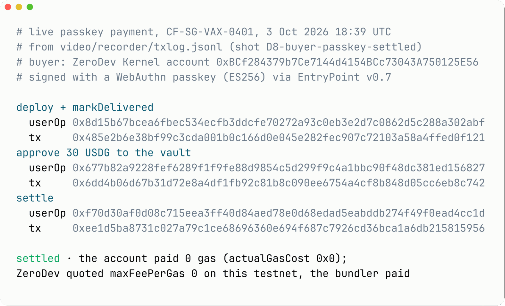</p>

| User operation | Bundled in transaction |
|---|---|
| Deploy the account + `markDelivered` · `0x8d15b67bcea6fbec534ecfb3ddcfe70272a93c0eb3e2d7c0862d5c288a302abf` | [`0x485e2b6e…ed0f121`](https://explorer.testnet.chain.robinhood.com/tx/0x485e2b6e38bf99c3cda001b0c166d0e045e282fec907c72103a58a4ffed0f121) |
| `approve` 30 USDG to the vault · `0x677b82a9228fef6289f1f9fe88d9854c5d299f9c4a1bbc90f48dc381ed156827` | [`0x6dd4b06d…6eb8c742`](https://explorer.testnet.chain.robinhood.com/tx/0x6dd4b06d67b31d72e8a4df1fb92c81b8c090ee6754a4cf8b848d05cc6eb8c742) |
| `settle` · `0xf70d30af0d08c715eea3ff40d84aed78e0d68edad5eabddb274f49f0ead4cc1d` | [`0xee1d5ba8…215815956`](https://explorer.testnet.chain.robinhood.com/tx/0xee1d5ba8731c027a79c1ce68696360e694f687c7926cd36bca1a6db215815956) |

The facility was set up by script with real transactions (register
[`0x997d619b…`](https://explorer.testnet.chain.robinhood.com/tx/0x997d619bf781de920cba145f5defbeb51271c3b9566175ccc9ad1df3e59df8e9),
deposit [`0x3cae0f60…`](https://explorer.testnet.chain.robinhood.com/tx/0x3cae0f60aefd49421f600124ffdf50a735a798001bebb570e5f20d486ae23c8e),
five releases ending [`0xac61d410…`](https://explorer.testnet.chain.robinhood.com/tx/0xac61d41015db36c14ad5de2f396571114f46376eae4017c3bc3d11cd4f21278e)).
**Gas, honestly:** the smart account paid nothing and holds no ETH, but not because of CargoFlow's paymaster: on this
testnet ZeroDev quotes a zero gas price, so the bundler
([`0x21196F1D…6AD7`](https://explorer.testnet.chain.robinhood.com/address/0x21196F1DAbA498D64EB31423D392EF3ccE546AD7))
paid the chain fee for the `handleOps` transactions. CargoFlow's own sponsorship policy webhook is built and tested
([ZeroDev gas policy](backend/README.md#zerodev-gas-policy)) but did not pay for these operations.

### The v3 reference run: `CF-LIVE-1791029236301`

`CF-LIVE-1791029236301` went from registration to settlement on the v3 contracts through the hosted API, each step
signed by the party's own key ([dashboard](https://cargoflow.adoranto737.workers.dev/track/0xc57490f8b1f0190b00197db978963899f55314865c0059eddaf8cfecdc8ff9e5)).
Every evidence epoch also recorded its source device in the `EvidenceRegistry`, and the gateway key was registered
in the `DeviceRegistry`.

| Step | Transaction |
|---|---|
| Exporter registers the shipment | [`0x83665f92…ad1ec2`](https://explorer.testnet.chain.robinhood.com/tx/0x83665f924c0ed6639e6a39fa1e3642d02e516664498ae28fb533507244ad1ec2) |
| Exporter reveals the policy (v3: humidity and shock limits) | [`0x0706fc0b…476c39`](https://explorer.testnet.chain.robinhood.com/tx/0x0706fc0bbe6781fb37fa73c99fd8c4e7bb3b9e12c924dc812e7b6636eb476c39) |
| Exporter opens the facility (5 x 4 USDG) | [`0x9b987b0d…07c1c45`](https://explorer.testnet.chain.robinhood.com/tx/0x9b987b0dd54a1aea8f91c54a109f5d3ca9391180472b5112fb704fade07c1c45) |
| Financier approves and deposits 20 USDG | [`0x4558a691…11dd26af`](https://explorer.testnet.chain.robinhood.com/tx/0x4558a69147fe4055518282c14027eeb97a59d3e3450214d3ba37a99811dd26af), [`0x035ed8b4…dc70d6cccd`](https://explorer.testnet.chain.robinhood.com/tx/0x035ed8b43aba8fffa439e59c50b69afa5e968a88e311f3643caf14dc70d6cccd) |
| Transit starts | [`0x4e99c463…483a282ed`](https://explorer.testnet.chain.robinhood.com/tx/0x4e99c463e4cec7b9c93bc3cc347c40bd17f1bffa67ec8af33ffc183483a282ed) |
| Milestones 1 and 2 release; the reefer fails and milestone 3 pauses the facility | [`0xde8924f9…f45833`](https://explorer.testnet.chain.robinhood.com/tx/0xde8924f96a7b5524b101364af5cb02430e9aa5f00beab6ff2457414291f45833), [`0xedb95631…ac3bb`](https://explorer.testnet.chain.robinhood.com/tx/0xedb95631e40b2e1c00a6be6c7a9c097093419b16c0d2d8247e0a7b943c7ac3bb), pause [`0xadd2c2f7…c8a9890`](https://explorer.testnet.chain.robinhood.com/tx/0xadd2c2f7dffde96677d1abb09be0e0f27216be907961ff6c6d3b11ea6c8a9890) |
| Recovery epoch committed | [`0xd65853ad…a1dd9876fe`](https://explorer.testnet.chain.robinhood.com/tx/0xd65853ad2c568ce68cc60e5cac97bce1939fdea679b3019aaaa507a1dd9876fe) |
| Exporter resumes with a Groth16 proof | [`0xadfe3b2f…1f503a9f52`](https://explorer.testnet.chain.robinhood.com/tx/0xadfe3b2fa8c89d30f847232b35009373b3d4163dc75b321d6490631f503a9f52) |
| Milestone 3 released, then 4 and 5 | [`0x920eb0b2…ac56380aa`](https://explorer.testnet.chain.robinhood.com/tx/0x920eb0b2319160aed02da939a2a18e5f059d52a3532a078a5325188ac56380aa), [`0x3449054c…b849f`](https://explorer.testnet.chain.robinhood.com/tx/0x3449054cb79bf9bb35690a99682a38b3eea4da5a3f4af1538d5248d51bcb849f), [`0xa23c6084…74167`](https://explorer.testnet.chain.robinhood.com/tx/0xa23c6084fea90c282b73db34843e12706ac5f4dfb4997927cbaea2c619b74167) |
| Buyer confirms delivery | [`0x7203cbe9…d933147990`](https://explorer.testnet.chain.robinhood.com/tx/0x7203cbe9751386d954e22b4f854c06081cbcdc1b4dc888da37f409d933147990) |
| Buyer approves and pays the invoice; waterfall settles | [`0xa6fe0fb0…aed40aa28`](https://explorer.testnet.chain.robinhood.com/tx/0xa6fe0fb004a6ed7afec187a7f2d21b4ce982346df76fde68ed9e1faaed40aa28), [`0x37571b49…cf4e365a35`](https://explorer.testnet.chain.robinhood.com/tx/0x37571b49186b43f2f02df4d2034cd495ac7095766d113c20060cdecf4e365a35) |

### A real user run through the hosted API

The real-user flows are checked live by `frontend/scripts/testnet-lifecycle.ts`, which drives one shipment from
registration to settlement through the hosted API with each party's own key: wallet-authorized logger, signed
readings, two releases, an excursion that pauses the facility, the exporter's zero-knowledge recovery, the remaining
releases, delivery and payment. Its run on v1 settled `CF-LIVE-1790936950736`
([dashboard](https://cargoflow.adoranto737.workers.dev/track/0x5a9082d1854c1cc3e5fcf8aa1ebc3a3560495e03ee7d00110baf256fe9b49d61),
[proof submitted by the exporter](https://explorer.testnet.chain.robinhood.com/tx/0xc582417abd0ce8498bab0fa4937b0a8ec8dbfbe19c47646f79646fa70ede1a82),
[invoice paid](https://explorer.testnet.chain.robinhood.com/tx/0x78984fdfcefd2fa792c7170fff94b1f4b482986e96fad29193ff450251605041)).
Its output (hashes shortened, long lines wrapped; full hashes are in the links above):

<p align="center"></p>

### History: the v1 deployment and its complete facility, transaction by transaction

Still on chain.

| Contract | Address |
|---|---|
| CargoFlowAccess | [`0x5Ed4f105E3c3C0a67f916c0fc339B261E3De81d7`](https://explorer.testnet.chain.robinhood.com/address/0x5Ed4f105E3c3C0a67f916c0fc339B261E3De81d7) |
| ShipmentRegistry | [`0x2f7cAc603654eC106dA242cD0b16044b31f7608d`](https://explorer.testnet.chain.robinhood.com/address/0x2f7cAc603654eC106dA242cD0b16044b31f7608d) |
| PolicyEngine | [`0x93f2cd67f404f62Ff34F729aad1118ea9e1582d0`](https://explorer.testnet.chain.robinhood.com/address/0x93f2cd67f404f62Ff34F729aad1118ea9e1582d0) |
| EvidenceRegistry | [`0x4aD47799586B4793b7952BA849013F5D0eC2e66a`](https://explorer.testnet.chain.robinhood.com/address/0x4aD47799586B4793b7952BA849013F5D0eC2e66a) |
| ReceivableVault | [`0x5298dCdBDf6EC799475B09c2Ecd0f089bD4D6902`](https://explorer.testnet.chain.robinhood.com/address/0x5298dCdBDf6EC799475B09c2Ecd0f089bD4D6902) |
| FinancingController | [`0xA2E708376CDDf0eb8fa746c43089611B4d49E210`](https://explorer.testnet.chain.robinhood.com/address/0xA2E708376CDDf0eb8fa746c43089611B4d49E210) |
| Groth16Verifier | [`0x1BAa24a99A9Fe8Cd53feB30E5dF098D1334E0a8D`](https://explorer.testnet.chain.robinhood.com/address/0x1BAa24a99A9Fe8Cd53feB30E5dF098D1334E0a8D) |

Manifest: [`contracts/deployments/robinhood-testnet-v1.json`](contracts/deployments/robinhood-testnet-v1.json).

A shipment from Nhava Sheva to Singapore financed with real testnet USDG: funding, two releases, a thermal
excursion that paused the facility, a **Groth16 proof verified on-chain** that resumed it, the remaining releases,
delivery and settlement through the waterfall. 22 transactions in 116 seconds, run at 1/2000 scale (a 20 USDG
facility against a 50 USDG invoice) because the faucet supplies 100 USDG. The full run is in the
[testnet runbook](docs/runbooks/testnet.md#the-hero-run-on-the-public-testnet-done).

| Step | Call | Transaction |
|---|---|---|
| Exporter registers the shipment | `registerShipment` | [`0x14391e95…cbe8fb`](https://explorer.testnet.chain.robinhood.com/tx/0x14391e958a37b803414b85a786640ae1fea3ea00c1087f30e3f2b1179bcbe8fb) |
| Exporter reveals the policy | `setPolicy` | [`0xec329edc…d52c35`](https://explorer.testnet.chain.robinhood.com/tx/0xec329edc96cc3c1f581086d8df5899721ace9fbccaaf4cba30cd9c2590d52c35) |
| Exporter opens the facility (5 x 4 USDG) | `createFacility` | [`0xc4229a4c…934362`](https://explorer.testnet.chain.robinhood.com/tx/0xc4229a4cd45811bba380eb080bb5ef5bd6b4182d969b1368414e4bd13d934362) |
| Financier approves the vault | `approve` | [`0xe06e9a84…f8a13c`](https://explorer.testnet.chain.robinhood.com/tx/0xe06e9a84c5135f471a1e962437994578dbba166961a0649602365cb579f8a13c) |
| Financier deposits 20 USDG | `depositCapital` | [`0x7a89490c…151ed7`](https://explorer.testnet.chain.robinhood.com/tx/0x7a89490cb7931b37feca36171051756c1bd4051f6d0edf0664a9f367a9151ed7) |
| Transit starts | `startTransit` | [`0x3b4026c0…4ae82a`](https://explorer.testnet.chain.robinhood.com/tx/0x3b4026c08d9f894731f6f0834d05ea578402c1ed9bf7186aa0d2d8dbf44ae82a) |
| Milestone 1 evidence committed | `commitEpoch` | [`0x1c59e560…886d83`](https://explorer.testnet.chain.robinhood.com/tx/0x1c59e560088dac3d51ce9034d4660e29248f5aa44fc02832e5da4e9cc2886d83) |
| Milestone 1 released (4 USDG) | `evaluateAndReleaseMilestone` | [`0xe445c731…985b84`](https://explorer.testnet.chain.robinhood.com/tx/0xe445c731baf8cffe7bdd8135d0e62e661c8c36359937bae3e1391a0f0b985b84) |
| Milestone 2 evidence committed | `commitEpoch` | [`0x00282b84…5e48e5`](https://explorer.testnet.chain.robinhood.com/tx/0x00282b84c41b9af9b96c97563ac64282b8b76e477517b4d5283998ed975e48e5) |
| Milestone 2 released (4 USDG) | `evaluateAndReleaseMilestone` | [`0x9732bccd…8281a4`](https://explorer.testnet.chain.robinhood.com/tx/0x9732bccd25d596deee00f41cdc9c022f038cab9b6fc45461e78d5eeda38281a4) |
| Anomaly: facility paused | `pauseFinancing` | [`0x6e324ebc…e50ccb`](https://explorer.testnet.chain.robinhood.com/tx/0x6e324ebc5a6f17724819ce6456a2d1b89f97dbb7d489a602aa98750055e50ccb) |
| Anomaly evidence committed (fails policy) | `commitEpoch` | [`0x80307e0f…d6b51f`](https://explorer.testnet.chain.robinhood.com/tx/0x80307e0f56c86eb0b77e04bbd98cbcd4247a13997df72ade11577c9283d6b51f) |
| Recovery evidence committed (core probe) | `commitEpoch` | [`0xeac18019…9b16b7`](https://explorer.testnet.chain.robinhood.com/tx/0xeac180198e196e79f2e0393995aa356ceb43c9f1147706c06ab289b0f89b16b7) |
| Facility resumed by Groth16 proof | `resumeWithProof` | [`0x3910c2a5…31a3e1`](https://explorer.testnet.chain.robinhood.com/tx/0x3910c2a5c191be43985e0a683e4fdc52a02af8d2f9b4d49749afbf79a131a3e1) |
| Milestone 3 released | `evaluateAndReleaseMilestone` | [`0xd68c70c7…71e11d`](https://explorer.testnet.chain.robinhood.com/tx/0xd68c70c7cf0581125fb381446b3855b980c7e27fa5fb68654bd973988b71e11d) |
| Milestone 4 evidence committed | `commitEpoch` | [`0x3bae0d30…195e47`](https://explorer.testnet.chain.robinhood.com/tx/0x3bae0d30318bd7acc8ef48ff4fc212ec78cc18ccf1b10afd118744c218195e47) |
| Milestone 4 released | `evaluateAndReleaseMilestone` | [`0x7fff78cb…b63b50`](https://explorer.testnet.chain.robinhood.com/tx/0x7fff78cb438b256cdedcc1f9f14c480d2336bf6972613e4c63120bac26b63b50) |
| Milestone 5 evidence committed | `commitEpoch` | [`0xdaca4d5d…d67e46`](https://explorer.testnet.chain.robinhood.com/tx/0xdaca4d5d9a5da85ac17c052338ae56080232a7c8c3fe4a6a3ec1d78ed2d67e46) |
| Milestone 5 released | `evaluateAndReleaseMilestone` | [`0x72aa29d6…090298`](https://explorer.testnet.chain.robinhood.com/tx/0x72aa29d6b7915f7857c89b6c49e8c367de16d048663c73e11bc38ff28f090298) |
| Buyer confirms delivery | `markDelivered` | [`0x908478b8…392c0d`](https://explorer.testnet.chain.robinhood.com/tx/0x908478b8dcd8a609a6c9790b54dc8b988bb17e0f47dccdf8b888198e05392c0d) |
| Buyer approves the vault | `approve` | [`0x1c13af60…5ed95c`](https://explorer.testnet.chain.robinhood.com/tx/0x1c13af606bf529b8e4fba252ac09899289197d809817ef7e779a804da65ed95c) |
| Buyer pays the invoice; waterfall settles | `settle` | [`0xcb11761c…b5bd6c`](https://explorer.testnet.chain.robinhood.com/tx/0xcb11761ca1c1b6b302c15ee27de0090b5c379034c28e621cf3cf9563b2b5bd6c) |

Result, read back from the chain: the exporter received **49.4 USDG** (20 advanced in tranches + 29.4 residual), the
financier **20.6 USDG** (20 principal + 0.6 fee), and the vault ended empty.

## Under the hood

### Evidence engine

Readings are validated and aligned into time buckets; each sensor contributes a mass over {physically fine, violated,
unknown}, and Dempster-Shafer combines them per bucket while recording the worst conflict between sources. Seven
capped penalties (physical, conflict, freshness, route, source reliability, fraud, coverage) turn that into a 0-100
score with a published formula. Conflict is taken at the worst step, not averaged, so a short excursion cannot be
averaged away. Eight readings close an epoch whose salted Poseidon Merkle root is committed on-chain with the score,
conflict and risk; the readings stay in Postgres. The controller releases only if the committed epoch satisfies the
on-chain policy, whatever the backend asked for.
Details: [the evidence score](backend/README.md#the-evidence-score), [`docs/project/07-evidence-engine.md`](docs/project/07-evidence-engine.md).

### Zero-knowledge recovery

After a pause, a Groth16 proof shows that eight readings of the unaffected probe, committed after the pause, lie
inside the policy band, without revealing any of them. The contract derives every public signal itself, and the proof
is bound to the chain, verifier, controller, shipment, epoch, policy, submitter and pause count, so it cannot be
replayed against another facility or another pause. The circuit has 13,494 constraints and proves in about a second;
`resumeWithProof` costs about 0.25 M gas on-chain. Recovery is automatic: the proof is prepared as soon as a probe has
eight fresh in-range readings and the exporter is notified (in-app, Telegram, email, Slack, webhook) to sign once.
Details: [commitments](backend/README.md#commitments-the-contract-with-the-circuit), [automatic ZK recovery](backend/README.md#automatic-zk-recovery), [`docs/project/08-zk-and-privacy.md`](docs/project/08-zk-and-privacy.md).

### AI monitor

A language model (Groq, OpenAI-compatible API, default `openai/gpt-oss-20b`) reviews every evaluated epoch and returns
a strictly parsed, schema-checked assessment. It is advisory: it may only ask for a stricter outcome (secondary proof
or a pause) when policy passed, and only above a confidence threshold. Pause is its only possible on-chain effect,
through a monitor key that holds no other role. It is given integers, booleans and enum members, never telemetry-derived
text, and any timeout, error or invalid reply falls back to the deterministic policy gate.
Details: [the AI monitor](backend/README.md#ai-monitor), [`docs/project/09-ai-monitoring.md`](docs/project/09-ai-monitoring.md).

### Disputes and defaults

The exporter, the financier or the arbiter can open a dispute on an active or paused facility, which freezes releases.
Only a wallet with the on-chain dispute role can resolve it, either resuming the facility or declaring a default; the
same role can resume a paused facility on a verified basis or mark a paused or delivered facility as defaulted. On
default the vault returns any undrawn USDG to the financier. The arbiter can never release a tranche, and every decision
is a transaction with a hashed reference.
Details: [facility state machine](docs/architecture.md#facility-state-machine), [`docs/project/05-roles-and-workflows.md`](docs/project/05-roles-and-workflows.md).

### Contracts v3: title, devices, parametric cover

- **Electronic bill of lading.** A carrier issues one ERC-721 token per bill (document hash, shipper, consignee,
  possession history). Bound to a facility, the bill is held by the controller and moves under documents against
  payment: to the buyer in the same transaction as their payment, to the financier on default, back to the exporter
  on cancel. Designed around MLETR concepts (exclusive control, singularity, integrity); not a legal compliance claim.
- **Device trust.** Gateways sign with Ed25519, P-256 keys in secure elements (X.509 chain checked against
  manufacturer roots) or WebAuthn passkeys, so a phone can be a signed inspection device. The device class weights
  source reliability (software key 95%, passkey 97%, secure element 99%), and every epoch records on chain which
  devices fed it.
- **Parametric cover.** An insurer's cover can pay out after N consecutive failed epochs, proven from the
  `EvidenceRegistry`'s commit order: the financier's drawn principal plus a salvage amount to the exporter.
- **Place-based milestones, humidity and shock limits, default cover** (from v2), a **cancel path** for facilities
  that never started, and an OpenZeppelin `Pausable` brake that can stop new risk only: settlement, delivery,
  payouts and refunds can never be paused.
- **Platform services.** Automatic ZK recovery, in-app, Telegram, email, Slack and webhook notifications, GS1 EPCIS 2.0
  export and import, risk-adjusted fee guidance, a financing market, settlement certificates, and RPC failover
  (QuickNode, Alchemy, public RPC).

## For developers

### Try it locally in five commands

Needs Foundry, Go 1.26, Node 20+, Postgres and [circom](https://docs.circom.io/getting-started/installation/).

```bash
make anvil &                                         # a local chain
make deploy-local                                    # contracts + a mock USDG
createdb cargoflow
ENV_FILE=.env.local.example make serve &             # API + indexer + evidence pipeline
ENV_FILE=.env.local.example make demo ARGS="-mint -pace 2s"   # the whole story, real transactions, numbers checked
```

The same `make demo` runs against the public testnet (`ARGS="-divisor 2000"` fits a 100 USDG faucet drip).

Then open the web app and use it as each party with your own wallets:

```bash
cd frontend && cp .env.example .env.local && sed -i 's#8080#8787#' .env.local && pnpm install && pnpm dev
```

### Developer platform

| Piece | What it gives you |
|---|---|
| [API reference](https://cargoflow.adoranto737.workers.dev/docs) | OpenAPI 3.1 generated from the Go route table (a test fails if a route is undocumented), with every wallet-signed message format |
| [`@cargoflow/sdk`](https://www.npmjs.com/package/@cargoflow/sdk) · `npm i @cargoflow/sdk` · [source](packages/sdk) | Typed client for every endpoint, ABIs, `prepare*` transaction builders for any wallet, gateway signing, CSV parsing, Merkle proof checks |
| [`@cargoflow/mcp`](https://www.npmjs.com/package/@cargoflow/mcp) · `npx -y @cargoflow/mcp` · [source](packages/mcp) | The MCP server above, also runnable locally over stdio |
| [`@cargoflow/gateway`](https://www.npmjs.com/package/@cargoflow/gateway) · `npm i -g @cargoflow/gateway` · [source](packages/gateway) | `cargoflow-gateway watch <folder>`: signs and sends logger exports with an offline queue; USB and serial modes; systemd unit and Docker image |
| [`cargoflow` (Python)](https://pypi.org/project/cargoflow/) · `pip install cargoflow` · [source](packages/python) | Pandas or polars frames, portfolio exposure, excursion and conflict statistics, a seeded Monte Carlo of default and recovery, example notebooks |

<table>
  <tr>
    <td width="33%" valign="top"><a href="https://cargoflow.adoranto737.workers.dev/developers">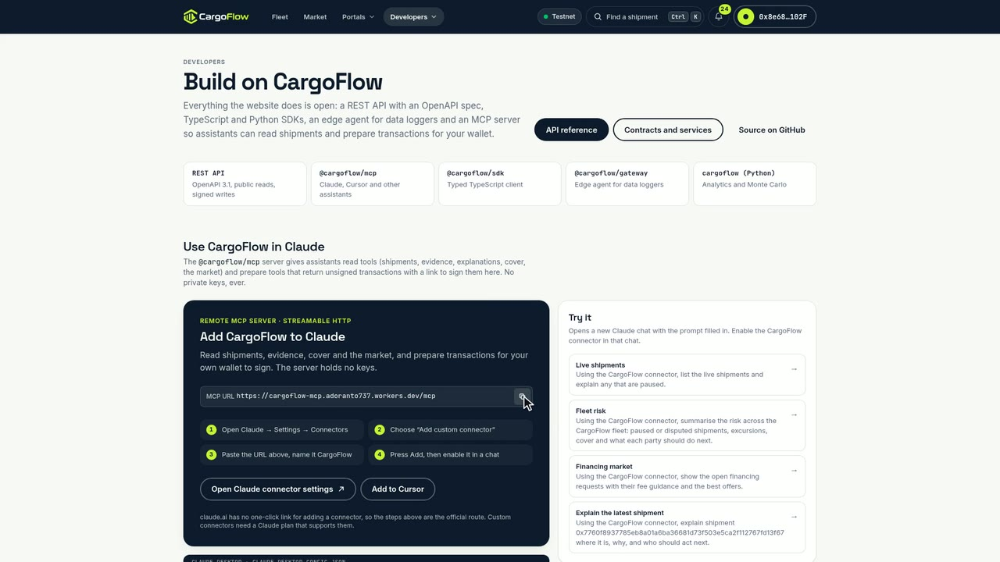</a><br><b>/developers</b>: MCP URL with a copy button, starter prompts, every package.</td>
    <td width="33%" valign="top"><a href="https://cargoflow.adoranto737.workers.dev/docs">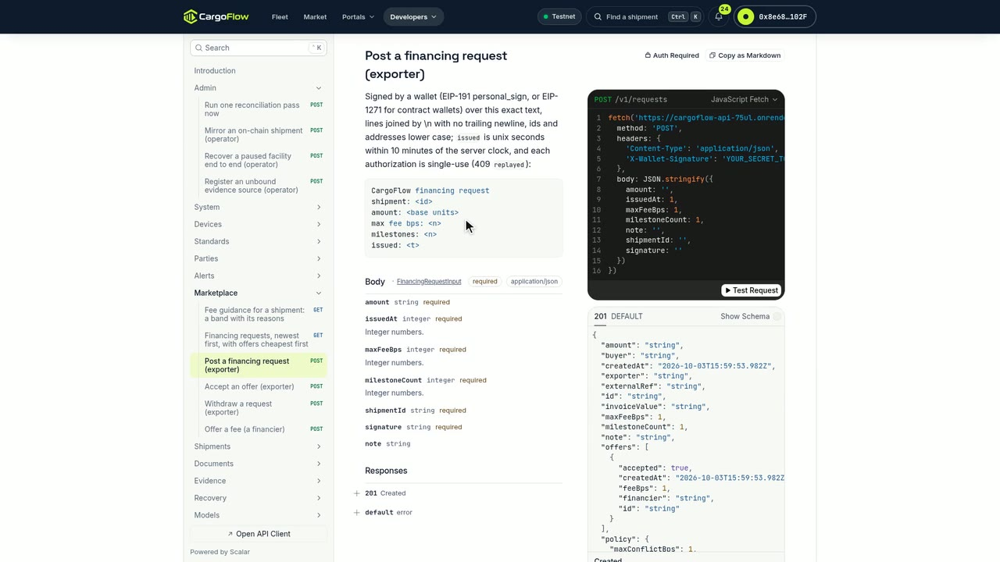</a><br><b>/docs</b>: the OpenAPI 3.1 reference, with each wallet-signed message format.</td>
    <td width="33%" valign="top"><a href="https://cargoflow.adoranto737.workers.dev/deployments">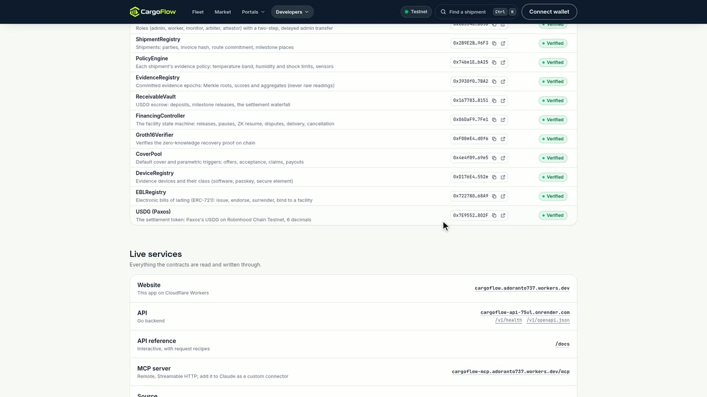</a><br><b>/deployments</b>: every contract and service, verified, with copy buttons.</td>
  </tr>
</table>

All four packages are published: [`@cargoflow/sdk`](https://www.npmjs.com/package/@cargoflow/sdk),
[`@cargoflow/mcp`](https://www.npmjs.com/package/@cargoflow/mcp) and [`@cargoflow/gateway`](https://www.npmjs.com/package/@cargoflow/gateway)
on npm, and [`cargoflow`](https://pypi.org/project/cargoflow/) on PyPI.

```bash
npm i @cargoflow/sdk                 # TypeScript client, ABIs, unsigned transaction builders
npx -y @cargoflow/mcp                # local MCP server over stdio (25 tools)
npm i -g @cargoflow/gateway          # data-logger edge agent: cargoflow-gateway watch <folder>
pip install cargoflow                # Python analytics
```

<p align="center"><b>TypeScript SDK</b><br>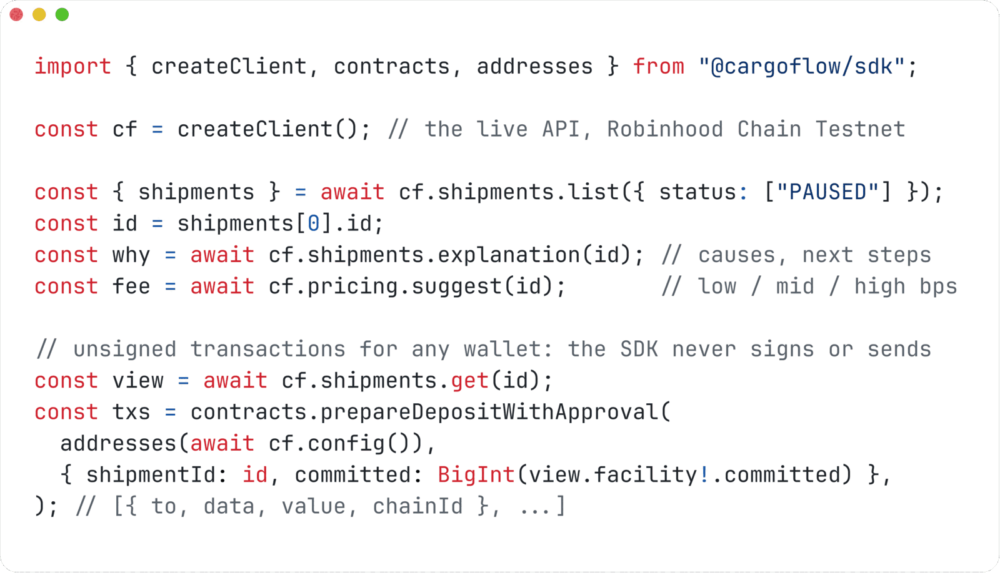</p>

<p align="center"><b>Gateway agent</b><br>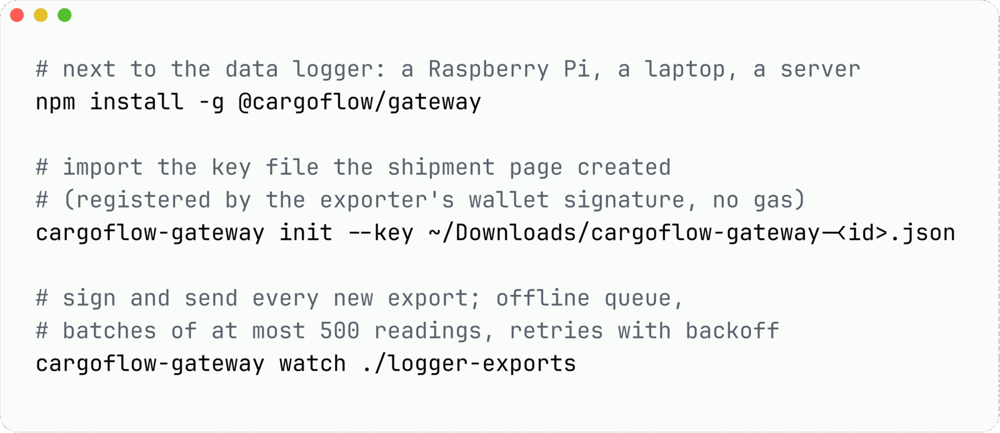</p>

<p align="center"><b>Python analytics</b><br>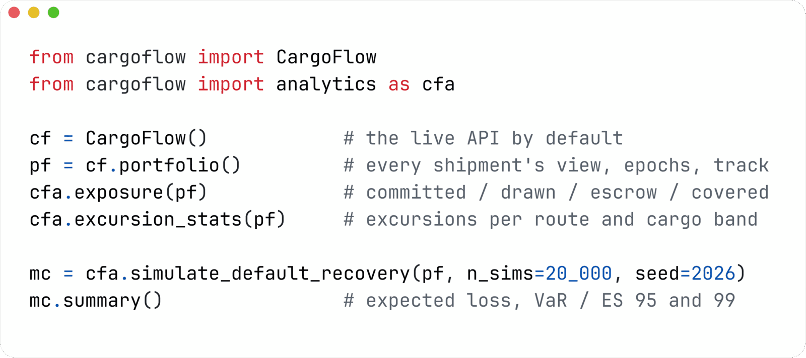</p>

<p align="center"><b>A signed telemetry request</b><br>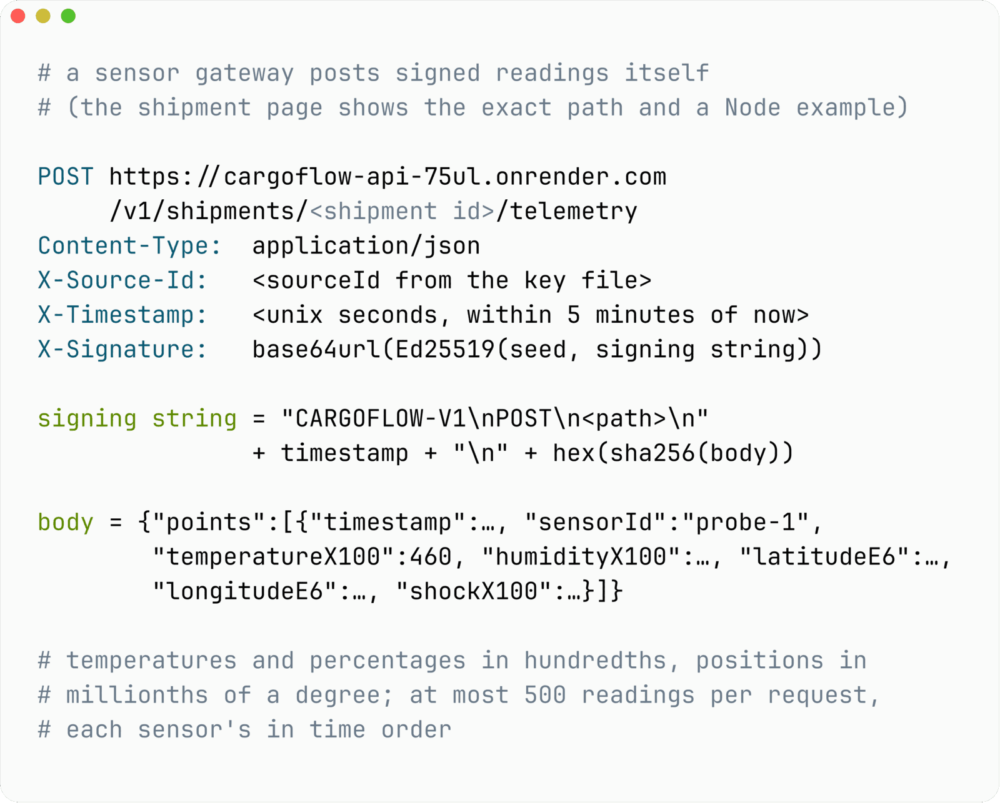</p>

A sensor gateway is an Ed25519 device key that the exporter authorizes with a wallet signature (no gas). It can upload a
data logger's CSV from the shipment page, or post readings itself, each request signed as above (the shipment page
shows the exact path and a complete Node example). The REST and WebSocket API, configuration, startup safety checks
and operational guarantees are in [`backend/README.md`](backend/README.md#api).

### The web app

Next.js 16 with wagmi and viem. Browser wallets, WalletConnect and ZeroDev passkey accounts are supported; every action
is a transaction the user signs.

| Page | Purpose |
|---|---|
| [`/`](https://cargoflow.adoranto737.workers.dev) | Track any shipment by id or reference, start financing, verify a committed evidence epoch |
| `/track/{id or reference}` | The live shipment: route, milestones, temperature per epoch against the agreed band, evidence score, sensor conflict and risk, escrow, AI monitor, zero-knowledge recovery, title, full audit trail with explorer links |
| [`/shipments`](https://cargoflow.adoranto737.workers.dev/shipments) | Every shipment: status tabs, search, sort, a wallet's own shipments, container details |
| [`/exporter`](https://cargoflow.adoranto737.workers.dev/exporter) | Register a shipment, set the cold-chain policy, open the facility or request financing from the market |
| [`/financier`](https://cargoflow.adoranto737.workers.dev/financier) | Fund facilities that name your wallet; exposure and settlement projection |
| [`/buyer`](https://cargoflow.adoranto737.workers.dev/buyer) | Confirm delivery and pay the invoice |
| [`/ebl`](https://cargoflow.adoranto737.workers.dev/ebl) | Issue, view and bind electronic bills of lading |
| [`/market`](https://cargoflow.adoranto737.workers.dev/market) | Financing requests, offers and fee guidance |
| [`/arbiter`](https://cargoflow.adoranto737.workers.dev/arbiter) | Dispute resolution for the dispute-role wallet |
| [`/developers`](https://cargoflow.adoranto737.workers.dev/developers), [`/docs`](https://cargoflow.adoranto737.workers.dev/docs), [`/deployments`](https://cargoflow.adoranto737.workers.dev/deployments) | MCP setup, SDKs, API reference, every address |

Tested by unit tests and Playwright tests that run the whole lifecycle in a real browser, through wallets, against
a real chain, with axe accessibility checks on every page. See [`frontend/README.md`](frontend/README.md).

### Deployment

| Piece | Where | How |
|---|---|---|
| Web app | Cloudflare Workers | Built with OpenNext and deployed with Wrangler: `cd frontend && pnpm cf:deploy` (config in [`frontend/wrangler.jsonc`](frontend/wrangler.jsonc); `NEXT_PUBLIC_API_URL` is compiled into the bundle) |
| API, indexer, evidence pipeline, prover | Render (Docker) | [`infra/docker/backend.Dockerfile`](infra/docker/backend.Dockerfile): the Go binary plus the compiled circuit and snarkjs prover; serves on port 8080 with a `/v1/health` check |
| Contracts | Robinhood Chain Testnet | `make testnet-deploy` (dry run), `BROADCAST=1 make testnet-deploy`, then `make testnet-verify`; see the [testnet runbook](docs/runbooks/testnet.md) |
| Remote MCP server | Cloudflare Workers | `cd packages/mcp && pnpm deploy:worker` |
| Database | Neon Postgres | migrations run on start |

## Sponsor and partner integrations

<p align="center"></p>

| Partner | How CargoFlow uses it | Status | Where |
|---|---|---|---|
| **Robinhood Chain** | All core contracts, settlement and evidence commitments live on Robinhood Chain Testnet (46630); the RIP-7212 P-256 precompile makes passkey signatures cheap | live | [`contracts/`](contracts) |
| **Paxos USDG** | Escrow, tranche releases, invoice payment and cover are real testnet USDG | live | `0x7E95…802F` |
| **ZeroDev** | Passkey smart accounts (Kernel v3.1, WebAuthn validator) for buyers, exporters and arbiters; a live passkey account confirmed delivery and paid an invoice through three user operations. A CargoFlow-controlled policy webhook that sponsors only CargoFlow contract calls, with per-wallet daily caps, is built and tested; on this testnet the operations so far cost nothing because ZeroDev quotes a zero gas price | accounts live; own paymaster not yet exercised | [`frontend/src/lib/passkey`](frontend/src/lib/passkey), [`backend/internal/sponsor`](backend/internal/sponsor) |
| **Alchemy** | Third-tier RPC failover and a signed webhook endpoint that wakes the indexer within about a second (the payload is never trusted; logs are re-read from the chain) | RPC live; webhook created once the auth token is supplied | [`backend/internal/api/webhooks.go`](backend/internal/api/webhooks.go), [`backend/cmd/alchemy-webhook`](backend/cmd/alchemy-webhook) |
| **QuickNode** | Primary RPC for the backend | live | `RPC_URL` |
| **OpenZeppelin** | v5.4: `AccessControlDefaultAdminRules`, `SafeERC20`, `ReentrancyGuard`, `Pausable`, `ERC721`, `Math` | live | [dependency matrix](docs/architecture.md#openzeppelin-dependency-matrix-v540-vendored) |
| **Dune** | Queries for volume and escrow, pause and recovery rates, and lender yield, plus a backend uploader that pushes indexed events, shipments and epochs to Dune tables every 15 minutes | built and tested; the account plan does not allow API uploads yet | [`analytics/dune`](analytics/dune), [`backend/internal/dune`](backend/internal/dune) |
| **Fhenix** | `ConfidentialInvoiceTerms` keeps the invoice margin and penalty schedule encrypted and computes the penalty under FHE; complements the ZK proof, which protects the readings | deployed, Arbitrum Sepolia | [`contracts/confidential`](contracts/confidential), [ZK and FHE](docs/project/08-zk-and-privacy.md) |
| **GMX** | `GMXHedgeVault` lets a financier hedge price exposure with their own collateral on GMX v2; escrowed USDG is never moved into a leveraged position | deployed, Arbitrum Sepolia | [`contracts/hedge`](contracts/hedge) |

Details, status and limits for each: [`docs/sponsors/README.md`](docs/sponsors/README.md).

## Measured, not claimed

<p align="center">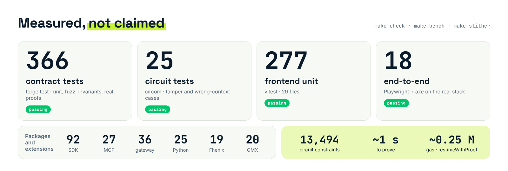</p>

| | |
|---|---|
| Contract tests | 366 (unit, fuzz, invariants, real-proof integration, smart-account callers, circuit breaker); Fhenix extension 19, GMX extension 20 including a fork test that places and cancels a real GMX order |
| Frontend | 296 unit tests; 18 Playwright end-to-end and accessibility tests on the real stack, including one shipment from registration to settlement through wallets and logger CSVs |
| Backend | Every Go package passes (devices, EPCIS validated against the official 2.0.1 schema, webhooks, sponsorship policy, Dune uploader); integration tests run a real anvil chain and Postgres; the end-to-end test drives the full story through the running service |
| Circuit | 13,494 constraints; proves in about 1 s; 25 tests including tamper and wrong-context cases |
| ZK resume on-chain | ~0.25 M gas (real Groth16 verification) |
| Stylus vs Solidity (optional engine) | 128-reading epoch fusion: 611,945 vs 31,511 gas on Arbitrum Sepolia (19x; 32x cached); [method and caveats](stylus/README.md) |
| Packages | SDK 92, MCP 27, gateway 36, Python 25 tests |
| Static analysis | Slither triaged: [`docs/security/slither-triage.md`](docs/security/slither-triage.md), [v3](docs/security/slither-v3.md) |

### The JavaScript suites, re-run for this README

Re-run on 4 October 2026.

<p align="center">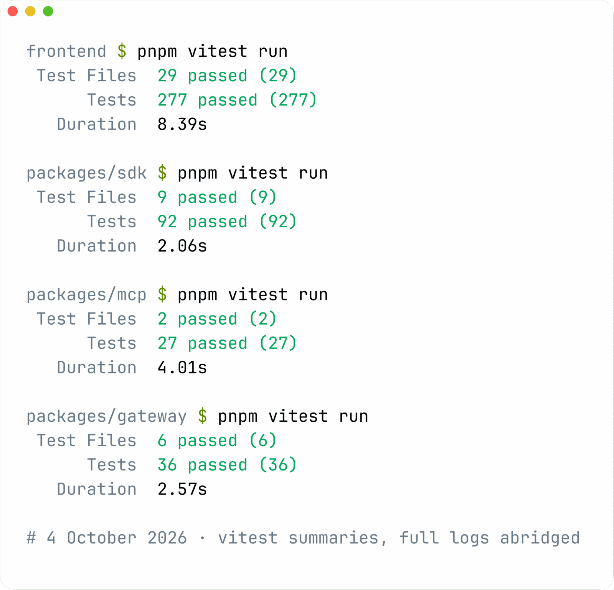</p>

Every figure is reproducible with `make check`, `make bench` and `make slither`; method and caveats are in
[`docs/benchmarks.md`](docs/benchmarks.md).

## Security and honest limits

Report vulnerabilities as described in [`SECURITY.md`](SECURITY.md). The threat model is in
[`docs/project/16-security-threat-model.md`](docs/project/16-security-threat-model.md) and the trust boundaries in
[`docs/architecture.md`](docs/architecture.md#trust-boundaries).

### Honest limits

- Testnet only. No audit. USDG here has no value.
- The Groth16 setup is single-party: it must be replaced by a public ceremony before any real use.
- Telemetry in the demo runs is simulated (signed readings from generated logger CSVs). Secure-element (P-256 with
  X.509) and passkey device paths are implemented and tested with test certificates, but no physical secure-element
  board has been run end to end.
- Passkey gas: the live passkey payment cost the account nothing because ZeroDev quotes a zero gas price on this
  testnet and its bundler paid the chain fee; CargoFlow's own sponsorship webhook (paymaster policy) is built and
  tested but has not paid for a live operation yet.
- Alchemy: the RPC tier is live; the indexer webhook is deployed but created only once the Alchemy auth token is
  supplied.
- Dune: the queries and the uploader are built and tested, but the current Dune plan does not allow API uploads, so
  the public tables are not live yet.
- Vendor logger presets in the gateway (Sensitech, Elitech, ELPRO) are marked experimental until checked against real exports.
- The AI monitor's score weights and thresholds are design parameters, not statistically calibrated.
- The electronic bill of lading is designed around MLETR concepts; it is not a claim of legal recognition.
- One backend instance per database; recovery proving runs inside the HTTP request.

What would change for production, and what comes next, is in the
[architecture notes](docs/architecture.md#what-would-change-for-production), the
[roadmap](docs/superpowers/plans/2026-09-30-cargoflow-roadmap.md) and the
[advanced roadmap](docs/project/22-advanced-roadmap.md).

## Demo video

<p align="center"><a href="https://github.com/LSUDOKO/CargoFlow/releases/download/v1.0.0/CargoFlow-v2-1080p.mp4"></a></p>

<p align="center"><b><a href="https://github.com/LSUDOKO/CargoFlow/releases/download/v1.0.0/CargoFlow-v2-1080p.mp4">▶ Watch the film (5:30, 1080p, MP4)</a></b> · <a href="https://github.com/LSUDOKO/CargoFlow/releases/download/v1.0.0/CargoFlow-v2.srt">captions (SRT)</a> · <a href="https://github.com/LSUDOKO/CargoFlow/releases/tag/v1.0.0">release v1.0.0</a></p>

A 5.5-minute film that tells this README's story: Meera, Daniel and Wei Lin; the real source pages; the twelve
mechanisms animated with the same characters; the live website recorded end to end (`CF-SG-VAX-0202`, with the passkey
payment on `CF-SG-VAX-0401`); the Telegram alerts recorded on a phone; CargoFlow inside claude.ai; the developer
platform; the sponsors; and the proof on chain. It is built in code with Remotion from [`video/`](video)
([script](video/SCRIPT-v2.md)); every GIF in this README is a frame range of it.

## Documentation

- [Docs index](docs/README.md): everything below in one place
- [Role guides](docs/guides/README.md): exporter, financier, buyer, carrier, arbiter, each told by its character
- [Architecture](docs/architecture.md): components, state machine, trust boundaries
- [Backend service, API and guarantees](backend/README.md)
- [Sponsor integrations](docs/sponsors/README.md) · [Testnet runbook](docs/runbooks/testnet.md)
- [Benchmarks](docs/benchmarks.md) and [Slither triage](docs/security/slither-triage.md)
- [Design system](docs/design/system.md) · [Media kit](docs/assets/v3/README.md)
- [Pitch deck (PDF)](docs/pitch/CargoFlow-pitch.pdf), its [HTML source](docs/pitch/index.html) and [slide PNGs](docs/pitch/slides)
- [Protocol knowledge base](docs/project/README.md), [design spec](docs/superpowers/specs/2026-09-30-cargoflow-design.md), [roadmap](docs/superpowers/plans/2026-09-30-cargoflow-roadmap.md)
- [Changelog](CHANGELOG.md), [Contributing](CONTRIBUTING.md), [Security policy](SECURITY.md)

## License

[MIT](LICENSE). The generated Groth16 verifier is GPL-3.0 (see [NOTICE](NOTICE)).
