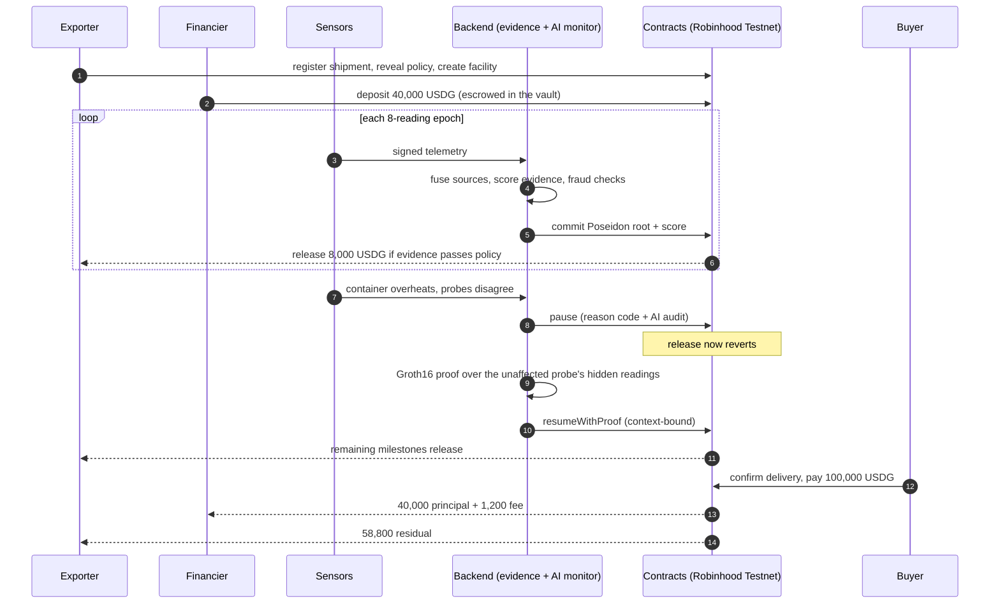

<p align="center">
  <picture>
    <source media="(prefers-color-scheme: dark)" srcset="frontend/public/brand/logo-dark.svg">
    
  </picture>
</p>

# CargoFlow

[](https://github.com/LSUDOKO/CargoFlow/actions/workflows/ci.yml)


[](LICENSE)

**Evidence-gated working capital for physical trade finance.**

A financier locks USDG in a shipment-specific escrow facility. Tranches release only when multi-source sensor
evidence satisfies an on-chain policy. An anomaly pauses the facility, a context-bound zero-knowledge proof of
secondary evidence resumes it, and the buyer's invoice payment settles through a fixed waterfall.

```
PHYSICAL REALITY → CRYPTOGRAPHIC EVIDENCE → EVIDENCE CONFIDENCE → FINANCIAL RISK → AVAILABLE CAPITAL → USDG SETTLEMENT
```

> **Status: testnet prototype with production-grade engineering.** Deployed and verified on Robinhood Chain
> Testnet with testnet USDG (no monetary value). Not audited, not a regulated financial product, and the ZK
> trusted setup is single-party (testnet only). See [limits](#honest-limits).

## The story in one picture

A 40,000 USDG facility against a 100,000 USDG invoice (5 milestones of 8,000, 3% fee):



## Why it is different

- **Capital follows physical evidence.** A shipment has a financial facility attached; a failed milestone
  changes what can be drawn, on-chain, not in a dashboard.
- **No single oracle.** Sources are fused with Dempster-Shafer and an explicit conflict factor, then scored
  with documented penalties. The same input always yields the same score.
- **Privacy by construction.** Raw telemetry never goes on-chain: only Poseidon Merkle roots, scores and
  proof verification status do. Recovery is proved in zero knowledge over readings that stay private.
- **An AI that cannot move money.** A language model may only ever make an outcome *stricter* (pause or ask for
  more proof), through a key that holds no other role. It never sees telemetry-derived text, and the policy
  gate decides alone whenever the model is absent, slow or wrong. See [the AI monitor](backend/README.md#ai-monitor).
- **Contracts hold final authority.** Core contracts are immutable (no proxy). Pause is narrow and cannot
  withdraw funds. Eight invariants are fuzz- and invariant-tested.

## Live on Robinhood Chain Testnet

Chain `46630` · RPC `https://rpc.testnet.chain.robinhood.com` · Explorer `https://explorer.testnet.chain.robinhood.com`

### Deployed contracts (source-verified)

| Contract | Address |
|---|---|
| CargoFlowAccess (roles) | [`0x5Ed4f105E3c3C0a67f916c0fc339B261E3De81d7`](https://explorer.testnet.chain.robinhood.com/address/0x5Ed4f105E3c3C0a67f916c0fc339B261E3De81d7) |
| ShipmentRegistry | [`0x2f7cAc603654eC106dA242cD0b16044b31f7608d`](https://explorer.testnet.chain.robinhood.com/address/0x2f7cAc603654eC106dA242cD0b16044b31f7608d) |
| PolicyEngine | [`0x93f2cd67f404f62Ff34F729aad1118ea9e1582d0`](https://explorer.testnet.chain.robinhood.com/address/0x93f2cd67f404f62Ff34F729aad1118ea9e1582d0) |
| EvidenceRegistry | [`0x4aD47799586B4793b7952BA849013F5D0eC2e66a`](https://explorer.testnet.chain.robinhood.com/address/0x4aD47799586B4793b7952BA849013F5D0eC2e66a) |
| ReceivableVault | [`0x5298dCdBDf6EC799475B09c2Ecd0f089bD4D6902`](https://explorer.testnet.chain.robinhood.com/address/0x5298dCdBDf6EC799475B09c2Ecd0f089bD4D6902) |
| FinancingController | [`0xA2E708376CDDf0eb8fa746c43089611B4d49E210`](https://explorer.testnet.chain.robinhood.com/address/0xA2E708376CDDf0eb8fa746c43089611B4d49E210) |
| Groth16Verifier | [`0x1BAa24a99A9Fe8Cd53feB30E5dF098D1334E0a8D`](https://explorer.testnet.chain.robinhood.com/address/0x1BAa24a99A9Fe8Cd53feB30E5dF098D1334E0a8D) |
| USDG (Paxos testnet stablecoin, 6 decimals) | [`0x7E955252E15c84f5768B83c41a71F9eba181802F`](https://explorer.testnet.chain.robinhood.com/address/0x7E955252E15c84f5768B83c41a71F9eba181802F) |

On Arbitrum Sepolia (optional Stylus evidence engine): Stylus `EvidenceEngine` [`0x2f7cac603654ec106da242cd0b16044b31f7608d`](https://sepolia.arbiscan.io/address/0x2f7cac603654ec106da242cd0b16044b31f7608d), Solidity reference [`0x5Ed4f105E3c3C0a67f916c0fc339B261E3De81d7`](https://sepolia.arbiscan.io/address/0x5Ed4f105E3c3C0a67f916c0fc339B261E3De81d7).

### A complete facility, transaction by transaction

A shipment from Nhava Sheva to Singapore financed with real testnet USDG: funding, two releases, a thermal
excursion that paused the facility, a **Groth16 proof verified on-chain** that resumed it, the remaining releases,
delivery and settlement through the waterfall. 22 transactions in 116 seconds, run at 1/2000 scale (a 20 USDG
facility against a 50 USDG invoice) because the faucet supplies 100 USDG.

| Step | Call | Transaction |
|---|---|---|
| Exporter registers the shipment | `registerShipment` | [`0x14391e95…cbe8fb`](https://explorer.testnet.chain.robinhood.com/tx/0x14391e958a37b803414b85a786640ae1fea3ea00c1087f30e3f2b1179bcbe8fb) |
| Exporter reveals the policy | `setPolicy` | [`0xec329edc…d52c35`](https://explorer.testnet.chain.robinhood.com/tx/0xec329edc96cc3c1f581086d8df5899721ace9fbccaaf4cba30cd9c2590d52c35) |
| Exporter opens the facility (5 x 4 USDG) | `createFacility` | [`0xc4229a4c…934362`](https://explorer.testnet.chain.robinhood.com/tx/0xc4229a4cd45811bba380eb080bb5ef5bd6b4182d969b1368414e4bd13d934362) |
| Financier approves the vault | `approve` | [`0xe06e9a84…f8a13c`](https://explorer.testnet.chain.robinhood.com/tx/0xe06e9a84c5135f471a1e962437994578dbba166961a0649602365cb579f8a13c) |
| Financier deposits 20 USDG | `depositCapital` | [`0x7a89490c…151ed7`](https://explorer.testnet.chain.robinhood.com/tx/0x7a89490cb7931b37feca36171051756c1bd4051f6d0edf0664a9f367a9151ed7) |
| Transit starts | `startTransit` | [`0x3b4026c0…4ae82a`](https://explorer.testnet.chain.robinhood.com/tx/0x3b4026c08d9f894731f6f0834d05ea578402c1ed9bf7186aa0d2d8dbf44ae82a) |
| Milestone 1 evidence committed | `commitEpoch` | [`0x1c59e560…886d83`](https://explorer.testnet.chain.robinhood.com/tx/0x1c59e560088dac3d51ce9034d4660e29248f5aa44fc02832e5da4e9cc2886d83) |
| Milestone 1 released (4 USDG) | `evaluateAndReleaseMilestone` | [`0xe445c731…985b84`](https://explorer.testnet.chain.robinhood.com/tx/0xe445c731baf8cffe7bdd8135d0e62e661c8c36359937bae3e1391a0f0b985b84) |
| Milestone 2 evidence committed | `commitEpoch` | [`0x00282b84…5e48e5`](https://explorer.testnet.chain.robinhood.com/tx/0x00282b84c41b9af9b96c97563ac64282b8b76e477517b4d5283998ed975e48e5) |
| Milestone 2 released (4 USDG) | `evaluateAndReleaseMilestone` | [`0x9732bccd…8281a4`](https://explorer.testnet.chain.robinhood.com/tx/0x9732bccd25d596deee00f41cdc9c022f038cab9b6fc45461e78d5eeda38281a4) |
| Anomaly: facility paused | `pauseFinancing` | [`0x6e324ebc…e50ccb`](https://explorer.testnet.chain.robinhood.com/tx/0x6e324ebc5a6f17724819ce6456a2d1b89f97dbb7d489a602aa98750055e50ccb) |
| Anomaly evidence committed (fails policy) | `commitEpoch` | [`0x80307e0f…d6b51f`](https://explorer.testnet.chain.robinhood.com/tx/0x80307e0f56c86eb0b77e04bbd98cbcd4247a13997df72ade11577c9283d6b51f) |
| Recovery evidence committed (core probe) | `commitEpoch` | [`0xeac18019…9b16b7`](https://explorer.testnet.chain.robinhood.com/tx/0xeac180198e196e79f2e0393995aa356ceb43c9f1147706c06ab289b0f89b16b7) |
| Facility resumed by Groth16 proof | `resumeWithProof` | [`0x3910c2a5…31a3e1`](https://explorer.testnet.chain.robinhood.com/tx/0x3910c2a5c191be43985e0a683e4fdc52a02af8d2f9b4d49749afbf79a131a3e1) |
| Milestone 3 released | `evaluateAndReleaseMilestone` | [`0xd68c70c7…71e11d`](https://explorer.testnet.chain.robinhood.com/tx/0xd68c70c7cf0581125fb381446b3855b980c7e27fa5fb68654bd973988b71e11d) |
| Milestone 4 evidence committed | `commitEpoch` | [`0x3bae0d30…195e47`](https://explorer.testnet.chain.robinhood.com/tx/0x3bae0d30318bd7acc8ef48ff4fc212ec78cc18ccf1b10afd118744c218195e47) |
| Milestone 4 released | `evaluateAndReleaseMilestone` | [`0x7fff78cb…b63b50`](https://explorer.testnet.chain.robinhood.com/tx/0x7fff78cb438b256cdedcc1f9f14c480d2336bf6972613e4c63120bac26b63b50) |
| Milestone 5 evidence committed | `commitEpoch` | [`0xdaca4d5d…d67e46`](https://explorer.testnet.chain.robinhood.com/tx/0xdaca4d5d9a5da85ac17c052338ae56080232a7c8c3fe4a6a3ec1d78ed2d67e46) |
| Milestone 5 released | `evaluateAndReleaseMilestone` | [`0x72aa29d6…090298`](https://explorer.testnet.chain.robinhood.com/tx/0x72aa29d6b7915f7857c89b6c49e8c367de16d048663c73e11bc38ff28f090298) |
| Buyer confirms delivery | `markDelivered` | [`0x908478b8…392c0d`](https://explorer.testnet.chain.robinhood.com/tx/0x908478b8dcd8a609a6c9790b54dc8b988bb17e0f47dccdf8b888198e05392c0d) |
| Buyer approves the vault | `approve` | [`0x1c13af60…5ed95c`](https://explorer.testnet.chain.robinhood.com/tx/0x1c13af606bf529b8e4fba252ac09899289197d809817ef7e779a804da65ed95c) |
| Buyer pays the invoice; waterfall settles | `settle` | [`0xcb11761c…b5bd6c`](https://explorer.testnet.chain.robinhood.com/tx/0xcb11761ca1c1b6b302c15ee27de0090b5c379034c28e621cf3cf9563b2b5bd6c) |

Result, read back from the chain: the exporter received **49.4 USDG** (20 advanced in tranches + 29.4 residual), the
financier **20.6 USDG** (20 principal + 0.6 fee), and the vault ended empty.

### How each party uses it

| Party | What they do, from their own wallet |
|---|---|
| **Exporter** | Registers the shipment, its cold-chain policy and the financing plan; adds a sensor gateway (an Ed25519 device key authorized by a wallet signature); uploads the data logger's readings or streams them through the signed API; starts transit; releases tranches as evidence clears; recovers a paused facility with a zero-knowledge proof; can open a dispute |
| **Financier** | Approves and deposits the committed USDG into the shipment's escrow; follows exposure and evidence live; can open a dispute |
| **Buyer** | Confirms delivery and pays the invoice; the vault repays the financier with the fee and sends the exporter the residual in the same transaction |
| **Arbiter** | Holds the on-chain dispute role: resolves disputes (resume or default), resumes a paused facility on verified evidence, or declares a default |

Nothing on this path needs an operator: the backend scores and commits the evidence, and the contracts decide
what may move.

## Try it locally in five commands

Needs Foundry, Go 1.24, Node 20+, Postgres and [circom](https://docs.circom.io/getting-started/installation/).

```bash
make anvil &                                         # a local chain
make deploy-local                                    # contracts + a mock USDG
createdb cargoflow
ENV_FILE=.env.local.example make serve &             # API + indexer + evidence pipeline
ENV_FILE=.env.local.example make demo ARGS="-mint -pace 2s"   # the whole story, real transactions, numbers checked
```

The same `make demo` runs against the public testnet (`ARGS="-divisor 2000"` fits a 100 USDG faucet drip).

Then open the web app and use it as each party with your own wallets:

```bash
cd frontend && cp .env.example .env.local && sed -i 's#8080#8787#' .env.local && pnpm install && pnpm dev
```

## The web app

Next.js 16 with wagmi and viem. Browser wallets and WalletConnect are supported; every action is a transaction the
user signs.

| Page | Purpose |
|---|---|
| `/` | Track any shipment by id or reference, start financing, verify a committed evidence epoch |
| `/track/{id or reference}` | The live shipment: route, milestones, temperature per epoch against the agreed band, evidence score, sensor conflict and risk, escrow, AI monitor, zero-knowledge recovery, full audit trail with explorer links |
| `/shipments` | Every shipment: status tabs, search, sort, a wallet's own shipments, container details |
| `/exporter` | Register a shipment, set the cold-chain policy, open the facility |
| `/financier` | Fund facilities that name your wallet; exposure and settlement projection |
| `/buyer` | Confirm delivery and pay the invoice |
| `/arbiter` | Dispute resolution for the dispute-role wallet |

Tested by unit tests and Playwright tests that run the whole lifecycle in a real browser, through wallets, against
a real chain, with axe accessibility checks on every page. See [`frontend/README.md`](frontend/README.md).

## Measured, not claimed

| | |
|---|---|
| Contract tests | 170 (unit, fuzz, invariants I1-I8, real-proof integration) |
| Frontend | 54 unit tests; 16 Playwright end-to-end and accessibility tests on the real stack |
| Backend | 21 Go packages with `-race`; integration tests run a real anvil chain and Postgres; the end-to-end test drives the full story through the running service |
| Circuit | 13,494 constraints; proves in about 1 s; 25 tests including tamper and wrong-context cases |
| ZK resume on-chain | ~0.25 M gas (real Groth16 verification) |
| Stylus vs Solidity (optional engine) | 128-reading epoch fusion: 611,945 vs 31,511 gas on Arbitrum Sepolia (19x; 32x cached); [method and caveats](stylus/README.md) |
| Static analysis | Slither triaged: [`docs/security/slither-triage.md`](docs/security/slither-triage.md) |

Every figure is reproducible with `make check`, `make bench` and `make slither`; method and caveats are in
[`docs/benchmarks.md`](docs/benchmarks.md).

## Repository layout

| Path | Purpose |
|---|---|
| `contracts/` | Solidity core (Foundry): registry, policy, evidence, controller, vault, verifier |
| `backend/` | Go service: ingestion, evidence engine, AI monitor, proof worker, API (wallet-signed gateway registration and recovery), indexer, reconciler, CLI story runner |
| `circuits/` | Circom telemetry-epoch circuit and Groth16 tooling |
| `infra/` | Hardened Dockerfile and compose stack |
| `scripts/` | Key generation, funding, testnet deploy and explorer verification |
| `docs/` | Architecture, runbooks, security, benchmarks, protocol knowledge base, design spec, roadmap |
| `stylus/` | Optional Rust (Stylus) evidence engine for Arbitrum Sepolia, benchmarked against a Solidity reference |
| `frontend/` | Next.js 16 web app: landing, live dashboard, fleet, exporter / financier / buyer portals, gateway onboarding and CSV upload, arbiter console |

## Documentation

- [Architecture](docs/architecture.md): components, state machine, trust boundaries
- [Backend service, API and guarantees](backend/README.md)
- [Testnet runbook](docs/runbooks/testnet.md)
- [Benchmarks](docs/benchmarks.md) and [Slither triage](docs/security/slither-triage.md)
- [Protocol knowledge base](docs/project/README.md), [design spec](docs/superpowers/specs/2026-09-30-cargoflow-design.md), [roadmap](docs/superpowers/plans/2026-09-30-cargoflow-roadmap.md)
- [Changelog](CHANGELOG.md), [Contributing](CONTRIBUTING.md), [Security policy](SECURITY.md)

## Honest limits

- Testnet only. No audit. USDG here has no value.
- The Groth16 setup is single-party: it must be replaced by a public ceremony before any real use.
- Telemetry is simulated; there is no hardware. Source authentication is Ed25519 signatures, not attested hardware.
- The AI monitor's score weights and thresholds are design parameters, not statistically calibrated.
- One backend instance per database; recovery proving runs inside the HTTP request.

## License

[MIT](LICENSE). The generated Groth16 verifier is GPL-3.0 (see [NOTICE](NOTICE)).
