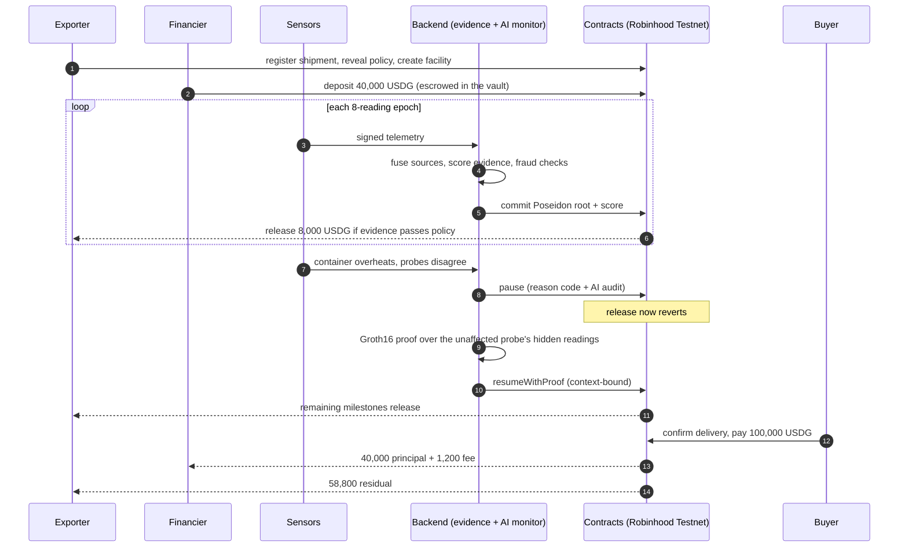

# CargoFlow

[](https://github.com/LSUDOKO/CargoFlow/actions/workflows/ci.yml)


[](LICENSE)

**Evidence-gated working capital for physical trade finance.**

A financier locks USDG in a shipment-specific escrow facility. Tranches release only when multi-source sensor
evidence satisfies an on-chain policy. An anomaly pauses the facility, a context-bound zero-knowledge proof of
secondary evidence resumes it, and the buyer's invoice payment settles through a fixed waterfall.

```
PHYSICAL REALITY → CRYPTOGRAPHIC EVIDENCE → EVIDENCE CONFIDENCE → FINANCIAL RISK → AVAILABLE CAPITAL → USDG SETTLEMENT
```

> **Status: testnet prototype with production-grade engineering.** Deployed and verified on Robinhood Chain
> Testnet with testnet USDG (no monetary value). Not audited, not a regulated financial product, and the ZK
> trusted setup is single-party (testnet only). See [limits](#honest-limits).

## The story in one picture

A 40,000 USDG facility against a 100,000 USDG invoice (5 milestones of 8,000, 3% fee):



## Why it is different

- **Capital follows physical evidence.** A shipment has a financial facility attached; a failed milestone
  changes what can be drawn, on-chain, not in a dashboard.
- **No single oracle.** Sources are fused with Dempster-Shafer and an explicit conflict factor, then scored
  with documented penalties. The same input always yields the same score.
- **Privacy by construction.** Raw telemetry never goes on-chain: only Poseidon Merkle roots, scores and
  proof verification status do. Recovery is proved in zero knowledge over readings that stay private.
- **An AI that cannot move money.** A language model may only ever make an outcome *stricter* (pause or ask for
  more proof), through a key that holds no other role. It never sees telemetry-derived text, and the policy
  gate decides alone whenever the model is absent, slow or wrong. See [the AI monitor](backend/README.md#ai-monitor).
- **Contracts hold final authority.** Core contracts are immutable (no proxy). Pause is narrow and cannot
  withdraw funds. Eight invariants are fuzz- and invariant-tested.

## Live on Robinhood Chain Testnet

All seven contracts are deployed and source-verified, and the full story has been run on the public chain: fund,
two milestones, thermal anomaly, pause, **Groth16 recovery proof verified on-chain**, remaining milestones,
delivery, settlement, with the AI monitor consulted at every epoch. 22 transactions, 116 seconds, each linked on
the explorer in [`docs/runbooks/testnet.md`](docs/runbooks/testnet.md#the-hero-run-on-the-public-testnet-done)
(run at 1/2000 scale, 20 USDG against a 50 USDG invoice, because the faucet drip was 100 USDG).

| Contract | Explorer |
|---|---|
| FinancingController | [`0xA2E7…E210`](https://explorer.testnet.chain.robinhood.com/address/0xA2E708376CDDf0eb8fa746c43089611B4d49E210) |
| ReceivableVault | [`0x5298…6902`](https://explorer.testnet.chain.robinhood.com/address/0x5298dCdBDf6EC799475B09c2Ecd0f089bD4D6902) |
| EvidenceRegistry | [`0x4aD4…6e66a`](https://explorer.testnet.chain.robinhood.com/address/0x4aD47799586B4793b7952BA849013F5D0eC2e66a) |
| Groth16Verifier | [`0x1BAa…0a8D`](https://explorer.testnet.chain.robinhood.com/address/0x1BAa24a99A9Fe8Cd53feB30E5dF098D1334E0a8D) |

| | |
|---|---|
| Chain | Robinhood Chain Testnet (ID `46630`), RPC `https://rpc.testnet.chain.robinhood.com` |
| USDG | `0x7E955252E15c84f5768B83c41a71F9eba181802F` (6 decimals) |

## Try it locally in five commands

Needs Foundry, Go 1.24, Node 20+, Postgres and [circom](https://docs.circom.io/getting-started/installation/).

```bash
make anvil &                                         # a local chain
make deploy-local                                    # contracts + a mock USDG
createdb cargoflow
ENV_FILE=.env.local.example make serve &             # API + indexer + evidence pipeline
ENV_FILE=.env.local.example make demo ARGS="-mint -pace 2s"   # the whole story, real transactions, numbers checked
```

The same `make demo` runs against the public testnet (`ARGS="-divisor 2000"` fits a 100 USDG faucet drip).

## Measured, not claimed

| | |
|---|---|
| Contract tests | 170 (unit, fuzz, invariants I1-I8, real-proof integration) |
| Backend | 19 Go packages with `-race`; integration tests run a real anvil chain and Postgres; the end-to-end test drives the full story through the running service |
| Circuit | 13,494 constraints; proves in about 1 s; 25 tests including tamper and wrong-context cases |
| ZK resume on-chain | ~0.25 M gas (real Groth16 verification) |
| Static analysis | Slither triaged: [`docs/security/slither-triage.md`](docs/security/slither-triage.md) |

Every figure is reproducible with `make check`, `make bench` and `make slither`; method and caveats are in
[`docs/benchmarks.md`](docs/benchmarks.md).

## Repository layout

| Path | Purpose |
|---|---|
| `contracts/` | Solidity core (Foundry): registry, policy, evidence, controller, vault, verifier |
| `backend/` | Go service: ingestion, evidence engine, AI monitor, proof worker, API, indexer, reconciler, demo runner |
| `circuits/` | Circom telemetry-epoch circuit and Groth16 tooling |
| `infra/` | Hardened Dockerfile and compose stack |
| `scripts/` | Key generation, funding, testnet deploy and explorer verification |
| `docs/` | Architecture, runbooks, security, benchmarks, protocol knowledge base, design spec, roadmap |
| `stylus/` | Optional Rust (Stylus) evidence engine for Arbitrum Sepolia, benchmarked against a Solidity reference |
| `frontend/` | Planned: dashboard |

## Documentation

- [Architecture](docs/architecture.md): components, state machine, trust boundaries
- [Backend service, API and guarantees](backend/README.md)
- [Testnet runbook](docs/runbooks/testnet.md)
- [Benchmarks](docs/benchmarks.md) and [Slither triage](docs/security/slither-triage.md)
- [Protocol knowledge base](docs/project/README.md), [design spec](docs/superpowers/specs/2026-09-30-cargoflow-design.md), [roadmap](docs/superpowers/plans/2026-09-30-cargoflow-roadmap.md)
- [Changelog](CHANGELOG.md), [Contributing](CONTRIBUTING.md), [Security policy](SECURITY.md)

## Honest limits

- Testnet only. No audit. USDG here has no value.
- The Groth16 setup is single-party: it must be replaced by a public ceremony before any real use.
- Telemetry is simulated; there is no hardware. Source authentication is Ed25519 signatures, not attested hardware.
- The AI monitor's score weights and thresholds are design parameters, not statistically calibrated.
- One backend instance per database; recovery proving runs inside the HTTP request.
- The dashboard is not built yet, so the API, the demo command and the explorer are the interface today.

## License

[MIT](LICENSE). The generated Groth16 verifier is GPL-3.0 (see [NOTICE](NOTICE)).
