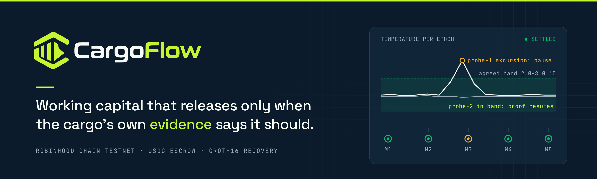
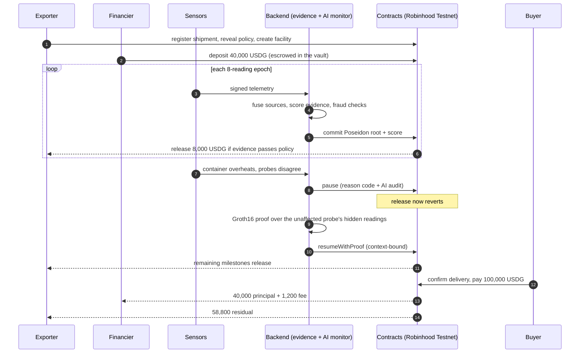
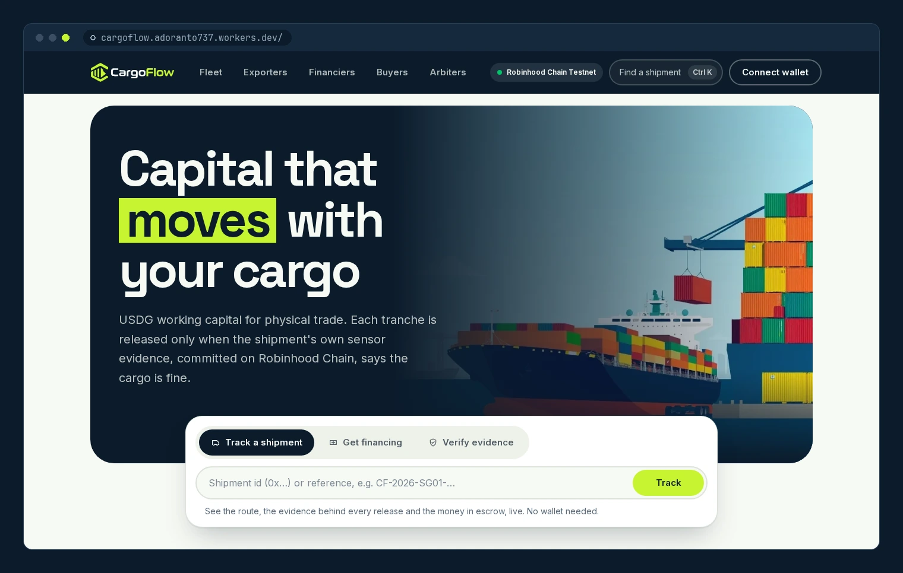
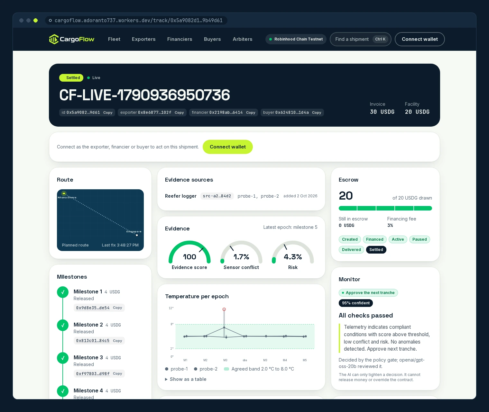
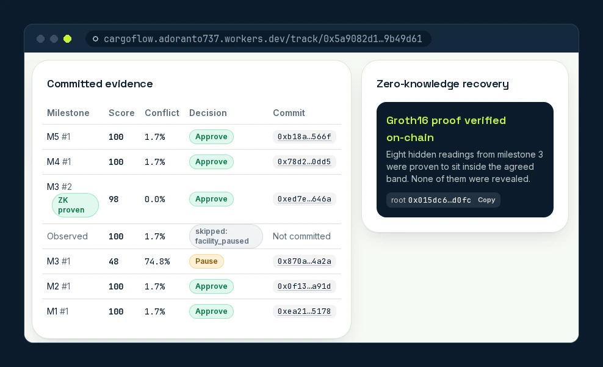
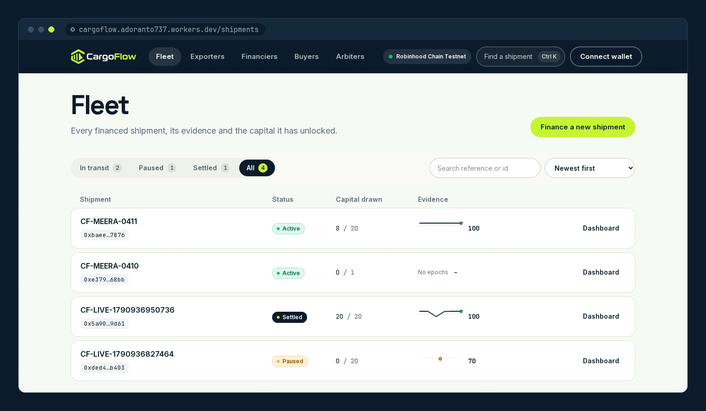
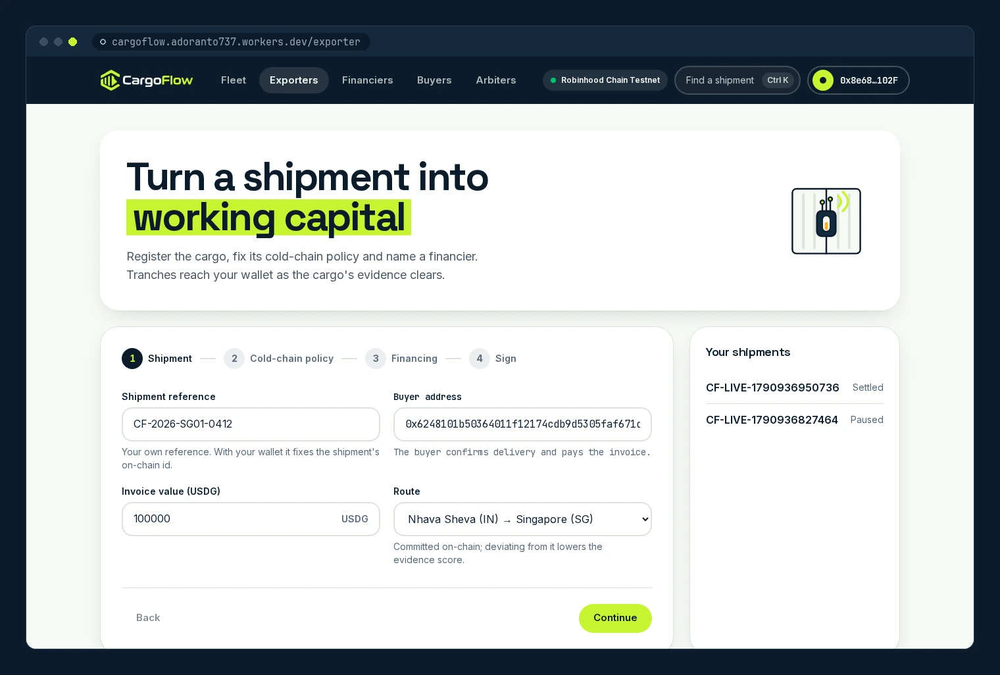
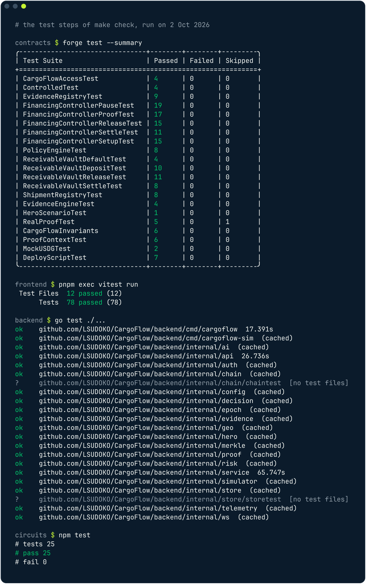
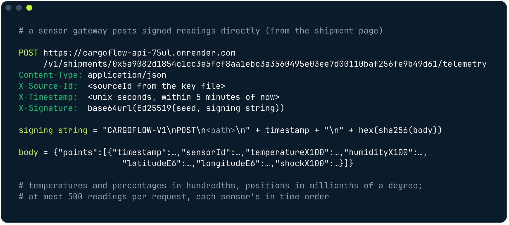

<p align="center">
  <picture>
    <source media="(prefers-color-scheme: dark)" srcset="frontend/public/brand/logo-dark.svg">
    
  </picture>
</p>

<p align="center">
  
</p>

<h3 align="center">Evidence-gated working capital for physical trade finance</h3>

<p align="center">
  <a href="https://cargoflow.adoranto737.workers.dev"></a>
  <a href="#deployed-contracts-source-verified"></a>
  <a href="https://explorer.testnet.chain.robinhood.com"></a>
  <a href="#measured-not-claimed"></a>
  <a href="#use-cargoflow-in-claude"></a>
  <a href="https://github.com/LSUDOKO/CargoFlow/actions/workflows/ci.yml"></a>
  <a href="LICENSE"></a>
</p>

<p align="center">
  
  
  
  
</p>

<p align="center">
  <a href="https://cargoflow.adoranto737.workers.dev"><b>Live app</b></a> ·
  <a href="https://cargoflow-api-75ul.onrender.com/v1/health"><b>API</b></a> ·
  <a href="https://cargoflow.adoranto737.workers.dev/docs"><b>API docs</b></a> ·
  <a href="#use-cargoflow-in-claude"><b>Use in Claude</b></a> ·
  <a href="https://cargoflow.adoranto737.workers.dev/deployments"><b>Contracts</b></a> ·
  <a href="https://explorer.testnet.chain.robinhood.com/address/0x06DaF9462eCF2434ED0314a005Bf762cCDEd7Fe1"><b>Explorer</b></a> ·
  <a href="docs/architecture.md"><b>Docs</b></a> ·
  <a href="#demo-video"><b>Demo video</b></a> (coming)
</p>

A financier locks USDG in a shipment-specific escrow facility. Tranches release only when multi-source sensor
evidence satisfies an on-chain policy. An anomaly pauses the facility, a context-bound zero-knowledge proof of
secondary evidence resumes it, and the buyer's invoice payment settles through a fixed waterfall.

```
PHYSICAL REALITY → CRYPTOGRAPHIC EVIDENCE → EVIDENCE CONFIDENCE → FINANCIAL RISK → AVAILABLE CAPITAL → USDG SETTLEMENT
```

> [!NOTE]
> **Status: testnet prototype with production-grade engineering.** Contracts v3 deployed and verified on Robinhood Chain
> Testnet (3 October 2026) with testnet USDG (no monetary value). Not audited, not a regulated financial product, and the ZK
> trusted setup is single-party (testnet only). See [honest limits](#honest-limits).

## Contents

- [The problem in one paragraph](#the-problem-in-one-paragraph)
- [What CargoFlow does](#what-cargoflow-does)
- [Product tour](#product-tour)
- [How each party uses it](#how-each-party-uses-it)
- [Architecture](#architecture)
- [Live on Robinhood Chain Testnet](#live-on-robinhood-chain-testnet): services, every contract address, a live v3 run
- [Use CargoFlow in Claude](#use-cargoflow-in-claude): the remote MCP server
- [Under the hood](#under-the-hood): evidence engine, zero-knowledge recovery, AI monitor, disputes
- [For developers](#for-developers): API reference, SDKs, gateway agent, Python analytics
- [Sponsor and partner integrations](#sponsor-and-partner-integrations)
- [Measured, not claimed](#measured-not-claimed)
- [Security and honest limits](#security-and-honest-limits)

## The problem in one paragraph

The Asian Development Bank puts the global trade finance gap at
[$2.5 trillion in 2025, about 10% of global trade, with 41% of SME applications rejected](https://www.adb.org/news/demand-trade-finance-rise-amid-supply-chain-realignment-adb-report)
([survey brief](https://www.adb.org/publications/adb-global-trade-finance-gap-survey)). In India, half of B2B sales are
made on credit with
[average payment terms of 52 days](https://group.atradius.com/knowledge-and-research/reports/b2b-payment-practices-trends-india-2025)
(Atradius, 2025), so an exporter waits about two months for cash it has already earned. And the cargo itself is at
risk in transit: biopharma alone loses
[about $35 billion a year to failures in temperature-controlled logistics](https://www.aircargonews.net/pharma-logistics/2019/07/failures-in-temperature-controlled-logistics-cost-biopharma-industry-billions/)
(IQVIA). A lender advancing money against a reefer container sees paperwork, not the container, so it either lends
blind or does not lend. CargoFlow lets the cargo's own sensor evidence decide how much capital is available, on-chain,
milestone by milestone.

## What CargoFlow does

<p align="center">
  
</p>

- **Capital follows physical evidence.** A shipment has a financial facility attached; a failed milestone
  changes what can be drawn, on-chain, not in a dashboard.
- **No single oracle.** Sources are fused with Dempster-Shafer and an explicit conflict factor, then scored
  with documented penalties. The same input always yields the same score.
- **Privacy by construction.** Raw telemetry never goes on-chain: only Poseidon Merkle roots, scores and
  proof verification status do. Recovery is proved in zero knowledge over readings that stay private.
- **An AI that cannot move money.** A language model may only ever make an outcome *stricter* (pause or ask for
  more proof), through a key that holds no other role. It never sees telemetry-derived text, and the policy
  gate decides alone whenever the model is absent, slow or wrong. See [the AI monitor](backend/README.md#ai-monitor).
- **Contracts hold final authority.** Core contracts are immutable (no proxy). Pause is narrow and cannot
  withdraw funds. Eight invariants are fuzz- and invariant-tested.

<details>
<summary><b>The same story as a sequence diagram</b> (a 40,000 USDG facility against a 100,000 USDG invoice, 5 milestones of 8,000, 3% fee)</summary>



</details>

## Product tour

Every screen below is the live app at **https://cargoflow.adoranto737.workers.dev**, captured on 2 October 2026 with
real testnet data.

**Landing.** Track any shipment by id or reference, start financing, or verify a committed evidence epoch.

<p align="center"></p>

**Live shipment dashboard.** The settled run `CF-LIVE-1790936950736`: parties, invoice and facility, route, every
milestone with its release transaction, the evidence score, sensor conflict and risk gauges, escrow, the AI monitor's
verdict, and temperature per epoch against the agreed band, with probe-1's excursion at milestone 3.

<p align="center"></p>

**Zero-knowledge recovery and committed evidence.** Each committed epoch with its score, conflict, decision and
on-chain commit. Milestone 3's first epoch scored 48 with 74.8% conflict and paused the facility; its second epoch is
marked *ZK proven*: eight hidden readings were proved to sit inside the band, and none of them was revealed.

<p align="center"></p>

<table>
  <tr>
    <td width="33%" valign="top"><br><b>Fleet.</b> Every shipment with status tabs, search, sort, capital drawn and an evidence sparkline.</td>
    <td width="33%" valign="top"><br><b>Exporter.</b> A four-step wizard: shipment, cold-chain policy, financing, sign. Shown with a read-only wallet; nothing was signed.</td>
    <td width="33%" valign="top"><br><b>Arbiter.</b> The dispute queue; acting on it needs the on-chain dispute role, which this wallet does not hold.</td>
  </tr>
</table>

## How each party uses it

<p align="center">
  
</p>

| Party | What they do, from their own wallet |
|---|---|
| **Exporter** | Registers the shipment, its cold-chain policy and the financing plan; adds a sensor gateway (an Ed25519 device key authorized by a wallet signature); uploads the data logger's readings or streams them through the signed API; starts transit; releases tranches as evidence clears; recovers a paused facility with a zero-knowledge proof; can open a dispute |
| **Financier** | Approves and deposits the committed USDG into the shipment's escrow; follows exposure and evidence live; can open a dispute |
| **Buyer** | Confirms delivery and pays the invoice; the vault repays the financier with the fee and sends the exporter the residual in the same transaction |
| **Arbiter** | Holds the on-chain dispute role: resolves disputes (resume or default), resumes a paused facility on verified evidence, or declares a default |

Nothing on this path needs an operator: the backend scores and commits the evidence, and the contracts decide
what may move. The full authority matrix, including what each role *cannot* do, is in
[`docs/architecture.md`](docs/architecture.md#who-may-do-what).

## Architecture

<p align="center">
  
</p>

The chain is the financial source of truth. Postgres holds operational evidence (readings, epochs, the action
outbox, the audit trail) and is reconciled from chain events; the API's facility view reads the chain directly, so a
lagging indexer can never show money that did not move. Components, the facility state machine and every trust
boundary are in [`docs/architecture.md`](docs/architecture.md).

### Repository layout

| Path | Purpose |
|---|---|
| `contracts/` | Solidity core (Foundry): registry, policy, evidence, controller, vault, verifier |
| `backend/` | Go service: ingestion, evidence engine, AI monitor, proof worker, API (wallet-signed gateway registration and recovery), indexer, reconciler, CLI story runner |
| `circuits/` | Circom telemetry-epoch circuit and Groth16 tooling |
| `infra/` | Hardened Dockerfile and compose stack |
| `scripts/` | Key generation, funding, testnet deploy and explorer verification |
| `docs/` | Architecture, runbooks, security, benchmarks, protocol knowledge base, design spec, roadmap |
| `stylus/` | Optional Rust (Stylus) evidence engine for Arbitrum Sepolia, benchmarked against a Solidity reference |
| `frontend/` | Next.js 16 web app: landing, live dashboard, fleet, market, exporter / financier / buyer / carrier portals, passkey accounts, API reference, arbiter console |
| `packages/sdk` | `@cargoflow/sdk`: typed TypeScript client, ABIs, unsigned transaction builders, gateway signing (Ed25519 and P-256), Merkle proof checks |
| `packages/mcp` | `@cargoflow/mcp`: MCP server (stdio, Streamable HTTP, and a Cloudflare Worker for the hosted endpoint) |
| `packages/gateway` | `@cargoflow/gateway`: edge agent for data loggers (folder watch, USB mass storage, serial, offline queue) |
| `packages/python` | `cargoflow` Python SDK: data frames, portfolio analytics, Monte Carlo of default and recovery |
| `contracts/confidential` | Fhenix CoFHE extension: encrypted invoice margin and penalty terms (Arbitrum Sepolia) |
| `contracts/hedge` | GMX v2 hedge vault for a financier's own collateral (Arbitrum Sepolia) |
| `analytics/dune` | Dune SQL for volume, escrow, pause and recovery rates and lender yield |

## Live on Robinhood Chain Testnet

Chain `46630` · RPC `https://rpc.testnet.chain.robinhood.com` · Explorer `https://explorer.testnet.chain.robinhood.com`

**Use it now:** connect any wallet on Robinhood Chain Testnet, or sign in with a passkey (Face ID, fingerprint or a
security key) through a ZeroDev smart account.

| Service | URL |
|---|---|
| Web app (Cloudflare Workers) | **https://cargoflow.adoranto737.workers.dev** |
| API (Render, Docker) | https://cargoflow-api-75ul.onrender.com ([health](https://cargoflow-api-75ul.onrender.com/v1/health), [OpenAPI 3.1](https://cargoflow-api-75ul.onrender.com/v1/openapi.json)) |
| Interactive API reference | https://cargoflow.adoranto737.workers.dev/docs |
| Remote MCP server (Cloudflare Workers) | `https://cargoflow-mcp.adoranto737.workers.dev/mcp` ([how to add it to Claude](#use-cargoflow-in-claude)) |
| Every contract and service, with copy buttons | https://cargoflow.adoranto737.workers.dev/deployments |

The free Render instance sleeps when idle, so the first request after a quiet spell can take up to a minute; a GitHub
Action pings it every 10 minutes.

### Deployed contracts, v3 (source-verified)

Deployed on 3 October 2026 in blocks 128,127,715 to 128,127,723. Every contract's source is verified on the explorer.

| Contract | What it does | Address |
|---|---|---|
| CargoFlowAccess | Roles (OpenZeppelin `AccessControlDefaultAdminRules`) | [`0x6b334b4C73c27CB297470140c86311075408b050`](https://explorer.testnet.chain.robinhood.com/address/0x6b334b4C73c27CB297470140c86311075408b050) |
| ShipmentRegistry | Shipments, parties, invoice hash, route commitment | [`0x2B9E2B70b6fF48DaD9847944bbEcE16c9f4396F3`](https://explorer.testnet.chain.robinhood.com/address/0x2B9E2B70b6fF48DaD9847944bbEcE16c9f4396F3) |
| PolicyEngine | Commit-reveal cold-chain policy (temperature, humidity, shock, route, evidence thresholds) | [`0x74be1E30bEeDc004447F0427Dd6EBC62CCDabA25`](https://explorer.testnet.chain.robinhood.com/address/0x74be1E30bEeDc004447F0427Dd6EBC62CCDabA25) |
| EvidenceRegistry | Committed epochs: Poseidon root, score, centroid, maxima, source devices | [`0x3930f06dC9Deb7b7587AD5a04B05350CaACc7BA2`](https://explorer.testnet.chain.robinhood.com/address/0x3930f06dC9Deb7b7587AD5a04B05350CaACc7BA2) |
| ReceivableVault | Escrow and the settlement waterfall | [`0x167783DB96E27f36f78C8E5F6f1575b0c45a8151`](https://explorer.testnet.chain.robinhood.com/address/0x167783DB96E27f36f78C8E5F6f1575b0c45a8151) |
| FinancingController | Facility state machine, place-based milestones, pause, ZK resume, title binding, cancel | [`0x06DaF9462eCF2434ED0314a005Bf762cCDEd7Fe1`](https://explorer.testnet.chain.robinhood.com/address/0x06DaF9462eCF2434ED0314a005Bf762cCDEd7Fe1) |
| Groth16Verifier | On-chain verification of the recovery proof | [`0xF00eE4c686cE4EaC0B161dEe757e19A1C600d0f6`](https://explorer.testnet.chain.robinhood.com/address/0xF00eE4c686cE4EaC0B161dEe757e19A1C600d0f6) |
| CoverPool | Default cover and parametric cover, pull-based payouts | [`0x4e4f09Da01f466275b586b0cc32613a90b1B69e5`](https://explorer.testnet.chain.robinhood.com/address/0x4e4f09Da01f466275b586b0cc32613a90b1B69e5) |
| DeviceRegistry | Evidence devices and their class (software key, passkey, secure element) | [`0xD176E4e02f97F12462e68014F92B2A13A664552e`](https://explorer.testnet.chain.robinhood.com/address/0xD176E4e02f97F12462e68014F92B2A13A664552e) |
| EBLRegistry | Electronic bills of lading as ERC-721 titles ("CFEBL") | [`0x72278056f6537e4F3437b96898BB439ab7BF68A9`](https://explorer.testnet.chain.robinhood.com/address/0x72278056f6537e4F3437b96898BB439ab7BF68A9) |
| USDG | Paxos testnet stablecoin, 6 decimals | [`0x7E955252E15c84f5768B83c41a71F9eba181802F`](https://explorer.testnet.chain.robinhood.com/address/0x7E955252E15c84f5768B83c41a71F9eba181802F) |

Machine-readable manifest: [`contracts/deployments/robinhood-testnet.json`](contracts/deployments/robinhood-testnet.json).
Passkey accounts use ZeroDev Kernel already deployed on this chain (EntryPoint v0.7
`0x0000000071727De22E5E9d8BAf0edAc6f37da032`, Kernel v3.1 factory `0xd703aaE79538628d27099B8c4f621bE4CCd142d5`,
WebAuthn validator `0x7ab16Ff354AcB328452F1D445b3Ddee9a91e9e69`) and the chain's RIP-7212 P-256 precompile.

**Arbitrum Sepolia (sponsor extensions, verified on Sourcify):** Fhenix `ConfidentialInvoiceTerms`
[`0x5c1C12448D27c2E8519c1E471078Bf42E685D207`](https://sepolia.arbiscan.io/address/0x5c1C12448D27c2E8519c1E471078Bf42E685D207),
GMX `GMXHedgeVault` [`0xE0E90F3E57e3a040AD99FE4384bE96Dd97002f74`](https://sepolia.arbiscan.io/address/0xE0E90F3E57e3a040AD99FE4384bE96Dd97002f74)
([manifest](contracts/deployments/arbitrum-sepolia.json)); optional Stylus `EvidenceEngine`
[`0x2f7cac603654ec106da242cd0b16044b31f7608d`](https://sepolia.arbiscan.io/address/0x2f7cac603654ec106da242cd0b16044b31f7608d)
and its Solidity reference [`0x5Ed4f105E3c3C0a67f916c0fc339B261E3De81d7`](https://sepolia.arbiscan.io/address/0x5Ed4f105E3c3C0a67f916c0fc339B261E3De81d7).

### A live run on v3

`CF-LIVE-1791029236301` went from registration to settlement on the v3 contracts through the hosted API, each step
signed by the party's own key ([dashboard](https://cargoflow.adoranto737.workers.dev/track/0xc57490f8b1f0190b00197db978963899f55314865c0059eddaf8cfecdc8ff9e5)).
Every evidence epoch also recorded its source device in the `EvidenceRegistry`, and the gateway key was registered
in the `DeviceRegistry`.

| Step | Transaction |
|---|---|
| Exporter registers the shipment | [`0x83665f92…ad1ec2`](https://explorer.testnet.chain.robinhood.com/tx/0x83665f924c0ed6639e6a39fa1e3642d02e516664498ae28fb533507244ad1ec2) |
| Exporter reveals the policy (v3: humidity and shock limits) | [`0x0706fc0b…476c39`](https://explorer.testnet.chain.robinhood.com/tx/0x0706fc0bbe6781fb37fa73c99fd8c4e7bb3b9e12c924dc812e7b6636eb476c39) |
| Exporter opens the facility (5 x 4 USDG) | [`0x9b987b0d…07c1c45`](https://explorer.testnet.chain.robinhood.com/tx/0x9b987b0dd54a1aea8f91c54a109f5d3ca9391180472b5112fb704fade07c1c45) |
| Financier approves and deposits 20 USDG | [`0x4558a691…11dd26af`](https://explorer.testnet.chain.robinhood.com/tx/0x4558a69147fe4055518282c14027eeb97a59d3e3450214d3ba37a99811dd26af), [`0x035ed8b4…dc70d6cccd`](https://explorer.testnet.chain.robinhood.com/tx/0x035ed8b43aba8fffa439e59c50b69afa5e968a88e311f3643caf14dc70d6cccd) |
| Transit starts | [`0x4e99c463…483a282ed`](https://explorer.testnet.chain.robinhood.com/tx/0x4e99c463e4cec7b9c93bc3cc347c40bd17f1bffa67ec8af33ffc183483a282ed) |
| Milestones 1 and 2 release; the reefer fails and milestone 3 pauses the facility | (evidence committed by the backend; see the dashboard's audit trail) |
| Recovery epoch committed | [`0xd65853ad…a1dd9876fe`](https://explorer.testnet.chain.robinhood.com/tx/0xd65853ad2c568ce68cc60e5cac97bce1939fdea679b3019aaaa507a1dd9876fe) |
| Exporter resumes with a Groth16 proof | [`0xadfe3b2f…1f503a9f52`](https://explorer.testnet.chain.robinhood.com/tx/0xadfe3b2fa8c89d30f847232b35009373b3d4163dc75b321d6490631f503a9f52) |
| Milestone 3 released, then 4 and 5 | [`0x920eb0b2…ac56380aa`](https://explorer.testnet.chain.robinhood.com/tx/0x920eb0b2319160aed02da939a2a18e5f059d52a3532a078a5325188ac56380aa) |
| Buyer confirms delivery | [`0x7203cbe9…d933147990`](https://explorer.testnet.chain.robinhood.com/tx/0x7203cbe9751386d954e22b4f854c06081cbcdc1b4dc888da37f409d933147990) |
| Buyer approves and pays the invoice; waterfall settles | [`0xa6fe0fb0…aed40aa28`](https://explorer.testnet.chain.robinhood.com/tx/0xa6fe0fb004a6ed7afec187a7f2d21b4ce982346df76fde68ed9e1faaed40aa28), [`0x37571b49…cf4e365a35`](https://explorer.testnet.chain.robinhood.com/tx/0x37571b49186b43f2f02df4d2034cd495ac7095766d113c20060cdecf4e365a35) |

<details>
<summary><b>History: the v1 deployment</b> (the runs below were made on it; still on chain)</summary>

| Contract | Address |
|---|---|
| CargoFlowAccess | [`0x5Ed4f105E3c3C0a67f916c0fc339B261E3De81d7`](https://explorer.testnet.chain.robinhood.com/address/0x5Ed4f105E3c3C0a67f916c0fc339B261E3De81d7) |
| ShipmentRegistry | [`0x2f7cAc603654eC106dA242cD0b16044b31f7608d`](https://explorer.testnet.chain.robinhood.com/address/0x2f7cAc603654eC106dA242cD0b16044b31f7608d) |
| PolicyEngine | [`0x93f2cd67f404f62Ff34F729aad1118ea9e1582d0`](https://explorer.testnet.chain.robinhood.com/address/0x93f2cd67f404f62Ff34F729aad1118ea9e1582d0) |
| EvidenceRegistry | [`0x4aD47799586B4793b7952BA849013F5D0eC2e66a`](https://explorer.testnet.chain.robinhood.com/address/0x4aD47799586B4793b7952BA849013F5D0eC2e66a) |
| ReceivableVault | [`0x5298dCdBDf6EC799475B09c2Ecd0f089bD4D6902`](https://explorer.testnet.chain.robinhood.com/address/0x5298dCdBDf6EC799475B09c2Ecd0f089bD4D6902) |
| FinancingController | [`0xA2E708376CDDf0eb8fa746c43089611B4d49E210`](https://explorer.testnet.chain.robinhood.com/address/0xA2E708376CDDf0eb8fa746c43089611B4d49E210) |
| Groth16Verifier | [`0x1BAa24a99A9Fe8Cd53feB30E5dF098D1334E0a8D`](https://explorer.testnet.chain.robinhood.com/address/0x1BAa24a99A9Fe8Cd53feB30E5dF098D1334E0a8D) |

Manifest: [`contracts/deployments/robinhood-testnet-v1.json`](contracts/deployments/robinhood-testnet-v1.json).

</details>

### A real user run through the hosted API (v1)

The real-user flows are checked live by `frontend/scripts/testnet-lifecycle.ts`, which drives one shipment from
registration to settlement through the hosted API with each party's own key: wallet-authorized logger, signed
readings, two releases, an excursion that pauses the facility, the exporter's zero-knowledge recovery, the remaining
releases, delivery and payment. Its last run settled `CF-LIVE-1790936950736`
([dashboard](https://cargoflow.adoranto737.workers.dev/track/0x5a9082d1854c1cc3e5fcf8aa1ebc3a3560495e03ee7d00110baf256fe9b49d61),
[proof submitted by the exporter](https://explorer.testnet.chain.robinhood.com/tx/0xc582417abd0ce8498bab0fa4937b0a8ec8dbfbe19c47646f79646fa70ede1a82),
[invoice paid](https://explorer.testnet.chain.robinhood.com/tx/0x78984fdfcefd2fa792c7170fff94b1f4b482986e96fad29193ff450251605041)).
Its output, line for line:

<p align="center"></p>

### A complete facility, transaction by transaction (v1)

A shipment from Nhava Sheva to Singapore financed with real testnet USDG: funding, two releases, a thermal
excursion that paused the facility, a **Groth16 proof verified on-chain** that resumed it, the remaining releases,
delivery and settlement through the waterfall. 22 transactions in 116 seconds, run at 1/2000 scale (a 20 USDG
facility against a 50 USDG invoice) because the faucet supplies 100 USDG. The full run is in the
[testnet runbook](docs/runbooks/testnet.md#the-hero-run-on-the-public-testnet-done).

| Step | Call | Transaction |
|---|---|---|
| Exporter registers the shipment | `registerShipment` | [`0x14391e95…cbe8fb`](https://explorer.testnet.chain.robinhood.com/tx/0x14391e958a37b803414b85a786640ae1fea3ea00c1087f30e3f2b1179bcbe8fb) |
| Exporter reveals the policy | `setPolicy` | [`0xec329edc…d52c35`](https://explorer.testnet.chain.robinhood.com/tx/0xec329edc96cc3c1f581086d8df5899721ace9fbccaaf4cba30cd9c2590d52c35) |
| Exporter opens the facility (5 x 4 USDG) | `createFacility` | [`0xc4229a4c…934362`](https://explorer.testnet.chain.robinhood.com/tx/0xc4229a4cd45811bba380eb080bb5ef5bd6b4182d969b1368414e4bd13d934362) |
| Financier approves the vault | `approve` | [`0xe06e9a84…f8a13c`](https://explorer.testnet.chain.robinhood.com/tx/0xe06e9a84c5135f471a1e962437994578dbba166961a0649602365cb579f8a13c) |
| Financier deposits 20 USDG | `depositCapital` | [`0x7a89490c…151ed7`](https://explorer.testnet.chain.robinhood.com/tx/0x7a89490cb7931b37feca36171051756c1bd4051f6d0edf0664a9f367a9151ed7) |
| Transit starts | `startTransit` | [`0x3b4026c0…4ae82a`](https://explorer.testnet.chain.robinhood.com/tx/0x3b4026c08d9f894731f6f0834d05ea578402c1ed9bf7186aa0d2d8dbf44ae82a) |
| Milestone 1 evidence committed | `commitEpoch` | [`0x1c59e560…886d83`](https://explorer.testnet.chain.robinhood.com/tx/0x1c59e560088dac3d51ce9034d4660e29248f5aa44fc02832e5da4e9cc2886d83) |
| Milestone 1 released (4 USDG) | `evaluateAndReleaseMilestone` | [`0xe445c731…985b84`](https://explorer.testnet.chain.robinhood.com/tx/0xe445c731baf8cffe7bdd8135d0e62e661c8c36359937bae3e1391a0f0b985b84) |
| Milestone 2 evidence committed | `commitEpoch` | [`0x00282b84…5e48e5`](https://explorer.testnet.chain.robinhood.com/tx/0x00282b84c41b9af9b96c97563ac64282b8b76e477517b4d5283998ed975e48e5) |
| Milestone 2 released (4 USDG) | `evaluateAndReleaseMilestone` | [`0x9732bccd…8281a4`](https://explorer.testnet.chain.robinhood.com/tx/0x9732bccd25d596deee00f41cdc9c022f038cab9b6fc45461e78d5eeda38281a4) |
| Anomaly: facility paused | `pauseFinancing` | [`0x6e324ebc…e50ccb`](https://explorer.testnet.chain.robinhood.com/tx/0x6e324ebc5a6f17724819ce6456a2d1b89f97dbb7d489a602aa98750055e50ccb) |
| Anomaly evidence committed (fails policy) | `commitEpoch` | [`0x80307e0f…d6b51f`](https://explorer.testnet.chain.robinhood.com/tx/0x80307e0f56c86eb0b77e04bbd98cbcd4247a13997df72ade11577c9283d6b51f) |
| Recovery evidence committed (core probe) | `commitEpoch` | [`0xeac18019…9b16b7`](https://explorer.testnet.chain.robinhood.com/tx/0xeac180198e196e79f2e0393995aa356ceb43c9f1147706c06ab289b0f89b16b7) |
| Facility resumed by Groth16 proof | `resumeWithProof` | [`0x3910c2a5…31a3e1`](https://explorer.testnet.chain.robinhood.com/tx/0x3910c2a5c191be43985e0a683e4fdc52a02af8d2f9b4d49749afbf79a131a3e1) |
| Milestone 3 released | `evaluateAndReleaseMilestone` | [`0xd68c70c7…71e11d`](https://explorer.testnet.chain.robinhood.com/tx/0xd68c70c7cf0581125fb381446b3855b980c7e27fa5fb68654bd973988b71e11d) |
| Milestone 4 evidence committed | `commitEpoch` | [`0x3bae0d30…195e47`](https://explorer.testnet.chain.robinhood.com/tx/0x3bae0d30318bd7acc8ef48ff4fc212ec78cc18ccf1b10afd118744c218195e47) |
| Milestone 4 released | `evaluateAndReleaseMilestone` | [`0x7fff78cb…b63b50`](https://explorer.testnet.chain.robinhood.com/tx/0x7fff78cb438b256cdedcc1f9f14c480d2336bf6972613e4c63120bac26b63b50) |
| Milestone 5 evidence committed | `commitEpoch` | [`0xdaca4d5d…d67e46`](https://explorer.testnet.chain.robinhood.com/tx/0xdaca4d5d9a5da85ac17c052338ae56080232a7c8c3fe4a6a3ec1d78ed2d67e46) |
| Milestone 5 released | `evaluateAndReleaseMilestone` | [`0x72aa29d6…090298`](https://explorer.testnet.chain.robinhood.com/tx/0x72aa29d6b7915f7857c89b6c49e8c367de16d048663c73e11bc38ff28f090298) |
| Buyer confirms delivery | `markDelivered` | [`0x908478b8…392c0d`](https://explorer.testnet.chain.robinhood.com/tx/0x908478b8dcd8a609a6c9790b54dc8b988bb17e0f47dccdf8b888198e05392c0d) |
| Buyer approves the vault | `approve` | [`0x1c13af60…5ed95c`](https://explorer.testnet.chain.robinhood.com/tx/0x1c13af606bf529b8e4fba252ac09899289197d809817ef7e779a804da65ed95c) |
| Buyer pays the invoice; waterfall settles | `settle` | [`0xcb11761c…b5bd6c`](https://explorer.testnet.chain.robinhood.com/tx/0xcb11761ca1c1b6b302c15ee27de0090b5c379034c28e621cf3cf9563b2b5bd6c) |

Result, read back from the chain: the exporter received **49.4 USDG** (20 advanced in tranches + 29.4 residual), the
financier **20.6 USDG** (20 principal + 0.6 fee), and the vault ended empty.

## Under the hood

### Evidence engine

Readings are validated and aligned into time buckets; each sensor contributes a mass over {physically fine, violated,
unknown}, and Dempster-Shafer combines them per bucket while recording the worst conflict between sources. Seven
capped penalties (physical, conflict, freshness, route, source reliability, fraud, coverage) turn that into a 0-100
score with a published formula. Conflict is taken at the worst step, not averaged, so a short excursion cannot be
averaged away. Eight readings close an epoch whose salted Poseidon Merkle root is committed on-chain with the score,
conflict and risk; the readings stay in Postgres. The controller releases only if the committed epoch satisfies the
on-chain policy, whatever the backend asked for.
Details: [the evidence score](backend/README.md#the-evidence-score), [`docs/project/07-evidence-engine.md`](docs/project/07-evidence-engine.md).

### Zero-knowledge recovery

After a pause, a Groth16 proof shows that eight readings of the unaffected probe, committed after the pause, lie
inside the policy band, without revealing any of them. The contract derives every public signal itself, and the proof
is bound to the chain, verifier, controller, shipment, epoch, policy, submitter and pause count, so it cannot be
replayed against another facility or another pause. The circuit has 13,494 constraints and proves in about a second;
`resumeWithProof` costs about 0.25 M gas on-chain.
Details: [commitments](backend/README.md#commitments-the-contract-with-the-circuit), [`docs/project/08-zk-and-privacy.md`](docs/project/08-zk-and-privacy.md).

### AI monitor

A language model (Groq, OpenAI-compatible API, default `openai/gpt-oss-20b`) reviews every evaluated epoch and returns
a strictly parsed, schema-checked assessment. It is advisory: it may only ask for a stricter outcome (secondary proof
or a pause) when policy passed, and only above a confidence threshold. Pause is its only possible on-chain effect,
through a monitor key that holds no other role. It is given integers, booleans and enum members, never telemetry-derived
text, and any timeout, error or invalid reply falls back to the deterministic policy gate.
Details: [the AI monitor](backend/README.md#ai-monitor), [`docs/project/09-ai-monitoring.md`](docs/project/09-ai-monitoring.md).

### Disputes and defaults

The exporter, the financier or the arbiter can open a dispute on an active or paused facility, which freezes releases.
Only a wallet with the on-chain dispute role can resolve it, either resuming the facility or declaring a default; the
same role can resume a paused facility on a verified basis or mark a paused or delivered facility as defaulted. On
default the vault returns any undrawn USDG to the financier. The arbiter can never release a tranche, and every decision
is a transaction with a hashed reference.
Details: [facility state machine](docs/architecture.md#facility-state-machine), [`docs/project/05-roles-and-workflows.md`](docs/project/05-roles-and-workflows.md).

### Contracts v3: title, devices, parametric cover

- **Electronic bill of lading.** A carrier issues one ERC-721 token per bill (document hash, shipper, consignee,
  possession history). Bound to a facility, the bill is held by the controller and moves under documents against
  payment: to the buyer in the same transaction as their payment, to the financier on default, back to the exporter
  on cancel. Designed around MLETR concepts (exclusive control, singularity, integrity); not a legal compliance claim.
- **Device trust.** Gateways sign with Ed25519, P-256 keys in secure elements (X.509 chain checked against
  manufacturer roots) or WebAuthn passkeys, so a phone can be a signed inspection device. The device class weights
  source reliability, and every epoch records on chain which devices fed it.
- **Parametric cover.** An insurer's cover can pay out after N consecutive failed epochs, proven from the
  `EvidenceRegistry`'s commit order: the financier's drawn principal plus a salvage amount to the exporter.
- **Place-based milestones, humidity and shock limits, default cover** (from v2), a **cancel path** for facilities
  that never started, and an OpenZeppelin `Pausable` brake that can stop new risk only: settlement, delivery,
  payouts and refunds can never be paused.
- **Platform services.** Automatic ZK recovery (the proof is prepared as soon as a probe reads in range again; the
  exporter signs once), in-app, Telegram, email, Slack and webhook notifications, GS1 EPCIS 2.0 export and import,
  risk-adjusted fee guidance, and RPC failover (QuickNode, public RPC, Alchemy).

## Use CargoFlow in Claude

CargoFlow runs a public remote MCP server, so Claude can read shipments, evidence, cover and the market, and prepare
unsigned transactions with a link to sign them in the web app. It holds no keys.

**claude.ai (web, desktop, mobile):** Settings → Connectors → **Add custom connector** → paste
`https://cargoflow-mcp.adoranto737.workers.dev/mcp` → Add. Then ask, for example: *"Using CargoFlow, summarise the
fleet risk and explain any paused shipment."* The [developers page](https://cargoflow.adoranto737.workers.dev/developers)
has a copy button, starter prompts that open Claude directly, and an "Add to Cursor" link.

```bash
claude mcp add --transport http cargoflow https://cargoflow-mcp.adoranto737.workers.dev/mcp   # Claude Code
```

25 tools: shipments, evidence, explanations, track, audit, parties, market, cover, documents (hash check against the
on-chain invoice hash), fleet risk, pricing, EPCIS, bills of lading, and `prepare_*` tools for deposit, release,
ZK resume, delivery, settlement, dispute, cover, cancel and parametric trigger. Source: [`packages/mcp`](packages/mcp).

## For developers

### Try it locally in five commands

Needs Foundry, Go 1.26, Node 20+, Postgres and [circom](https://docs.circom.io/getting-started/installation/).

```bash
make anvil &                                         # a local chain
make deploy-local                                    # contracts + a mock USDG
createdb cargoflow
ENV_FILE=.env.local.example make serve &             # API + indexer + evidence pipeline
ENV_FILE=.env.local.example make demo ARGS="-mint -pace 2s"   # the whole story, real transactions, numbers checked
```

The same `make demo` runs against the public testnet (`ARGS="-divisor 2000"` fits a 100 USDG faucet drip).

Then open the web app and use it as each party with your own wallets:

```bash
cd frontend && cp .env.example .env.local && sed -i 's#8080#8787#' .env.local && pnpm install && pnpm dev
```

### Developer platform

| Piece | What it gives you |
|---|---|
| [API reference](https://cargoflow.adoranto737.workers.dev/docs) | OpenAPI 3.1 generated from the Go route table (a test fails if a route is undocumented), with every wallet-signed message format |
| [`@cargoflow/sdk`](packages/sdk) | Typed client for every endpoint, ABIs, `prepare*` transaction builders for any wallet, gateway signing, CSV parsing, Merkle proof checks |
| [`@cargoflow/mcp`](packages/mcp) | The MCP server above, also runnable locally over stdio |
| [`@cargoflow/gateway`](packages/gateway) | `cargoflow-gateway watch <folder>`: signs and sends logger exports with an offline queue; USB and serial modes; systemd unit and Docker image |
| [`cargoflow` (Python)](packages/python) | Pandas or polars frames, portfolio exposure, excursion and conflict statistics, a seeded Monte Carlo of default and recovery, example notebooks |

The packages build and pass their tests in this repository; they are not yet published to npm or PyPI, so install
them from the repository until then.

### Checks

`make check` formats, builds and tests everything. Its test steps, as run for this README:

<p align="center"></p>

### The web app

Next.js 16 with wagmi and viem. Browser wallets and WalletConnect are supported; every action is a transaction the
user signs.

| Page | Purpose |
|---|---|
| `/` | Track any shipment by id or reference, start financing, verify a committed evidence epoch |
| `/track/{id or reference}` | The live shipment: route, milestones, temperature per epoch against the agreed band, evidence score, sensor conflict and risk, escrow, AI monitor, zero-knowledge recovery, full audit trail with explorer links |
| `/shipments` | Every shipment: status tabs, search, sort, a wallet's own shipments, container details |
| `/exporter` | Register a shipment, set the cold-chain policy, open the facility |
| `/financier` | Fund facilities that name your wallet; exposure and settlement projection |
| `/buyer` | Confirm delivery and pay the invoice |
| `/arbiter` | Dispute resolution for the dispute-role wallet |

Tested by unit tests and Playwright tests that run the whole lifecycle in a real browser, through wallets, against
a real chain, with axe accessibility checks on every page. See [`frontend/README.md`](frontend/README.md).

### API and sensor gateways

The REST and WebSocket API, configuration, startup safety checks and operational guarantees are documented in
[`backend/README.md`](backend/README.md#api). A sensor gateway is an Ed25519 device key that the exporter authorizes
with a wallet signature. It can upload a data logger's CSV from the shipment page, or post readings itself, each
request signed like this (the shipment page shows the exact path and a complete Node example):

<p align="center"></p>

### Deployment

| Piece | Where | How |
|---|---|---|
| Web app | Cloudflare Workers | Built with OpenNext and deployed with Wrangler: `cd frontend && pnpm cf:deploy` (config in [`frontend/wrangler.jsonc`](frontend/wrangler.jsonc); `NEXT_PUBLIC_API_URL` is compiled into the bundle) |
| API, indexer, evidence pipeline, prover | Render (Docker) | [`infra/docker/backend.Dockerfile`](infra/docker/backend.Dockerfile): the Go binary plus the compiled circuit and snarkjs prover; serves on port 8080 with a `/v1/health` check |
| Contracts | Robinhood Chain Testnet | `make testnet-deploy` (dry run), `BROADCAST=1 make testnet-deploy`, then `make testnet-verify`; see the [testnet runbook](docs/runbooks/testnet.md) |
| Remote MCP server | Cloudflare Workers | `cd packages/mcp && pnpm deploy:worker` |
| Database | Neon Postgres | migrations run on start |

## Sponsor and partner integrations

| Partner | How CargoFlow uses it | Where |
|---|---|---|
| **Robinhood Chain** | All core contracts, settlement and evidence commitments live on Robinhood Chain Testnet (46630) | [`contracts/`](contracts) |
| **Paxos USDG** | Escrow, tranche releases, invoice payment and cover are real testnet USDG | `0x7E95…802F` |
| **ZeroDev** | Passkey smart accounts (Kernel v3, WebAuthn validator) for buyers, exporters and arbiters; gas sponsored through a CargoFlow-controlled policy webhook that pays only for CargoFlow contract calls, with per-wallet daily caps | [`frontend/src/lib/passkey`](frontend/src/lib/passkey), [`backend/internal/sponsor`](backend/internal/sponsor) |
| **Alchemy** | Third-tier RPC failover and a signed webhook endpoint that wakes the indexer within about a second (the payload is never trusted; logs are re-read from the chain) | [`backend/internal/api/webhooks.go`](backend/internal/api/webhooks.go), [`backend/cmd/alchemy-webhook`](backend/cmd/alchemy-webhook) |
| **QuickNode** | Primary RPC for the backend | `RPC_URL` |
| **OpenZeppelin** | v5.4: `AccessControlDefaultAdminRules`, `SafeERC20`, `ReentrancyGuard`, `Pausable`, `ERC721`, `Math` | [dependency matrix](docs/architecture.md) |
| **Dune** | Queries for volume and escrow, pause and recovery rates, and lender yield, plus a backend uploader that pushes indexed events, shipments and epochs to Dune tables every 15 minutes (built and tested; the current Dune account plan does not allow API uploads yet, so the tables go live when it does) | [`analytics/dune`](analytics/dune), [`backend/internal/dune`](backend/internal/dune) |
| **Fhenix** | `ConfidentialInvoiceTerms` keeps the invoice margin and penalty schedule encrypted and computes the penalty under FHE; complements the ZK proof, which protects the readings | [`contracts/confidential`](contracts/confidential), [ZK and FHE](docs/project/08-zk-and-privacy.md) |
| **GMX** | `GMXHedgeVault` lets a financier hedge price exposure with their own collateral on GMX v2; escrowed USDG is never moved into a leveraged position | [`contracts/hedge`](contracts/hedge) |

Details, status and limits for each: [`docs/sponsors/README.md`](docs/sponsors/README.md).

## Measured, not claimed

| | |
|---|---|
| Contract tests | 366 (unit, fuzz, invariants, real-proof integration, smart-account callers, circuit breaker); Fhenix extension 19, GMX extension 20 including a fork test that places and cancels a real GMX order |
| Frontend | 277 unit tests; 18 Playwright end-to-end and accessibility tests on the real stack, including one shipment from registration to settlement through wallets and logger CSVs |
| Backend | Every Go package passes (devices, EPCIS validated against the official 2.0.1 schema, webhooks, sponsorship policy, Dune uploader); integration tests run a real anvil chain and Postgres; the end-to-end test drives the full story through the running service |
| Circuit | 13,494 constraints; proves in about 1 s; 25 tests including tamper and wrong-context cases |
| ZK resume on-chain | ~0.25 M gas (real Groth16 verification) |
| Stylus vs Solidity (optional engine) | 128-reading epoch fusion: 611,945 vs 31,511 gas on Arbitrum Sepolia (19x; 32x cached); [method and caveats](stylus/README.md) |
| Packages | SDK 92, MCP 27, gateway 36, Python 25 tests |
| Static analysis | Slither triaged: [`docs/security/slither-triage.md`](docs/security/slither-triage.md), [v3](docs/security/slither-v3.md) |

Every figure is reproducible with `make check`, `make bench` and `make slither`; method and caveats are in
[`docs/benchmarks.md`](docs/benchmarks.md).

## Security and honest limits

Report vulnerabilities as described in [`SECURITY.md`](SECURITY.md). The threat model is in
[`docs/project/16-security-threat-model.md`](docs/project/16-security-threat-model.md) and the trust boundaries in
[`docs/architecture.md`](docs/architecture.md#trust-boundaries).

### Honest limits

- Testnet only. No audit. USDG here has no value.
- The Groth16 setup is single-party: it must be replaced by a public ceremony before any real use.
- Telemetry in the demo runs is simulated. Secure-element (P-256 with X.509) and passkey device paths are implemented
  and tested with test certificates, but no physical secure-element board has been run end to end.
- Vendor logger presets in the gateway (Sensitech, Elitech, ELPRO) are marked experimental until checked against real exports.
- The AI monitor's score weights and thresholds are design parameters, not statistically calibrated.
- One backend instance per database; recovery proving runs inside the HTTP request.

What would change for production, and what comes next, is in the
[architecture notes](docs/architecture.md#what-would-change-for-production), the
[roadmap](docs/superpowers/plans/2026-09-30-cargoflow-roadmap.md) and the
[advanced roadmap](docs/project/22-advanced-roadmap.md).

## Documentation

- [Architecture](docs/architecture.md): components, state machine, trust boundaries
- [Backend service, API and guarantees](backend/README.md)
- [Testnet runbook](docs/runbooks/testnet.md)
- [Benchmarks](docs/benchmarks.md) and [Slither triage](docs/security/slither-triage.md)
- [Protocol knowledge base](docs/project/README.md), [design spec](docs/superpowers/specs/2026-09-30-cargoflow-design.md), [roadmap](docs/superpowers/plans/2026-09-30-cargoflow-roadmap.md)
- [Changelog](CHANGELOG.md), [Contributing](CONTRIBUTING.md), [Security policy](SECURITY.md)

## Demo video

Coming: a walkthrough of the live app, from registration to settlement.

## License

[MIT](LICENSE). The generated Groth16 verifier is GPL-3.0 (see [NOTICE](NOTICE)).
