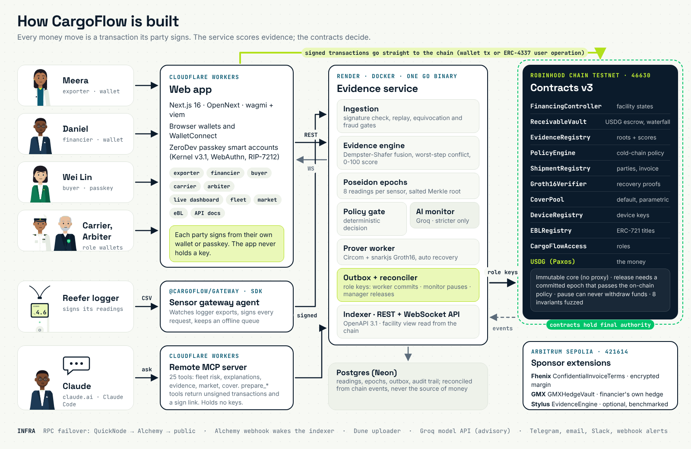

# CargoFlow documentation

Everything about CargoFlow in one place, in the order most readers need it. The [README](../README.md) tells the story
end to end; these pages go deeper.

## Start here

| | |
|---|---|
| [README](../README.md) | The problem, the cast, how it works in twelve beats, the live product, Claude, architecture, every contract and live run |
| [Role guides](guides/README.md) | One per party, told by its character, with the exact contract calls: [exporter](guides/exporter.md) · [financier](guides/financier.md) · [buyer](guides/buyer.md) · [carrier](guides/carrier.md) · [arbiter](guides/arbiter.md) |
| [All links](../README.md#all-links) | Every link in one table: website, app, API, contracts, pitch deck, film, MCP, packages, Telegram |
| [Live app](https://cargoflow.adoranto737.workers.dev) | Production build, live on Robinhood Chain Testnet; connect a wallet or sign in with a passkey |
| Pitch deck | [PDF](pitch/CargoFlow-pitch.pdf) · [PPTX](pitch/CargoFlow-pitch.pptx) · [HTML, animated](https://lsudoko.github.io/CargoFlow/pitch/) · [Google Drive](GDRIVE_PITCH_URL) |
| [Use CargoFlow in Claude](../README.md#use-cargoflow-in-claude) | The remote MCP server: `https://cargoflow-mcp.adoranto737.workers.dev/mcp` ([add it](https://claude.ai/new?modal=add-custom-connector)) |

## How it is built

| | |
|---|---|
| [Architecture](architecture.md) | Components, the facility state machine, who may do what, trust boundaries, evidence to money in one pass, what changes for production |
| [Backend service](../backend/README.md) | The Go service: API, configuration, startup checks, the evidence score, commitments, AI monitor, automatic ZK recovery, device trust, EPCIS, fee guidance, ZeroDev gas policy, Alchemy webhook, Dune upload, guarantees and known limits |
| [Frontend](../frontend/README.md) | The Next.js web app, its tests and the testnet lifecycle script |
| [Design system](design/system.md) | Tokens, type, layout, components and motion shared by the website and the film ([audit](design/audit.md)) |
| [Contracts deployments](../contracts/deployments/robinhood-testnet.json) | Machine-readable v3 manifest ([Arbitrum Sepolia](../contracts/deployments/arbitrum-sepolia.json), [v1](../contracts/deployments/robinhood-testnet-v1.json)) |
| [Stylus engine](../stylus/README.md) | Optional Rust evidence engine on Arbitrum Sepolia, benchmarked against Solidity |

## For developers

| | |
|---|---|
| [API reference](https://cargoflow.adoranto737.workers.dev/docs) | Interactive OpenAPI 3.1 reference with every wallet-signed message format ([raw spec](https://cargoflow-api-75ul.onrender.com/v1/openapi.json)) |
| [`@cargoflow/sdk`](../packages/sdk/README.md) | Typed TypeScript client, ABIs, unsigned transaction builders, gateway signing, Merkle proof checks |
| [`@cargoflow/mcp`](../packages/mcp/README.md) | The MCP server: hosted, stdio and Streamable HTTP; client configs for claude.ai, Claude Code, Claude Desktop and Cursor |
| [`@cargoflow/gateway`](../packages/gateway/README.md) | The edge agent for data loggers: folder watch, USB, serial, offline queue |
| [`cargoflow` for Python](../packages/python/README.md) | Data frames, portfolio analytics, Monte Carlo of default and recovery |
| [Dune queries](../analytics/dune) | Volume, escrow, pause and recovery rates, lender yield |
| [GitHub Packages](releases/github-packages.md) | The npm packages as `@lsudoko/cargoflow-*` and the `ghcr.io/lsudoko/cargoflow-backend` / `cargoflow-gateway` images: how they are published and pulled |

## Operations, security, proof

| | |
|---|---|
| [Testnet runbook](runbooks/testnet.md) | Keys, funding, deploy, verify, and the hero run on the public testnet |
| [Sponsor integrations](sponsors/README.md) | What each partner does in CargoFlow, where the code is, its status and what comes next |
| [Benchmarks](benchmarks.md) | Gas, proving time and how every figure is reproduced |
| [Slither triage](security/slither-triage.md) | Static analysis findings and decisions ([v2](security/slither-v2.md), [v3](security/slither-v3.md)) |
| [Threat model](project/16-security-threat-model.md) | Assets, adversaries and mitigations; vulnerability reports per [SECURITY.md](../SECURITY.md) |

## The protocol in depth

| | |
|---|---|
| [Protocol knowledge base](project/README.md) | Chapters 00 to 27: problem, research, architecture, roles, evidence engine, ZK and privacy, AI monitoring, risk, contracts, USDG and Robinhood Chain, testing, roadmap |
| [Design spec](superpowers/specs/2026-09-30-cargoflow-design.md) | The decisions behind the build and where they depart from the knowledge base |
| [Roadmap](superpowers/plans/2026-09-30-cargoflow-roadmap.md) and [advanced roadmap](project/22-advanced-roadmap.md) | What comes next |
| [Plans](superpowers/plans) | Every workstream plan, including [this documentation's](superpowers/plans/2026-10-04-story-readme-site.md) |

## The film and the media kit

| | |
|---|---|
| [Demo film script](../video/SCRIPT-v2.md) | The 5.5-minute film scene by scene, with the claims checked against their sources |
| [Media kit](assets/v3/README.md) | Every image and GIF in these docs, how it was made (all from the film's code-native illustration library and real captures, nothing generated) and how to regenerate it |
| [Source captures](../video/public/sources) | The statistics' source pages, captured with highlight boxes |
| [claude.ai captures](../video/public/footage/claude) | The real claude.ai sessions with the CargoFlow connector |

[Changelog](../CHANGELOG.md) · [Contributing](../CONTRIBUTING.md) · [License](../LICENSE)
