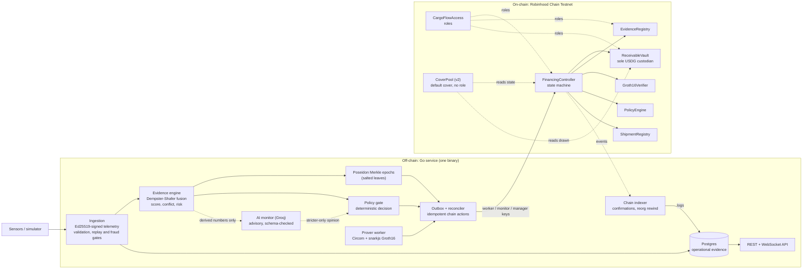
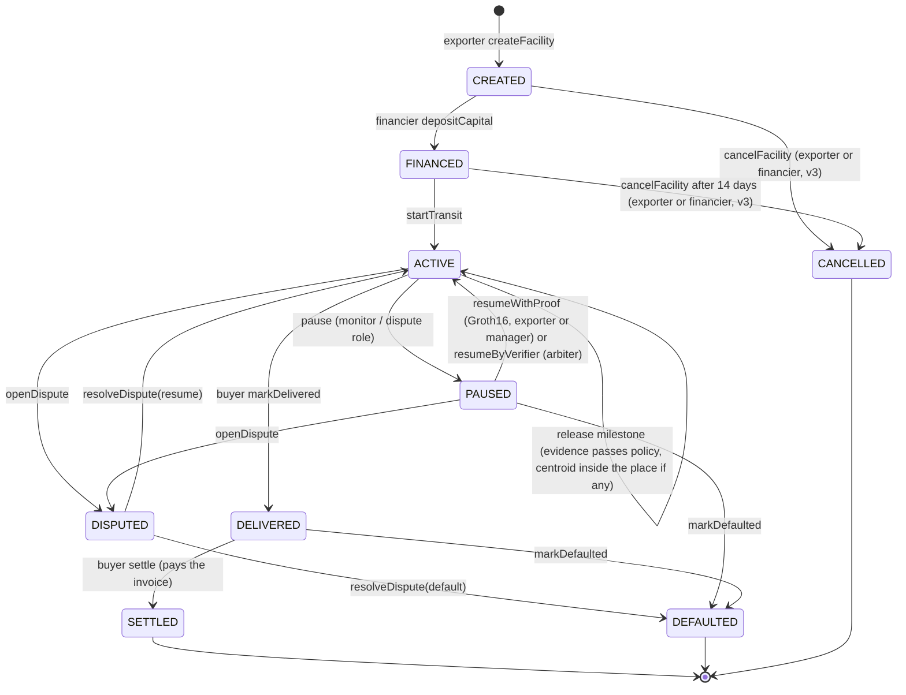

# Architecture

How the pieces fit, who may do what, and what is trusted. Protocol detail lives in
[`docs/project/`](project/README.md); the decisions that departed from it are in the
[design spec](superpowers/specs/2026-09-30-cargoflow-design.md#10-deviations-from-docsproject-decided-during-p1).

## Components

The chain is the financial source of truth. Postgres holds operational evidence (readings, epochs, the
action outbox, the audit trail) and is reconciled from chain events; the API's facility view reads the
chain directly, so a lagging indexer can never show money that did not move.

## Facility state machine

Release is binary and sequential: a milestone releases its exact tranche or nothing, strictly in order, once.
Settlement is a fixed waterfall: invoice -> financier (drawn principal + fee + undrawn) -> exporter (residual).

Contracts v2 adds three conditions without adding a state:

- **Place-based milestones.** A milestone may carry a place (`latE6`, `lonE6`, `radiusM`, 1-1,000 km). Evidence
  that passes the policy but whose epoch centroid lies outside the radius reverts `OutsideMilestonePlace`; the
  facility stays ACTIVE and the milestone waits for later evidence (`HELD_NOT_AT_PLACE` off chain). The distance
  is computed on chain in integer math (`GeoDistance`), and `placeCheck` exposes the exact value.
- **Humidity and shock limits.** The policy carries `maxHumidityX100` and `maxShockX100` (0 = no limit); each
  epoch commits its maxima. A breach reverts `EvidenceBelowPolicy` like a low score and the service pauses with
  `HUMIDITY_LIMIT` / `SHOCK_LIMIT`. The ZK circuit still proves only temperature, so such a pause is recovered by
  the arbiter or fresh evidence; a proof cannot resume a facility whose recovery epoch breaches either limit.
- **Default cover.** `CoverPool` lets an insurer escrow cover before transit and the financier buy it (premium
  paid directly to the insurer, at most 20%). On SETTLED the cover is credited back to the insurer; on DEFAULTED
  the financier is credited `min(cover, drawn)` and the insurer the rest; payouts are pulled with `withdraw()`.
  The pool holds no role and cannot touch the vault.

Contracts v3 (one redeploy; additive: every v2 function, struct, event and error keeps its signature, the
`Status` enum gains `CANCELLED` and `CoverStatus` gains `TRIGGERED`, both at the end):

- **Cancellation.** A facility that never started can be closed: while CREATED by the exporter or the
  financier at any time, while FINANCED by either of them once `CANCEL_TIMEOUT` (14 days) has passed since the
  deposit. The vault (`closeCancelled`) returns the whole deposit to the financier; nothing was drawn, so
  nothing else moves. A cover on a cancelled facility is released to the insurer through the unchanged
  `release()`.
- **Electronic bill of lading (`EBLRegistry`, OpenZeppelin ERC-721).** A carrier (`CARRIER_ROLE`) issues one
  token per bill (document hash, issuer, shipper, consignee or "to order"); holding the token is holding the
  title, transfers are endorsements, and `surrender` returns it to the carrier at delivery and freezes it.
  The exporter can bind a bill to its facility before transit (`bindTitle`): the token is escrowed in the
  controller. **Rule: documents against payment.** On `settle` the title passes to the buyer in the same
  transaction as the payment; on default it passes to the financier (its security); on cancellation it returns
  to the exporter. While bound nobody, including the exporter, the carrier and the admin, can move it. This
  is the safest of the options considered: the buyer can never hold the title without having paid, and the
  financier never depends on a third party handing it over. Designed around MLETR concepts (exclusive control:
  a single token owner; singularity: one token per document hash; integrity: an immutable hash and a frozen
  state once surrendered or voided). This is not a legal compliance claim: legal recognition depends on the
  jurisdiction and on a reliable-system assessment that code cannot grant.
- **Device registry (`DeviceRegistry`).** A write-once record of evidence device keys and their class
  (0 software, 1 passkey, 2 secure element). The backend verifies X.509 / WebAuthn attestations off chain and
  records them with `ATTESTOR_ROLE`; anyone may self-register a software key. The evidence worker can record
  which device keys fed an epoch (`EvidenceRegistry.recordEpochSources`), so anyone can audit the sources.
- **Parametric cover.** An offer may carry a trigger (N consecutive non-compliant epochs, salvage to the
  exporter). Every committed epoch now has a 1-based commit ordinal within its shipment; anyone proves the
  trigger with N epoch ids whose ordinals are consecutive, all non-compliant, all committed after acceptance,
  while the facility is ACTIVE, PAUSED or DISPUTED. The pool pays the financier `min(cover, drawn)`, the
  exporter `min(salvage, rest)`, the insurer the remainder, once, pull-based. It is final: a later settle or
  default does not reopen it (the insurer prices that).
- **Circuit breaker (OpenZeppelin `Pausable`).** A guardian (`PAUSER_ROLE`) can stop new risk only:
  `createFacility`, `depositCapital`, `bindTitle`, `offerCover`, `offerParametricCover`, `acceptCover`,
  `registerDevice`. Exits are never pausable: milestone release, `markDelivered`, `settle`, pauses and dispute
  resolution, defaults, `cancelFacility` refunds, cover `release` / `claim` / `triggerParametric` /
  `withdraw` / `withdrawOffer`, device revocation. Funds can therefore never be trapped by a pause.
- **Rescue.** The access contract's admin can sweep tokens sent to the CoverPool by mistake: for USDG only
  the excess over open offers + active covers + credited payouts, for other tokens the balance.
- **Smart-account callers.** No contract uses `tx.origin` or assumes an EOA: buyer, exporter and arbiter may
  be ERC-4337 accounts (ZeroDev Kernel with the WebAuthn validator is already deployed on Robinhood Chain
  Testnet, and the RIP-7212 P-256 precompile at `0x100` answers there). Gas sponsorship is off chain (Alchemy
  Gas Manager); CargoFlow ships no account or paymaster contracts. Titles are moved with `transferFrom`, so a
  contract recipient needs no receiver hook and cannot block a transition.

## Who may do what

| Actor | Authority | Cannot |
|---|---|---|
| Exporter | register shipment, set policy, create facility, start transit, trigger release, bind a bill of lading (v3), cancel before transit (v3) | change a committed policy, redirect funds (recipient is fixed to the exporter) |
| Financier | deposit the committed amount, trigger release, accept a cover offer (pays the premium) | withdraw once deposited |
| Insurer (v2, any address) | offer default cover before transit, withdraw an unaccepted offer, withdraw credited payouts | take back an accepted cover, or be paid before the facility settles or defaults |
| Buyer | confirm delivery, pay the invoice | settle on someone else's behalf (`NotBuyer`) |
| Worker key (`EVIDENCE_VERIFIER`) | commit evidence epochs | release, pause, resume |
| Monitor key (`MONITOR`) | request a pause | anything else; the service refuses to start if it holds another role |
| Manager key (`FACILITY_MANAGER`) | start transit, release, submit recovery proofs | resume without a proof, change policy, move funds elsewhere |
| Arbiter (`DISPUTE`) | pause, resume by verifier (the trusted fallback), open and resolve disputes, declare default | release |
| Carrier (`CARRIER`, v3) | issue bills of lading; void a live bill it holds | move a bill held by anyone else, or one escrowed by the controller |
| Attestor (`ATTESTOR`, v3, the backend) | record attested devices of any class, revoke devices | move funds |
| Guardian (`PAUSER`, v3) | pause / unpause new risk (facilities, deposits, cover, title binding, devices) | block any exit: release, delivery, settlement, refunds, cover payouts |
| Admin | grant and revoke roles (two-step, delayed transfer); rescue tokens sent to the cover pool by mistake (untracked excess only) | touch a facility, the vault, tracked cover funds or a title |
| AI model | recommend a stricter outcome | hold any key or call anything: the service acts on its behalf only through the monitor key, and only to pause |

## Trust boundaries

| Boundary | What crosses | Protection |
|---|---|---|
| Sensor to service | readings | Ed25519 signature over method, path, time and body hash; replay, equivocation, fixed-point bounds, fraud signals |
| Service to chain | roots, scores, pauses, releases | three role-limited keys, an idempotent outbox, decoded reverts, startup role verification |
| Service to model | `Brief`: integers, booleans, enum members and the shipment id | no telemetry-derived text can reach it; reply parsed strictly and validated twice; timeout, panic and invalid-reply fallback |
| Model to chain | at most a pause request | stricter-than-policy only, confidence threshold, pause-only key, contracts decide legality |
| Prover to chain | `a, b, c` | the contract derives every public signal itself; the proof is bound to chain, verifier, controller, shipment, epoch, policy, submitter and pause count |
| Database to API | operational views | the facility view is read from the chain |

## Evidence to money, in one pass

1. Readings validate and align into time buckets; each sensor contributes a mass over {physically fine,
   violated, unknown}; Dempster-Shafer combines them per bucket and records the worst conflict.
2. Penalties (physical, conflict, freshness, route, source reliability, fraud, coverage) make a 0-100 score
   with a published formula.
3. Eight readings close an epoch whose salted Poseidon Merkle root is committed on-chain with score,
   conflict and risk, and (v2) the epoch's aggregates: centroid, highest humidity, highest shock. The readings
   themselves stay in Postgres.
4. The policy gate decides approve, request secondary proof, or pause. The model may only tighten that.
5. The controller releases only if the committed epoch satisfies the on-chain policy (and, for a place-based
   milestone, lies inside its place), regardless of what the backend asked for.
6. After a pause, a Groth16 proof that eight committed-after-the-pause readings of the unaffected probe lie in
   the policy band, bound to this exact pause, resumes the facility.

## What would change for production

A public trusted-setup ceremony (or a transparent proof system), attested hardware sources instead of
signing keys, a multi-instance backend with a distributed lock and a proof queue, calibrated scoring, an
independent audit, and a governance story for the admin and verifier roles.
