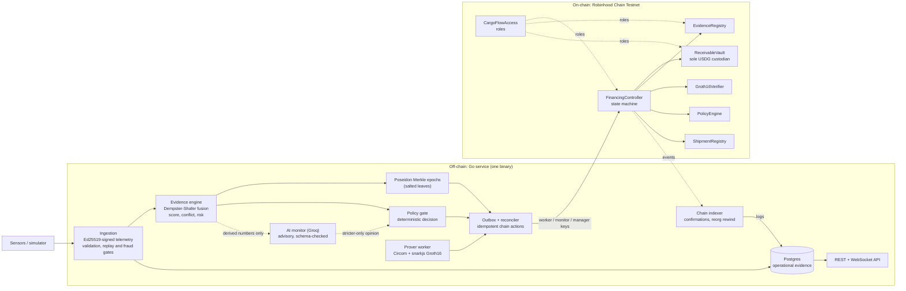
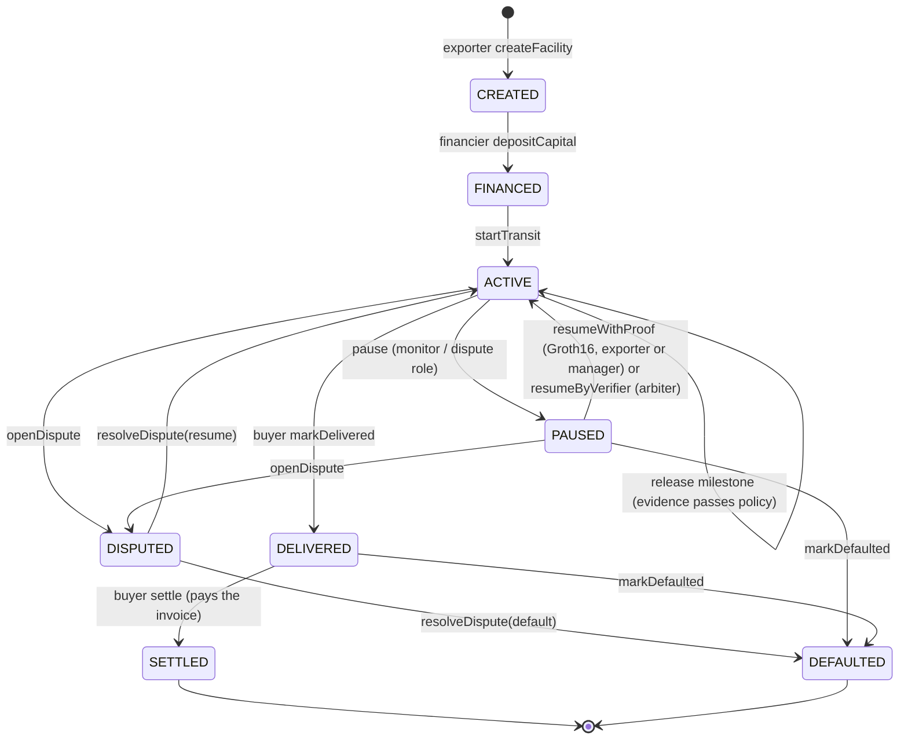

# Architecture

How the pieces fit, who may do what, and what is trusted. Protocol detail lives in
[`docs/project/`](project/README.md); the decisions that departed from it are in the
[design spec](superpowers/specs/2026-09-30-cargoflow-design.md#10-deviations-from-docsproject-decided-during-p1).

## Components

The chain is the financial source of truth. Postgres holds operational evidence (readings, epochs, the
action outbox, the audit trail) and is reconciled from chain events; the API's facility view reads the
chain directly, so a lagging indexer can never show money that did not move.

## Facility state machine

Release is binary and sequential: a milestone releases its exact tranche or nothing, strictly in order, once.
Settlement is a fixed waterfall: invoice -> financier (drawn principal + fee + undrawn) -> exporter (residual).

## Who may do what

| Actor | Authority | Cannot |
|---|---|---|
| Exporter | register shipment, set policy, create facility, start transit, trigger release | change a committed policy, redirect funds (recipient is fixed to the exporter) |
| Financier | deposit the committed amount, trigger release | withdraw once deposited |
| Buyer | confirm delivery, pay the invoice | settle on someone else's behalf (`NotBuyer`) |
| Worker key (`EVIDENCE_VERIFIER`) | commit evidence epochs | release, pause, resume |
| Monitor key (`MONITOR`) | request a pause | anything else; the service refuses to start if it holds another role |
| Manager key (`FACILITY_MANAGER`) | start transit, release, submit recovery proofs | resume without a proof, change policy, move funds elsewhere |
| Arbiter (`DISPUTE`) | pause, resume by verifier (the trusted fallback), open and resolve disputes, declare default | release |
| Admin | grant and revoke roles (two-step, delayed transfer) | touch a facility or the vault |
| AI model | recommend a stricter outcome | hold any key or call anything: the service acts on its behalf only through the monitor key, and only to pause |

## Trust boundaries

| Boundary | What crosses | Protection |
|---|---|---|
| Sensor to service | readings | Ed25519 signature over method, path, time and body hash; replay, equivocation, fixed-point bounds, fraud signals |
| Service to chain | roots, scores, pauses, releases | three role-limited keys, an idempotent outbox, decoded reverts, startup role verification |
| Service to model | `Brief`: integers, booleans, enum members and the shipment id | no telemetry-derived text can reach it; reply parsed strictly and validated twice; timeout, panic and invalid-reply fallback |
| Model to chain | at most a pause request | stricter-than-policy only, confidence threshold, pause-only key, contracts decide legality |
| Prover to chain | `a, b, c` | the contract derives every public signal itself; the proof is bound to chain, verifier, controller, shipment, epoch, policy, submitter and pause count |
| Database to API | operational views | the facility view is read from the chain |

## Evidence to money, in one pass

1. Readings validate and align into time buckets; each sensor contributes a mass over {physically fine,
   violated, unknown}; Dempster-Shafer combines them per bucket and records the worst conflict.
2. Penalties (physical, conflict, freshness, route, source reliability, fraud, coverage) make a 0-100 score
   with a published formula.
3. Eight readings close an epoch whose salted Poseidon Merkle root is committed on-chain with score,
   conflict and risk; the readings themselves stay in Postgres.
4. The policy gate decides approve, request secondary proof, or pause. The model may only tighten that.
5. The controller releases only if the committed epoch satisfies the on-chain policy, regardless of what the
   backend asked for.
6. After a pause, a Groth16 proof that eight committed-after-the-pause readings of the unaffected probe lie in
   the policy band, bound to this exact pause, resumes the facility.

## What would change for production

A public trusted-setup ceremony (or a transparent proof system), attested hardware sources instead of
signing keys, a multi-instance backend with a distributed lock and a proof queue, calibrated scoring, an
independent audit, and a governance story for the admin and verifier roles.
