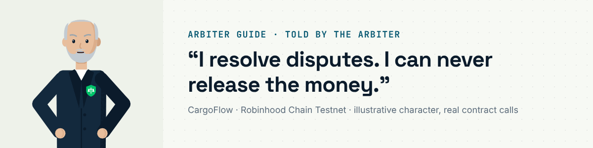
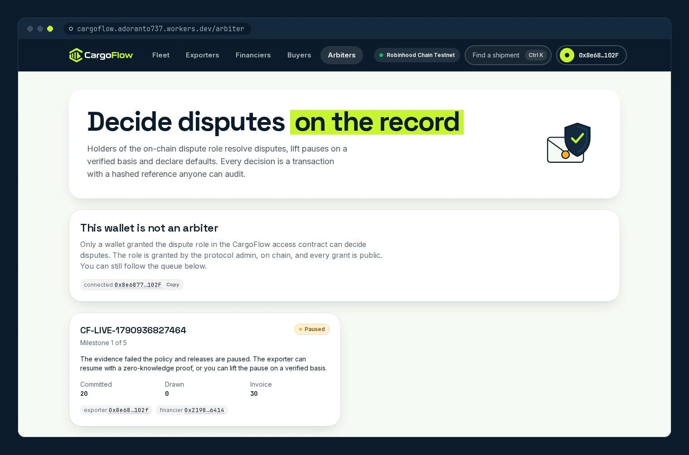

# Arbiter guide: the referee

I hold the on-chain dispute role (`DISPUTE`) in
[`CargoFlowAccess`](https://explorer.testnet.chain.robinhood.com/address/0x6b334b4C73c27CB297470140c86311075408b050).
I can pause a facility, resume a paused one on a verified basis, resolve disputes and declare a default. I can never
release a tranche: the contract has no path for it. Every decision I make is a transaction with a hashed reference,
so it is on the record.

You need: a wallet that holds the `DISPUTE` role (granted by the protocol admin)
and a little testnet ETH.

## 1 · The queue

[/arbiter](https://cargoflow.adoranto737.workers.dev/arbiter) lists every paused or disputed facility with its evidence,
the AI monitor's audit and the explanation. Acting needs the role; with any other wallet the console is read-only, as
in this capture.

## 2 · Pause, or resume on a verified basis

| Action | On chain | When |
|---|---|---|
| Pause a facility | `pauseFinancing(shipmentId, reasonCode)` | something is wrong that the evidence has not caught yet |
| Resume without a proof | `resumeByVerifier(shipmentId, basis)` | the trusted fallback: the facility is paused and I record the verified basis (a non-zero hash, for example of an inspection report) |

The normal way back from a pause is the exporter's zero-knowledge proof (`resumeWithProof`); `resumeByVerifier` is for
when no proof is possible.

## 3 · Resolve a dispute

The exporter, the financier or I can open a dispute on an active or paused facility (`openDispute`), which freezes
releases. Only the dispute role can close it:

| Decision | On chain | Effect |
|---|---|---|
| Resume | `resolveDispute(shipmentId, true, resolutionRef)` | the facility is active again; releases continue on evidence |
| Default | `resolveDispute(shipmentId, false, resolutionRef)` | as below |

## 4 · Declare a default

`markDefaulted(shipmentId, ref)` on a paused or delivered facility (or the default branch of `resolveDispute`): the
vault returns any undrawn USDG to the financier, an escrowed bill of lading moves to the financier, and default cover in
the [`CoverPool`](https://explorer.testnet.chain.robinhood.com/address/0x4e4f09Da01f466275b586b0cc32613a90b1B69e5) becomes
claimable (min(cover, drawn principal)).

## 5 · What I cannot do

I cannot call `evaluateAndReleaseMilestone` (only the exporter, the financier and the facility manager key can, and
the contract still checks the evidence), I cannot redirect a payout, and I cannot touch the vault. The full authority
matrix, including what each role *cannot* do, is in [`docs/architecture.md`](../architecture.md#who-may-do-what).

---

Other guides: [exporter](exporter.md) · [financier](financier.md) · [buyer](buyer.md) · [carrier](carrier.md) ·
[all guides](README.md) · [docs index](../README.md)
