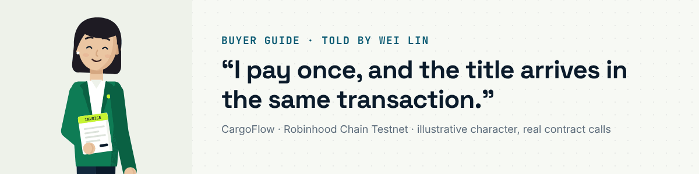
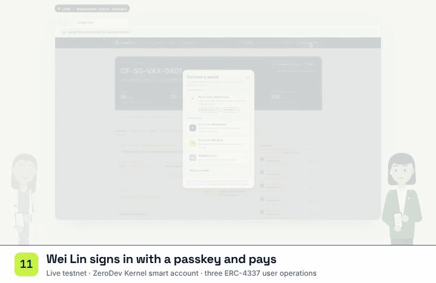
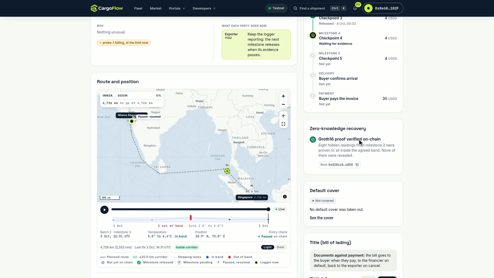
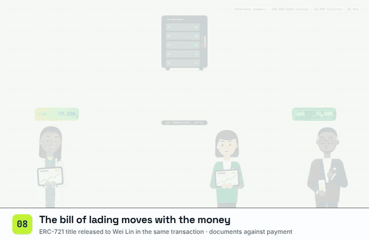
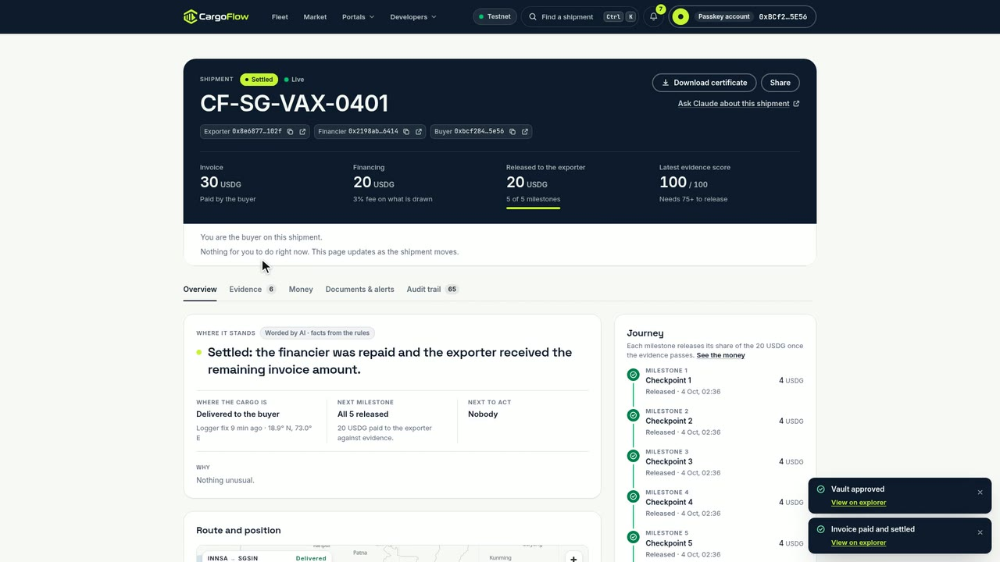

# Buyer guide: Wei Lin

I import pharmaceuticals in Singapore. I want the right cargo, at the right temperature, and the title papers in the
same moment I pay. With CargoFlow I can see the whole voyage's evidence before I confirm, I pay the invoice once, and
the contract sends the financier and the exporter their shares and hands me the electronic bill of lading in that same
transaction. I use a passkey, so I need no browser extension. The links are my live passkey run `CF-SG-VAX-0401`
([dashboard](https://cargoflow.adoranto737.workers.dev/track/0x195c3fb058809fac41122a6540827510c79c7fe29462c8dea46bc18549c53f51)).

## 1 · Sign in with a passkey (or any wallet)

**Connect wallet → Continue with passkey → Create a passkey account** (or **Sign in with an existing passkey**). Face ID,
a fingerprint or a security key creates a ZeroDev Kernel smart account; my address is the account
[`0xBCf2…5E56`](https://explorer.testnet.chain.robinhood.com/address/0xBCf284379b7Ce7144d4154BCc73043A750125E56). The
chain verifies the passkey's P-256 signature through its RIP-7212 precompile. A browser wallet works the same way.

## 2 · Check the evidence and confirm delivery

On the shipment page (or [/buyer](https://cargoflow.adoranto737.workers.dev/buyer)) I see every committed epoch, the
excursion and the verified recovery. When the reefer is on my quay I press **Confirm delivery**. With a passkey this is
an ERC-4337 user operation; the first one also deploys my account.

| On chain | Contract | My run (user operation → transaction) |
|---|---|---|
| deploy account + `markDelivered` | FinancingController | `0x8d15b67b…a302abf` → [`0x485e2b6e…`](https://explorer.testnet.chain.robinhood.com/tx/0x485e2b6e38bf99c3cda001b0c166d0e045e282fec907c72103a58a4ffed0f121) |

## 3 · Approve and pay the invoice

**1. Approve 30 USDG**, then **2. Pay the 30 USDG invoice**. The controller runs the waterfall through the vault: the
financier gets principal plus fee (20.6), the exporter the rest (9.4).

| On chain | Contract | My run (user operation → transaction) |
|---|---|---|
| `approve` 30 USDG to the vault | USDG | `0x677b82a9…1ed156827` → [`0x6dd4b06d…`](https://explorer.testnet.chain.robinhood.com/tx/0x6dd4b06d67b31d72e8a4df1fb92c81b8c090ee6754a4cf8b848d05cc6eb8c742) |
| `settle` | FinancingController → ReceivableVault | `0xf70d30af…ead4cc1d` → [`0xee1d5ba8…`](https://explorer.testnet.chain.robinhood.com/tx/0xee1d5ba8731c027a79c1ce68696360e694f687c7926cd36bca1a6db215815956) |

Gas: my account paid nothing and holds no ETH. On Robinhood Chain Testnet ZeroDev quotes a zero gas price and its
bundler covers the chain fee; CargoFlow's own sponsorship policy is built and tested and takes over where gas is priced.

## 4 · The title is mine, and so is the certificate

When the exporter has bound a bill of lading, it moves to me inside the payment transaction: its possession history
ends *Released to Wei Lin* and the title card reads *With the buyer*. On the film's shipment `CF-SG-VAX-0202` bill #2
left escrow for the buyer in the [`settle`](https://explorer.testnet.chain.robinhood.com/tx/0xabba66b6f602ed9e04bbabcd1a56e118cf188ae8bd9934b3f7e405e341f6e562)
transaction (my passkey run had no bill bound). **Download certificate** gives a PDF with every epoch, the proof and the
split.

---

Other guides: [exporter](exporter.md) · [financier](financier.md) · [carrier](carrier.md) · [arbiter](arbiter.md) ·
[all guides](README.md) · [docs index](../README.md)
