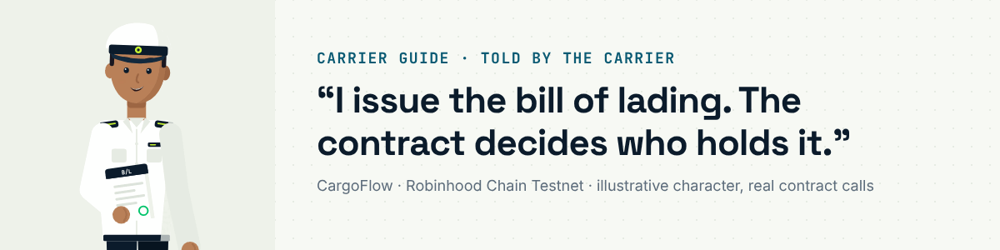

# Carrier guide: the ship's officer

I issue the bill of lading: the document of title to the cargo. In CargoFlow it is an ERC-721 token on the
[`EBLRegistry`](https://explorer.testnet.chain.robinhood.com/address/0x72278056f6537e4F3437b96898BB439ab7BF68A9)
("CFEBL"), one per bill, carrying the document's fingerprint, the shipper, the consignee and its possession history.
Once the exporter binds it to a facility, the contract holds it and moves it under documents against payment. The
links are bill #2 on `CF-SG-VAX-0202`, recorded for the demo film on 3 October 2026.

You need: a wallet that holds the on-chain `CARRIER` role on the `EBLRegistry` (granted by the protocol admin) and a
little testnet ETH.

## 1 · Issue the bill

On [/ebl](https://cargoflow.adoranto737.workers.dev/ebl) I choose **Issue a bill**: the shipper (the exporter's
address), the consignee (a named buyer), and the bill-of-lading PDF, which is hashed in my browser and never uploaded.
**Issue bill of lading** mints the token to the shipper. Each document can be issued only once.

| On chain | Contract | Real run |
|---|---|---|
| `issue(documentHash, shipper, consignee)` | EBLRegistry | [`0x86b63198…`](https://explorer.testnet.chain.robinhood.com/tx/0x86b6319841759e126154dd71fb1959b6a34f085cdbd858ce3d2e0f07e34f11df) (bill #2) |

Every bill has a public page with its number, fingerprint and possession history; anyone can check a paper or PDF copy
against the fingerprint.

## 2 · The exporter binds it into escrow

The exporter approves the controller and binds the bill to her facility
([`bindTitle`](https://explorer.testnet.chain.robinhood.com/tx/0xc13143ddd3ebd67249e6e24df969eb29723f844711d05258bd0f887be30f4707)).
From then on the `FinancingController` holds the token; the title card reads *In escrow*. I cannot move a bill the
controller holds, and neither can anyone else.

## 3 · The title follows the money

The controller releases the bill in exactly three cases, each in the same transaction as the money:

| Outcome | Bill goes to | On chain |
|---|---|---|
| The buyer pays | the buyer | inside `settle` ([real run](https://explorer.testnet.chain.robinhood.com/tx/0xabba66b6f602ed9e04bbabcd1a56e118cf188ae8bd9934b3f7e405e341f6e562)) |
| The facility defaults | the financier | inside `markDefaulted` / `resolveDispute` (default) |
| The facility is cancelled before transit | back to the exporter | inside `cancelFacility` |

The holder can surrender the bill back to me when the cargo is collected (`surrender`), which closes the title. I can void a live bill only while I hold it myself
(`voidBill`), never one held by anyone else or escrowed by the controller.

Designed around MLETR concepts (exclusive control, singularity, integrity); not a claim of legal recognition.

---

Other guides: [exporter](exporter.md) · [financier](financier.md) · [buyer](buyer.md) · [arbiter](arbiter.md) ·
[all guides](README.md) · [docs index](../README.md)
