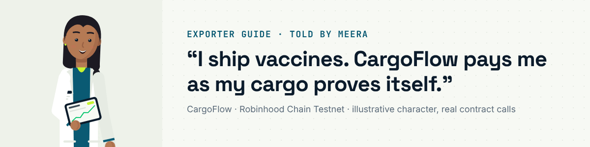

# Exporter guide: Meera

I export vaccines from Pune through Nhava Sheva to Singapore at 2 to 8 °C. I pay for the vials, the reefer and the
freight today; my buyer pays about two months later. With CargoFlow a financier escrows working capital against my
shipment, and it is released to me milestone by milestone as the cargo's own evidence passes. Every step below is a
transaction I sign from my own wallet on [Robinhood Chain Testnet](https://explorer.testnet.chain.robinhood.com),
or a message I sign without gas. The links are my real run, `CF-SG-VAX-0202`, recorded for the demo film on
3 October 2026 ([dashboard](https://cargoflow.adoranto737.workers.dev/track/0xc99131cb35886c991398b53530e1cfedb12fa1f7205a3f95f49b13cd1f7d761a)).

You need: a wallet on Robinhood Chain Testnet with a little testnet ETH, your buyer's address and, if you already
have one, your financier's address.

## 1 · Register the shipment, the policy and the facility

On [/exporter](https://cargoflow.adoranto737.workers.dev/exporter) the wizard has four steps: **Shipment** (reference,
buyer, invoice value, route; the invoice PDF is fingerprinted in the browser, never uploaded), **Cold-chain policy**
(the Pharma template fills 2 to 8 °C, humidity ≤ 85%, shock ≤ 3 g, score ≥ 75, conflict ≤ 30%), **Financing** (I have a
financier, or ask the [market](https://cargoflow.adoranto737.workers.dev/market); amount, milestones, fee) and **Sign**.

| On chain | Contract | My run |
|---|---|---|
| `registerShipment` | ShipmentRegistry | [`0x40291f4e…`](https://explorer.testnet.chain.robinhood.com/tx/0x40291f4eadf2b2014f042de8b6afbfeb12e0635c5b7f3cb6b5a25536793ff67d) |
| `setPolicy` (commit-reveal) | PolicyEngine | [`0xa2fa7ae1…`](https://explorer.testnet.chain.robinhood.com/tx/0xa2fa7ae11c676837b8ecdc8887b5a0cd4a97d3a929ab720768f4c0971ce9b028) |
| `createFacility` (20 USDG in 5 milestones, 3% fee) | FinancingController | [`0x5a9fe4b2…`](https://explorer.testnet.chain.robinhood.com/tx/0x5a9fe4b23d2128ce5bd9550145c2ebc1c29a11726d6c2400c3926e8eaee52abe) |

Until transit starts I can cancel a facility that never started (`cancelFacility`).

## 2 · Bind the bill of lading

The [carrier](carrier.md) issues the electronic bill of lading to me. On my shipment page, in the title card, I choose
**Bind a bill of lading**: I approve the controller for the token and bind it. From now on the contract holds the
title and releases it to the buyer only when she pays.

| On chain | Contract | My run |
|---|---|---|
| `approve` (ERC-721) | EBLRegistry | [`0x7827d144…`](https://explorer.testnet.chain.robinhood.com/tx/0x7827d14406bebecde2fe1ba6a9dbd02998b908ab6c2e249b4bc9bec1fa6b1b38) |
| `bindTitle` | FinancingController | [`0xc13143dd…`](https://explorer.testnet.chain.robinhood.com/tx/0xc13143ddd3ebd67249e6e24df969eb29723f844711d05258bd0f887be30f4707) |

## 3 · Start transit and let the logger speak

I press **Start transit**, then **Add sensor gateway**: a device key for the reefer logger, authorized by a wallet
*signature* (no gas). Readings arrive as a logger CSV through **Submit readings**, or from the
[gateway agent](../../packages/gateway) in the warehouse. Each request is signed by the device key; eight readings per
sensor close an epoch, which the service scores and commits. When the committed epoch passes my policy, the controller
releases a tranche to me.

| On chain | Who sends it | My run |
|---|---|---|
| `startTransit` | me | [`0xd592d1c7…`](https://explorer.testnet.chain.robinhood.com/tx/0xd592d1c7cf36e855ec77b480ea29a685cdd6585d27d51cea1f7632476fae9d87) |
| `commitEpoch` (root + score) | backend worker key | per epoch, see the audit trail |
| `evaluateAndReleaseMilestone` M1, M2 | backend manager key (I or the financier may also call it; the contract checks the evidence either way) | [`0x5a9c4c84…`](https://explorer.testnet.chain.robinhood.com/tx/0x5a9c4c84727c67105d64226c8efb3d3d80b5e3e97e99560a8e19e34c3836ea94) · [`0xe6ba1be8…`](https://explorer.testnet.chain.robinhood.com/tx/0xe6ba1be8c8f2ae78ec4ef9d0c918037328d73d35fa24678f78df31b7adc2dcdc) |

## 4 · If the cargo warms up, the facility pauses

When probe-1 climbed out of the band and the two probes disagreed (74.8% conflict), the epoch scored 48 and the
facility paused itself: releases revert until it resumes. The page says why, in plain words, and what each of us does
next. Pause cannot move or withdraw any money.

| On chain | Who sends it | My run |
|---|---|---|
| `pauseFinancing` (reason code) | backend | [`0x0baca4b1…`](https://explorer.testnet.chain.robinhood.com/tx/0x0baca4b115f0dacfb67b4398af06ec0d7ee05a05276e25b6f764796f3535a9dc) |

## 5 · "Proof ready": I sign once and it resumes

As soon as probe-2 had eight fresh readings in band, CargoFlow prepared a Groth16 proof that they sit inside the band,
without revealing any of them, and notified me (the bell; Telegram, email, Slack or a webhook if I set them up). I chose
**Review and sign**, signed, and submitted the proof. The contract checked it against this exact pause, and the
remaining milestones released.

| On chain | Contract | My run |
|---|---|---|
| `resumeWithProof` (Groth16, bound to chain, verifier, controller, shipment, epoch, policy, submitter, pause count) | FinancingController → Groth16Verifier | [`0x79c68fc0…`](https://explorer.testnet.chain.robinhood.com/tx/0x79c68fc0a35fc23f08678215e858a1d16af38ce61b13307524e67802af8a232f) |
| `evaluateAndReleaseMilestone` M3, M4, M5 | FinancingController | [`0x00ac460b…`](https://explorer.testnet.chain.robinhood.com/tx/0x00ac460b140317ee5a807946bef8055a28cbc9fe129951f39f5734f1c38bfeea) · [`0x1e8964b0…`](https://explorer.testnet.chain.robinhood.com/tx/0x1e8964b0f8d7ae452baa6327ad6ecb4c1396c64e4fa5b1257f74f8fd94394cb6) · [`0x1404f204…`](https://explorer.testnet.chain.robinhood.com/tx/0x1404f2048472cfc84ea674884a8b2651769f2e15b7093a77823c62d1e122dd91) |

## 6 · Settlement: the residual comes to me

When the [buyer](buyer.md) pays, the vault repays the financier's principal and fee and sends me the rest in the same
transaction ([`settle`](https://explorer.testnet.chain.robinhood.com/tx/0xabba66b6f602ed9e04bbabcd1a56e118cf188ae8bd9934b3f7e405e341f6e562)):
on a 30 USDG invoice with 20 USDG drawn at 3%, the financier gets 20.6 and I get 9.4 on top of the 20 already advanced.
**Download certificate** gives a PDF of the whole story for my records.

If something is wrong at any point I can **open a dispute** (`openDispute`), which freezes releases until the
[arbiter](arbiter.md) resolves it.

---

Other guides: [financier](financier.md) · [buyer](buyer.md) · [carrier](carrier.md) · [arbiter](arbiter.md) ·
[all guides](README.md) · [docs index](../README.md)
