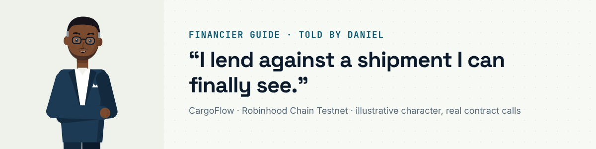
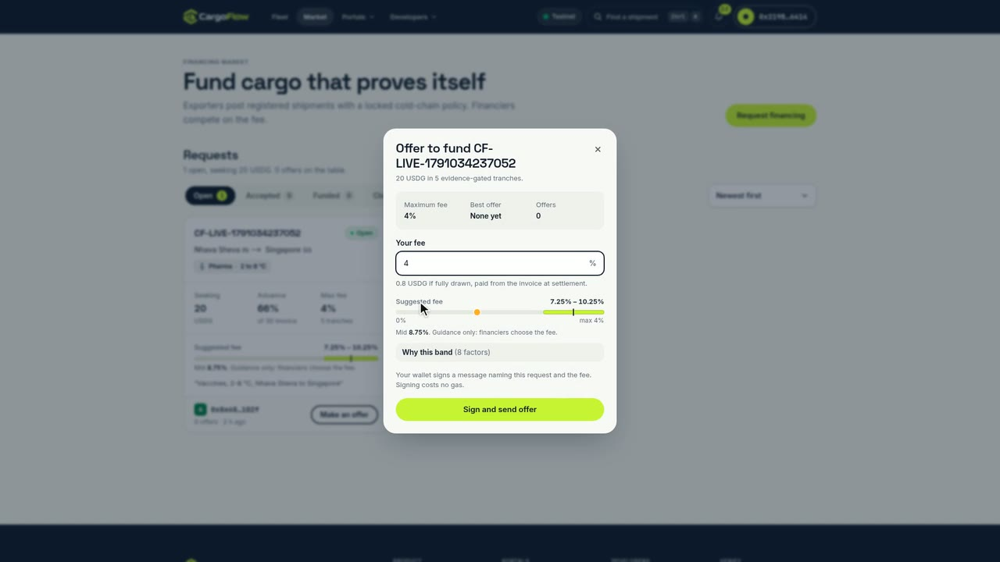
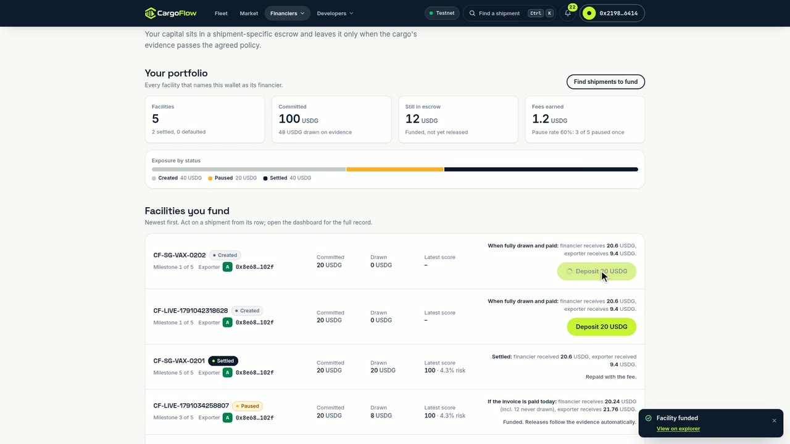
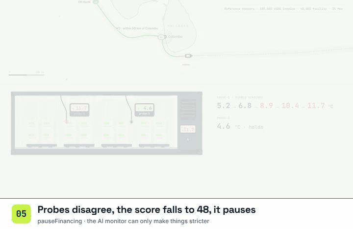
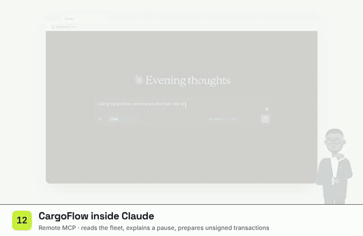
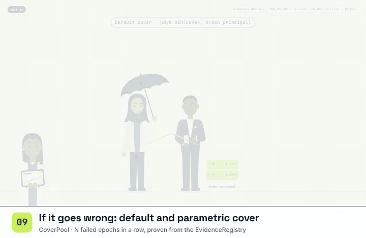
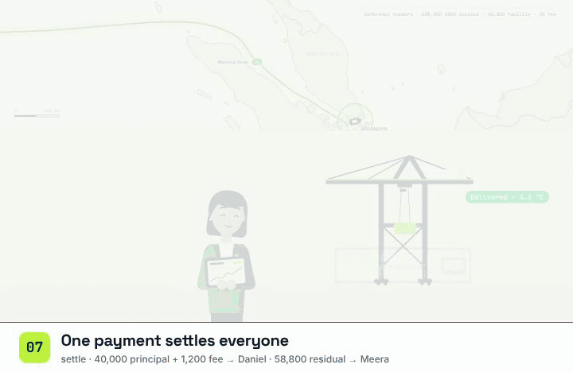

# Financier guide: Daniel

I run a credit fund. Before CargoFlow I got an invoice and a bill of lading, paperwork, not the container, so I lent
blind or not at all. Now my USDG sits in a shipment-specific escrow and leaves it only when the cargo's committed
evidence passes the policy on chain. Everything I do is a transaction from my own wallet, or a message I sign
without gas. The links are the real run `CF-SG-VAX-0202` from 3 October 2026
([dashboard](https://cargoflow.adoranto737.workers.dev/track/0xc99131cb35886c991398b53530e1cfedb12fa1f7205a3f95f49b13cd1f7d761a)).

You need: a wallet on Robinhood Chain Testnet with testnet ETH and the USDG you commit
([`0x7E95…802F`](https://explorer.testnet.chain.robinhood.com/address/0x7E955252E15c84f5768B83c41a71F9eba181802F)).

## 1 · Find a facility to fund

Facilities where an exporter named my wallet appear on [/financier](https://cargoflow.adoranto737.workers.dev/financier).
Shipments without a financier post requests on the [market](https://cargoflow.adoranto737.workers.dev/market); there I
see the suggested fee band (low / mid / high, with the reasons: route, cargo band, the exporter's track record) and send
an offer. An offer is a wallet *signature*, not a transaction; I choose the fee.

## 2 · Approve and deposit

The card shows the settlement preview before I commit (here: 20.6 USDG back on 20 when fully drawn and paid). I approve
the vault for the committed amount, then deposit. The whole facility is now escrowed in the `ReceivableVault`; I cannot
withdraw it, and nobody can send it anywhere except by the rules: tranches to the exporter on passing evidence, the
waterfall at settlement, undrawn USDG back to me on default or cancel.

| On chain | Contract | Real run |
|---|---|---|
| `approve` (USDG to the vault) | USDG | [`0xf77e1c21…`](https://explorer.testnet.chain.robinhood.com/tx/0xf77e1c21a999a3d3641b3e26e9f1b6736e1d7323a2d54d6d481acf825123ba7d) |
| `depositCapital` | FinancingController → ReceivableVault | [`0xdb32bb6a…`](https://explorer.testnet.chain.robinhood.com/tx/0xdb32bb6a22a7aa52265b03df3d46e1d78e27948e5bcdb933e1e8944691ce360b) |

## 3 · Watch the evidence, not the paperwork

The shipment page shows each milestone with its release transaction, the evidence score, sensor conflict and risk, the
temperature per epoch against the band, the AI monitor's verdict and an explanation in plain words. When the cargo
warmed up on `CF-SG-VAX-0202`, the facility paused itself
([`pauseFinancing`](https://explorer.testnet.chain.robinhood.com/tx/0x0baca4b115f0dacfb67b4398af06ec0d7ee05a05276e25b6f764796f3535a9dc))
before another USDG left escrow, and resumed only on a verified zero-knowledge proof. I can also trigger a release
myself (`evaluateAndReleaseMilestone`); the contract re-checks the evidence either way.

I often ask Claude instead of opening the dashboard:

"Using CargoFlow, summarise the fleet risk and explain any paused shipment", or "Prepare the deposit for …", which
returns unsigned transactions and a link to sign them here. Setup: [Use CargoFlow in Claude](../../README.md#use-cargoflow-in-claude).

## 4 · Optional: cover

An insurer can offer default cover before transit; I accept it and pay the premium (`acceptCover` on the
[`CoverPool`](https://explorer.testnet.chain.robinhood.com/address/0x4e4f09Da01f466275b586b0cc32613a90b1B69e5)). On a
default it pays min(cover, my drawn principal). Parametric cover pays after N consecutive failed epochs, proven from the
`EvidenceRegistry`'s commit order. Payouts are pull-based: I withdraw what I am credited.

## 5 · Settlement: principal and fee in the buyer's transaction

I do nothing at the end: when the [buyer](buyer.md) pays, the vault sends me principal plus fee in the same
transaction ([`settle`](https://explorer.testnet.chain.robinhood.com/tx/0xabba66b6f602ed9e04bbabcd1a56e118cf188ae8bd9934b3f7e405e341f6e562)).
If something is wrong I can **open a dispute** (`openDispute`); on a default the undrawn USDG comes back to me and the
bill of lading moves to me.

---

Other guides: [exporter](exporter.md) · [buyer](buyer.md) · [carrier](carrier.md) · [arbiter](arbiter.md) ·
[all guides](README.md) · [docs index](../README.md)
