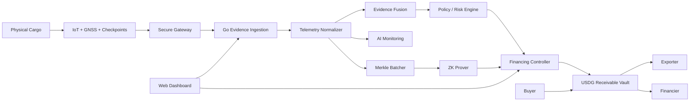

# System Architecture

## 1. Architecture overview

## 2. Layer responsibilities

### Physical logistics layer

Inputs:

- temperature;
- humidity;
- shock;
- GNSS latitude/longitude;
- checkpoint identity;
- custody signatures.

For the hackathon these are simulated, but the data model should look like real telemetry.

### Ingestion layer

Responsibilities:

- authenticate source;
- validate timestamp monotonicity;
- reject malformed packets;
- normalize fixed-point values;
- detect obvious GPS impossibilities;
- persist raw evidence off-chain.

### Evidence layer

Responsibilities:

- compute per-source compliance mass;
- combine sensor evidence;
- calculate conflict;
- calculate evidence confidence;
- track source/provider quality;
- produce evidence snapshots.

### Cryptographic layer

Responsibilities:

- Merkle-root telemetry epochs;
- prove selected facts in zero knowledge;
- bind proofs to context;
- prevent stale proof reuse;
- expose proof verification results to the financial controller.

### Financial layer

Responsibilities:

- register facility;
- lock USDG;
- release approved tranche;
- pause future releases;
- settle invoice;
- return unused commitment;
- handle allowed default/dispute paths.

### AI layer

Responsibilities:

- anomaly pattern detection;
- explanation;
- action recommendation;
- confidence estimation;
- escalation to secondary evidence.

The AI must not directly own the vault or arbitrary transfer authority.

## 3. Chain architecture decision

### Robinhood Chain

Use for:

- ShipmentRegistry;
- PolicyEngine;
- FinancingController;
- ReceivableVault;
- ZK verifier if compatible;
- user-facing USDG settlement.

### Arbitrum Sepolia

Use for:

- optional Stylus/Rust EvidenceEngine;
- experimentation with compute-heavy evidence fusion;
- comparative gas benchmarks.

Do not create an unnecessary cross-chain dependency for the critical demo path. The first working demo must succeed entirely on one financial chain.

## 4. Data ownership rule

Public on-chain:

- shipment identifier;
- commitment hashes;
- policy commitment;
- milestone state;
- evidence score / bounded result;
- Merkle roots;
- proof verification status;
- financing amounts;
- settlement transactions.

Private off-chain:

- raw sensor stream;
- exact route history;
- commercial invoice content;
- supplier/buyer internal metadata;
- raw AI input context.

## 5. Reliability principle

Every off-chain action that can influence capital must leave a cryptographic or signed artifact that the smart contract can validate or that a role-restricted contract method can reference.

## 6. Single-chain critical path

The critical path should be:

`frontend → Robinhood Chain contracts`

The backend enhances evidence but should not become the only source of financial truth.
