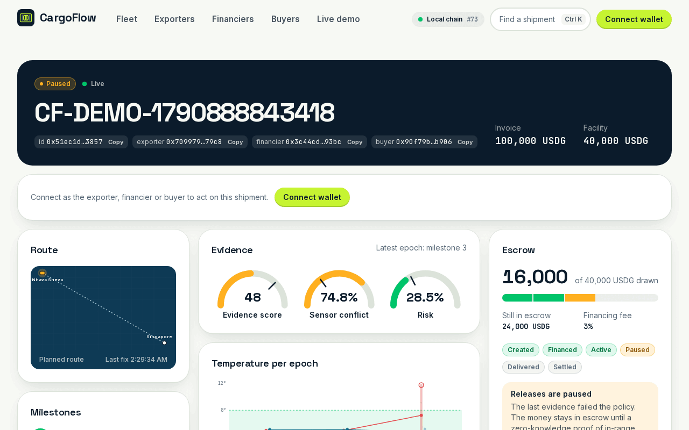

# CargoFlow web app

The dashboard for CargoFlow: track a shipment's evidence and escrow live, register and finance shipments from a
wallet, fund facilities, settle invoices, and play the whole story in judge mode.



## Stack

Next.js 16 (App Router, React 19, Turbopack) · TypeScript (strict) · Tailwind CSS 4 · wagmi 3 + viem ·
TanStack Query · zod · Vitest · Playwright + axe.

## Run it

```bash
cp .env.example .env.local     # NEXT_PUBLIC_API_URL, NEXT_PUBLIC_WALLETCONNECT_PROJECT_ID, ...
pnpm install
pnpm dev                       # http://localhost:3000
```

It needs a running backend (`make serve` at the repository root). Deployment addresses and the chain id come from
the backend's `/v1/config`, so one build works against a local chain or Robinhood Chain Testnet. For the local
stack in `../.env.local.example`, set `NEXT_PUBLIC_API_URL=http://127.0.0.1:8787`.

| Variable | Purpose |
|---|---|
| `NEXT_PUBLIC_API_URL` | Backend base URL (REST and WebSocket) |
| `NEXT_PUBLIC_WALLETCONNECT_PROJECT_ID` | Enables WalletConnect; browser wallets work without it |
| `NEXT_PUBLIC_LOCAL_RPC_URL` | RPC of the local anvil chain (default `http://127.0.0.1:8545`) |
| `NEXT_PUBLIC_E2E` | `1` only for Playwright: adds test wallets backed by anvil's dev accounts |

All of these are public: they are compiled into the browser bundle. The browser never holds a private key or the
backend's admin key.

## Pages

| Route | What it is |
|---|---|
| `/` | Landing: tabbed track / finance / verify bar, live stats, how it works, the settlement waterfall, verified contracts |
| `/track/[id]` | Live shipment dashboard: route, milestones, telemetry against the policy band, evidence gauges, escrow, AI monitor, ZK proof, audit trail |
| `/shipments` | Fleet: status tabs, search, sort, "my shipments", container drawer |
| `/exporter` | Wizard: register shipment → set policy → open facility → start tracking, each step a wallet transaction that resumes safely |
| `/financier` | Facilities naming your wallet: approve and deposit, exposure, settlement projection |
| `/buyer` | Confirm delivery and pay the invoice through the waterfall |
| `/demo` | Judge mode: the whole story scene by scene with server-held demo wallets (backend `DEMO_MODE=true`) |

## Tests

```bash
pnpm lint && pnpm typecheck && pnpm test     # 54 unit tests: formatting, schemas, fleet filter, waterfall, guards
bash scripts/e2e-stack.sh                    # 16 Playwright tests against a fresh anvil + Postgres + backend + production build
```

The end-to-end suite plays the full story in the browser, drives the exporter wizard and the financier's deposit with
real wallet transactions, checks not-found, offline and mobile behaviour, and runs axe on every page (no serious or
critical violations allowed).

## Layout of `src/`

| Path | Contents |
|---|---|
| `app/` | Routes, layout, providers, error and not-found pages, generated icon and OG image |
| `components/ui` | Accessible primitives: Button, Card, Pill, HashBadge, Tabs, Accordion, Drawer, Modal, Toast, Field, Stepper |
| `components/{landing,shipment,fleet,portal,demo,wallet,layout,brand}` | Page sections |
| `lib/api` | zod schemas mirroring the Go API, fetch client, query hooks, WebSocket stream |
| `lib/chain` | wagmi config, ABIs generated from `contracts/out` (`pnpm abi`), `useTx`, revert decoding |
| `lib/*.ts` | Pure logic with unit tests: formatting, fleet filtering, waterfall, milestones, exporter helpers |

## Design tokens

Navy `#0B1B2B` base, lime `#C6F432` signal (calls to action and the highlighted keyword), emerald `#00C46A` for
on-chain verified, amber `#FFB020` for pauses, red `#E5484D` for failures only. Space Grotesk for display,
Inter for text, JetBrains Mono for hashes and amounts. Brand assets and their provenance are in
[`public/brand/README.md`](public/brand/README.md).
